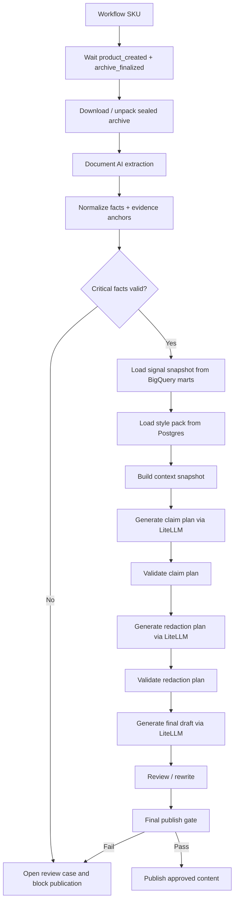
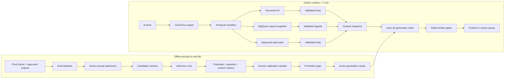
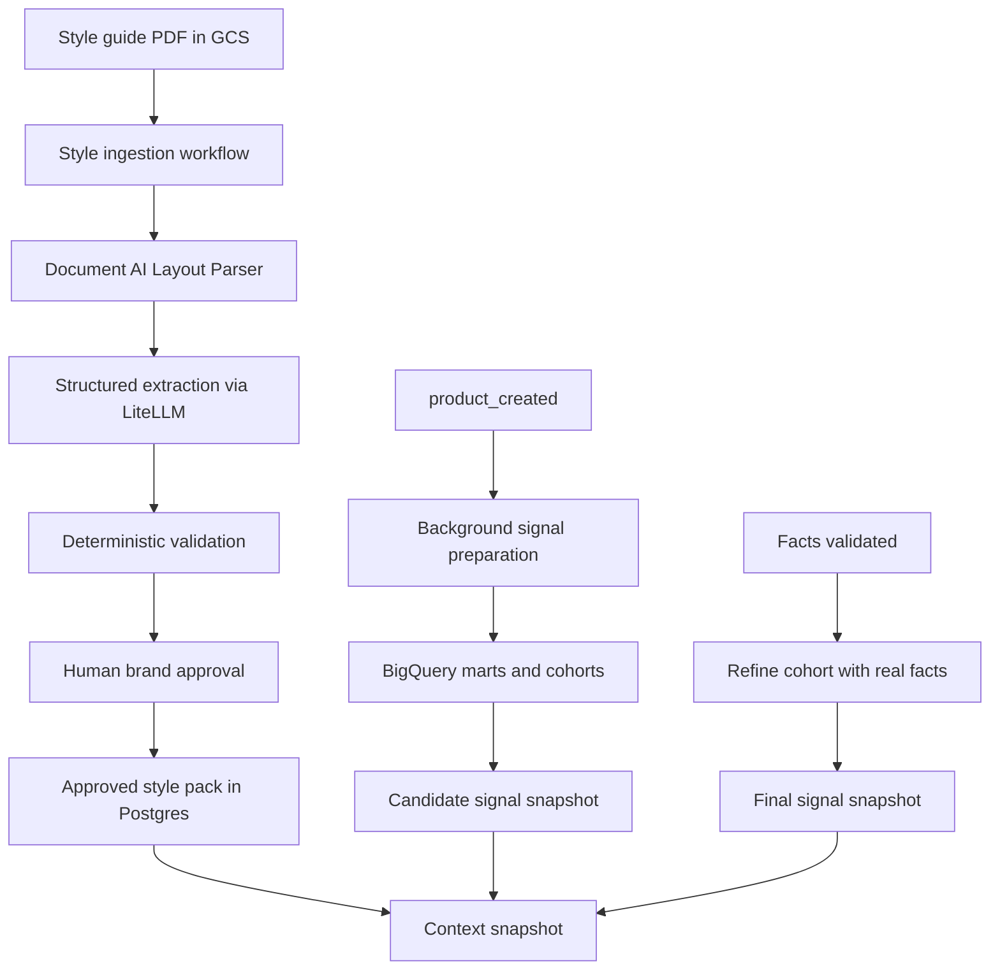

# Architecture Cible

Pour Axolotl, l’architecture cible la plus solide en 2026 est une architecture en **deux vitesses** :

1. **un runtime online** orienté SLA `< 2 min`
2. **un lab offline** orienté optimisation des prompts, évaluations Vertex et promotion des variantes

C’est le point clé.  
Si tu mélanges optimisation, judge LLM, pairwise, calibrations humaines et génération client dans le même flux, tu casses ton SLA et tu rends le système ingérable.

Le point qui manquait dans ma réponse précédente est celui-ci :

**le online ne part pas d’un prompt “brut non optimisé”.**  
Le online utilise toujours une **`generation_recipe_active` déjà promue offline**.

Autrement dit :

- l’**offline** sert à choisir la meilleure recette
- l’**online** applique cette recette au nouveau SKU en moins de 2 minutes

Donc le nouveau produit n’est pas “non optimisé” ; il est généré avec la **meilleure version connue à date**.  
Ce qui reste vrai, en revanche, c’est que le SKU est nouveau, donc il peut encore y avoir des cas limites. C’est pour ça qu’il faut un **publish gate** et, au début, une **mise en production progressive**.

---

## 1. Décision d’architecture

### Ce qui doit être vrai

- **zéro hallucination technique** : seules les infos extraites et validées depuis le dossier usine peuvent devenir des facts publiables
- **vendor lock-in minimal** : la génération passe par **LiteLLM**
- **orchestration robuste** : **Temporal** pilote tout le workflow par SKU
- **évaluation SOTA 2026** : **Vertex AI** est utilisé surtout dans le **lab offline**, pas dans le hot path
- **scalabilité saisonnière** : un workflow indépendant par SKU, piloté par files Temporal
- **distribution frontend propre** : le storefront ne lit pas directement le moteur GenAI

### Ce que ça veut dire concrètement pour le client

Il faut distinguer trois moments :

1. **bootstrapping initial**
2. **runtime de génération pour un nouveau produit**
3. **amélioration continue du moteur**

### 1. Bootstrapping initial

Avant de publier la première vraie fiche automatiquement, tu construis :

- un dataset de départ avec historiques Axolotl
- quelques cas annotés manuellement
- quelques cas synthétiques difficiles
- une `generation_recipe_v1` pour :
  - claim plan
  - redaction plan
  - final draft
  - review

Puis tu fais tourner l’offline lab Vertex et tu choisis une première baseline promue.

Donc, le premier vrai SKU en prod n’utilise **pas** un prompt improvisé.  
Il utilise déjà une **v1 évaluée offline**.

### 2. Runtime pour un nouveau produit

Quand un nouveau SKU arrive :

- on ne ré-optimise pas les prompts pour ce SKU
- on applique la **meilleure version active**
- on valide fortement les sorties
- on décide :
  - soit `published`
  - soit `pending_editor_review`

### 3. Amélioration continue

Ensuite, les traces de prod, les sorties validées, les corrections humaines et les cas ratés repartent dans le lab offline pour produire :

- `generation_recipe_v2`
- puis `v3`
- etc.

---

## 2. Vue d’ensemble

```mermaid
flowchart LR
    P["Pub/Sub: product_created"] --> E["Eventarc"]
    G["GCS: sealed technical archive finalized"] --> E
    S["GCS: style guide source"] --> E

    E --> API["Cloud Run API"]
    API --> PG["Cloud SQL PostgreSQL"]
    API --> TW["Temporal workflows"]

    TW --> GCS["Cloud Storage"]
    TW --> DAI["Google Document AI"]
    DAI --> FV["Fact normalization + evidence validation"]
    FV --> PG

    BQ["BigQuery sales + reviews + marts"] --> SS["Signal snapshot builder"]
    SS --> PG

    PG --> CTX["Context snapshot"]
    CTX --> LLM["LiteLLM generation chain"]

    LLM --> CP["Claim plan"]
    CP --> VR1["Deterministic validators"]

    VR1 --> RP["Redaction plan"]
    RP --> VR2["Deterministic validators"]

    VR2 --> FD["Final draft"]
    FD --> RV["Review / rewrite"]
    RV --> GATE["Publish gate"]

    GATE -->|fail| RQ["Review queue back-office"]
    GATE -->|pass| PUB["Publisher"]

    PUB --> CMS["PIM / CMS / commerce API"]
    PUB --> PCA["Product Content API"]

    CMS --> FE["Frontend / storefront"]
    PCA --> FE

    PG --> LAB["Offline prompt & eval lab"]
    BQ --> LAB
    LAB --> VX["Vertex optimizers + evaluations"]
    VX --> PG
```



---

## 2 bis. Comment on extrait le style guide

C’était un angle mort dans la réponse précédente.  
Le style guide ne doit **pas** être consommé tel quel au runtime.

Le bon pattern est :

- le PDF source vit dans **GCS**
- mais ce PDF est transformé en **style pack structuré versionné**
- le runtime lit uniquement ce **style pack approuvé**

### Outil recommandé

Pour le style guide, je recommande une pipeline séparée :

1. **Document AI Layout Parser** pour lire le PDF, récupérer :
   - titres
   - sections
   - sous-sections
   - chunks cohérents
2. **LiteLLM avec structured outputs** pour transformer ces chunks en JSON métier
3. **validation déterministe**
4. **review / approbation humaine**
5. **publication d’un `style_pack_version` dans Postgres**

### Pourquoi Document AI Layout Parser ici

Parce que le problème du style guide n’est pas d’extraire des dimensions ou des tables comme dans un dossier usine.  
Le problème est de :

- préserver la structure du document
- comprendre les sections
- chunker proprement
- ensuite laisser un LLM mapper ces sections vers ton schéma métier

Le Layout Parser est très adapté à ça, parce qu’il extrait justement :

- headings
- listes
- blocs
- structure de page
- chunks utiles à la récupération

### Puis transformation LLM structurée

Ensuite tu fais une extraction structurée du type :

```json
{
  "voice_rules": [],
  "tone_profiles": [],
  "forbidden_lexicon": [],
  "preferred_lexicon": [],
  "formatting_rules": [],
  "category_specific_rules": []
}
```

Le LLM ne doit pas produire du texte libre.  
Il doit produire un JSON de type :

- `VOICE` : règles globales
- `TONE` : règles par catégorie ou gamme
- `rule_type`
- `criticite`
- `texte`
- `target_tone_id` nullable

### Puis gouvernance humaine

Sophie, la guardian de la marque, doit pouvoir :

- supprimer une règle mal extraite
- corriger une règle
- ajouter un tone spécifique
- republier une nouvelle version

Donc le flow style guide est en réalité un **workflow admin/offline**, pas un workflow produit.

### Conclusion style guide

Donc :

- **GCS** stocke la source
- **Document AI Layout Parser** lit et structure
- **LiteLLM structured output** transforme en règles
- **humain approuve**
- **Postgres** stocke le style pack normalisé
- **runtime** consomme seulement la version approuvée

Vertex n’est pas obligatoire ici.  
Tu peux l’utiliser plus tard pour optimiser le prompt d’ingestion du style guide, mais la chaîne pragmatique de base est :

**Document AI + LiteLLM + validation + humain**

---

## 3. Flow online recommandé

### Entrées

Tu as deux signaux métier principaux :

- `product_created` via **Pub/Sub**
- `archive technique finalisé` via **event GCS**

Le bon pattern, aligné avec ton doc PLM, c’est :

- le PLM/quality process compile les PDFs en **un seul zip scellé**
- seul ce zip final déclenche l’event GCS
- on évite totalement les triggers sur uploads partiels

C’est beaucoup plus propre que de réagir à chaque PDF.

### Ingestion

**Eventarc** route les événements vers **Cloud Run API** en HTTP.

Cloud Run ne fait pas le travail lourd.  
Il fait seulement :

- validation CloudEvent
- déduplication idempotente
- persistance d’état dans Postgres
- démarrage ou signal d’un workflow **Temporal**

Le bon pattern Temporal ici est :

- **1 workflow par SKU**
- le workflow attend que toutes les pièces soient présentes :
  - métadonnées produit
  - archive technique finale
  - style pack applicable
  - snapshot de signaux marketing

Et là, il faut clarifier un point important :  
le snapshot de signaux marketing ne doit pas être calculé au dernier moment si on peut l’éviter.

---

## 3 bis. Comment s’enchaînent online et offline

C’est probablement la zone la plus importante à expliquer au client.

### Ce qu’il ne faut pas imaginer

Il ne faut pas imaginer :

- offline fait l’optimisation
- online ignore totalement l’offline
- puis on pousse automatiquement au frontend

Ce serait faux.

### Le vrai enchaînement

Le vrai cycle est :

1. **offline** fabrique et promeut une `generation_recipe_active`
2. **online** utilise ce package actif pour générer les nouveaux SKU
3. **online** applique des gates :
   - facts OK
   - plans structurés OK
   - claims interdits absents
   - grounding suffisant
4. si la politique de publication le permet, on publie
5. les traces de prod repartent en **offline** pour améliorer la prochaine version

### Donc le publish vers le frontend ne se fait pas toujours immédiatement

Tu as en réalité plusieurs modes de déploiement possibles.

#### Mode 1. `draft_only`

Au démarrage du projet :

- on génère en moins de 2 min
- mais la fiche va dans un back-office éditorial
- pas directement au frontend

#### Mode 2. `human_approved_publish`

Ensuite :

- si tout passe techniquement
- la fiche est “ready for editor review”
- un humain approuve
- puis publication CMS/PIM

#### Mode 3. `auto_publish_low_risk`

À maturité :

- certaines familles stables peuvent auto-publier
- d’autres restent en revue humaine

C’est la vraie approche sérieuse.

### Donc la bonne réponse au client est

Oui, le SLA 2 minutes est respecté pour **générer** la fiche.  
Mais cela ne veut pas dire :

- “toutes les fiches sont instantanément visibles sur le site”

Au début, la bonne stratégie est :

- génération rapide
- validation forte
- publication progressive selon le niveau de confiance

---

## 4. Workflow Temporal par SKU



---

## 5. Comment garantir le “zero technical hallucination”

Le point le plus important à expliquer au client :

**le LLM ne doit jamais inventer la vérité technique.**  
La vérité technique vient uniquement de la chaîne :

`dossier usine -> Document AI -> facts validés -> validators -> contexte`

### Recommandation GCP / SOTA

Pour les facts techniques :

- utiliser **Document AI** pour extraire
- conserver les **evidences** :
  - page
  - text anchor
  - parfois bounding polygon / provenance
- valider ensuite de façon **déterministe**
- si un fact critique est ambigu ou absent :
  - on bloque la publication
  - on ouvre une review humaine

### Donc, concrètement

On stocke par fact :

- `id_fact`
- `cle`
- `valeur`
- `unite`
- `confiance`
- `processor_version`
- `request_config_snapshot`
- `source_document`
- `page_number`
- `text_anchor`
- `evidence_excerpt`

Et on ajoute des règles dures :

- dimensions obligatoires si attendues pour la famille
- unités cohérentes
- certifications dans référentiel autorisé
- pas de doublons contradictoires
- cohérence inter-champs

### Ce qu’il ne faut pas faire

Ne jamais dire :

- “Document AI extrait, donc c’est forcément vrai”

Non.  
Même en 2026, la bonne pratique GCP est :

- extraction
- normalisation
- validation métier
- human review si nécessaire

### Point important sur les features GenAI de Document AI

Les capacités GenAI / derived fields peuvent aider pour des champs complexes, mais pour Axolotl :

- **elles ne doivent pas devenir la source de vérité des facts critiques**
- surtout si tu perds une partie de la traçabilité fine vers le document

Pour les dimensions, matériaux, certifications, contraintes d’assemblage :

- source de vérité = extraction ancrée + validation métier
- pas génération libre

---

## 6. Comment traiter ventes et reviews sans hallucination

Ici, il faut séparer deux choses.

### 1. Les signaux ventes

Pour les ventes, la meilleure approche n’est pas LLM-first.  
C’est **SQL-first** dans **BigQuery**.

Exemples :

- top conversion rate par famille
- top SKU margin
- top repeated benefits by season
- uplift par angle merchandising
- performance par matériau, gamme, prix, usage

Ces signaux doivent être construits par :

- vues SQL
- modèles Dataform
- tables mart versionnées
- scheduled queries si besoin

Donc :

- **pas de prompt optimization nécessaire** pour les signaux ventes
- c’est du calcul analytique déterministe

### 2. Les signaux reviews

Pour les reviews, il y a deux niveaux.

#### Niveau A. Basique et robuste

Tu fais un pipeline déterministe / semi-déterministe :

- nettoyage
- langue
- segmentation
- taxonomie contrôlée
- dictionnaires

#### Niveau B. Plus SOTA 2026

Tu utilises **BigQuery `AI.GENERATE_TABLE`** pour enrichir des reviews en signaux structurés, par exemple :

- `code_signal`
- `sentiment`
- `snippet_evidence`
- `confidence`
- `taxonomy_version`

Mais ici la règle est très importante :

- ces signaux sont **marketing**
- ils servent à **prioriser**
- ils ne créent jamais des facts techniques

Donc si un signal review dit “semble très robuste” :

- ça peut influencer le message
- mais ça ne permet pas d’inventer “acier marine grade” ou “résiste 20 ans”

---

## 6 bis. Comment faire pour un nouveau produit

C’était ton autre vraie question.

Un nouveau SKU n’a souvent :

- ni ventes propres
- ni reviews propres

Donc on ne calcule pas les signaux sur le SKU lui-même.  
On les calcule sur un **groupe comparable**.

### Il faut donc introduire la notion de “cohorte comparable”

Par exemple, à partir de :

- famille produit
- sous-famille
- gamme prix
- collection
- matériau dominant
- usage
- ton cible
- dimensions proches

On construit un `profil_de_similarite_produit`.

### Ensuite BigQuery va chercher les comparables

Exemple :

- nouveau produit = table outdoor premium en teck 210 cm
- BigQuery va chercher :
  - tables premium outdoor
  - teck / bois nobles
  - taille proche
  - même segment prix
  - même usage repas extérieur

Donc les signaux peuvent venir de :

- produits similaires
- anciennes collections
- catégories analogues
- précédents modèles, si disponibles

Pas besoin que ce soit l’ancienne version exacte du même SKU.

### Recommandation de flow

Le bon design est en **deux temps** :

#### Temps 1. dès `product_created`

On lance une tâche de fond de préparation des signaux à partir des métadonnées déjà disponibles :

- famille
- collection
- segment prix
- merchandising metadata

On obtient un premier `candidate_signal_snapshot`.

#### Temps 2. après facts validés

Une fois Document AI terminé, on affine avec :

- matériau réel
- dimensions réelles
- certifications
- contraintes d’usage

On recalcule ou raffine le `final_signal_snapshot`.

### Donc oui : cette partie doit être préparée en tâche de fond

C’est même préférable.

Comme ça, quand le workflow de génération a :

- facts validés
- style pack
- produit créé

il a déjà soit :

- un snapshot prêt
- soit un snapshot presque prêt à être finalisé

### Et si le produit est vraiment nouveau

Si Axolotl lance une catégorie totalement nouvelle et qu’il n’y a pas assez d’historique :

- on fallback sur une cohorte plus large
- ou on met les signaux à `null`
- ou on réduit leur poids dans le claim plan

C’est très important :  
**mieux vaut peu de signaux que de faux signaux.**

Le produit peut toujours être généré correctement avec :

- facts validés
- style pack
- et peu ou pas de signaux marketing

---

## 7. Où mettre Vertex AI dans cette architecture

Le bon design n’est pas “Vertex partout”.  
Le bon design est :

- **LiteLLM comme gateway canonique de génération**
- **Vertex comme plateforme d’optimisation et d’évaluation offline**

### Donc

#### Online

Tu utilises :

- prompts actifs déjà promus
- modèles appelés via LiteLLM
- validateurs déterministes
- éventuellement un petit contrôle qualité final si budget SLA disponible

#### Offline

Tu utilises Vertex pour :

- `zero-shot optimizer`
- `few-shot optimizer`
- `data-driven optimizer`
- pointwise metrics
- pairwise / AutoSxS
- calibration du judge contre ratings humains

C’est exactement le pattern moderne :

- runtime stable et rapide
- lab riche et expérimental

### Où mettre l’évaluation des signaux reviews

Si tu utilises un prompt BigQuery/LLM pour classifier les reviews, cette évaluation doit elle aussi aller en offline :

- dataset annoté de reviews
- prompt candidates
- custom metrics
- exact match / F1 sur `code_signal`
- validation des snippets
- promotion du meilleur prompt de classification

Donc oui, il peut y avoir un petit sous-lab offline pour la couche “signal mining review”.

---

## 8. Pipeline offline recommandé

Pour Axolotl, le pipeline offline cible est :

`facts/signaux/style -> claim plan -> redaction plan -> final draft -> review`

Et la bonne stratégie n’est pas :

- “on évalue seulement le texte final”

La bonne stratégie est :

- **évaluation de chaque étage critique**
- puis **évaluation end-to-end finale**
- puis promotion

### Pourquoi

Si tu n’évalues que le texte final :

- tu ne sais pas si le problème vient du claim plan
- ou du redaction plan
- ou du draft
- ou du review

Tu perds toute capacité d’optimisation fine.

### Donc la reco SOTA

- **stage-level optimization** pour diagnostiquer et améliorer
- **end-to-end promotion gate** pour décider quelle chaîne devient active

### Ce que l’offline produit exactement

L’offline ne produit pas directement une fiche frontend.  
Il produit surtout :

- `generation_recipe_version`
- `prompt_name` / `prompt_version`
- `model_profile`
- `exemplar_pack`
- `routing_policy`
- `publish_policy`

C’est ça qui devient actif pour le online.

---

## 9. Mapping online vs offline

### Online obligatoire

À garder dans le SLA :

- validateurs déterministes sur facts
- validateurs déterministes sur claim plan
- validateurs déterministes sur redaction plan
- validateurs déterministes sur final draft
- review gate
- publication ou review queue

### Offline obligatoire

À sortir du SLA :

- prompt optimizers Vertex
- pointwise judge massif
- pairwise comparaisons massives
- AutoSxS
- calibration judge/humains
- benchmark multi-modèles

### Donc la jonction online/offline est

- offline choisit la meilleure version
- online exécute cette version
- online collecte les traces
- offline réapprend à partir de ces traces

---

## 10. Temporal : comment le découper proprement

Temporal est central ici.

Il faut **plusieurs task queues**, pas un worker monolithique.

### Recommandation

- `ingestion_queue`
- `style_ingestion_queue`
- `document_ai_queue`
- `fact_validation_queue`
- `signal_snapshot_queue`
- `generation_queue`
- `publish_queue`
- `offline_lab_queue`

### Pourquoi

Parce que :

- le style guide est un workflow rare et administratif
- Document AI a ses propres limites / latences
- LiteLLM a ses propres quotas
- les jobs offline ne doivent jamais bloquer le runtime
- tu veux pouvoir scaler différemment chaque type de travail

### Activités Temporal typiques

- `telecharger_archive_gcs`
- `decompresser_archive`
- `lancer_extraction_document_ai`
- `normaliser_facts`
- `valider_facts_critiques`
- `charger_snapshot_signaux`
- `charger_pack_style`
- `construire_context_snapshot`
- `generer_claim_plan`
- `valider_claim_plan`
- `generer_redaction_plan`
- `valider_redaction_plan`
- `generer_final_draft`
- `review_rewrite`
- `publier_contenu`
- `ouvrir_review_case`
- `ingester_style_guide`
- `publier_style_pack_version`

---

## 11. Comment tenir le SLA < 2 minutes

Il faut être très clair avec le client :

**le SLA < 2 minutes est réaliste seulement pour le happy path.**

C’est-à-dire :

- archive technique complète et propre
- extraction Document AI correcte
- pas de fact critique ambigu
- signaux déjà pré-calculés dans BigQuery
- prompts déjà optimisés offline
- pas de revue humaine nécessaire

### Budget temps réaliste

- Event ingest + Temporal start : `2-5s`
- Download/unpack archive : `5-10s`
- Document AI : `30-60s`
- Fact normalization + validation : `5-10s`
- Signal fetch BigQuery mart : `2-5s`
- Claim plan + redaction plan + draft + review : `20-40s`
- Persist + publish : `5-10s`

Donc oui, tu peux viser `< 2 min` sur le happy path.

Mais tu dois aussi dire :

- **si les facts critiques sont ambigus, on bloque et on route en review**
- sinon la promesse “zero technical hallucination” n’est pas crédible

---

## 12. Comment exposer la fiche au frontend

Ici, la pratique 2026 la plus sérieuse n’est pas :

- “le frontend appelle directement le moteur GenAI”

Ce serait une mauvaise architecture.

### Recommandation cible

Le moteur Factory Writer est une **supply chain de contenu**, pas un endpoint frontend public.

Le bon pattern est :

1. le pipeline génère et valide la fiche
2. la fiche approuvée est publiée dans une **couche de diffusion**
3. le frontend lit cette couche de diffusion

### Deux options

#### Option A. Architecture cible retail sérieuse

Publier dans un :

- **PIM**
- **CMS headless**
- ou **commerce backend**

Puis le frontend lit :

- API CMS/PIM
- cache/CDN
- éventuellement moteur de search/indexation

C’est la meilleure option pour :

- gouvernance contenu
- multi-canal
- preview
- merchandising
- workflows éditoriaux
- internationalisation future

#### Option B. POC rapide

Publier dans Postgres puis exposer via :

- `GET /products/{sku}/content`

C’est acceptable pour un POC.  
Mais ce n’est pas la meilleure cible long terme.

### Donc ma reco

- **POC** : Product Content API sur Cloud Run + Postgres
- **Target architecture** : Publisher vers CMS/PIM/commerce, frontend lit le CMS/PIM

### Et surtout

Le frontend ne voit que :

- `published_content`

Il ne voit pas :

- les drafts
- les sorties intermédiaires
- les variantes offline
- les contenus en review

C’est ce point qui règle le problème que tu soulevais :  
**on ne pousse pas au frontend une fiche simplement “générée”. On pousse une fiche “générée + passée par la politique de publication”.**

---

## 13. Diagramme runtime vs lab



---

## 14. Diagramme spécifique style + signaux



---

## 15. Architecture de données minimale

Pour rester clair et démontrable, je recommande ces objets canonique côté Postgres :

- `product_intake_state`
- `dossier_archive`
- `style_guide_source`
- `style_pack_version`
- `document_extraction_run`
- `product_fact`
- `fact_evidence`
- `analytics_snapshot`
- `context_snapshot`
- `prompt_registry_ref`
- `generation_job`
- `llm_call_trace`
- `claim_plan`
- `redaction_plan`
- `content_draft`
- `review_result`
- `review_case`
- `published_content`

### Point important

Tu avais déjà soulevé un bon point dans tes reviews :

- il faut tracer `processor_version` et `request_config_snapshot` pour Document AI
- il faut aussi tracer la télémétrie runtime des appels LLM :
  - latence
  - tokens
  - retries
  - coût
  - cache hit/miss
  - statut

Sinon tu ne peux pas piloter proprement le SLA ni optimiser le routing.

---

## 16. Recommandation finale à présenter au client

La meilleure proposition Axolotl est :

### Online

- Event-driven via Pub/Sub + GCS + Eventarc
- Cloud Run comme façade d’ingestion
- Temporal comme colonne vertébrale d’orchestration
- Document AI pour extraire les facts techniques
- BigQuery marts pour produire les signaux ventes/reviews
- LiteLLM pour la chaîne de génération
- validateurs déterministes à chaque étage
- publication seulement si le publish gate passe

### Offline

- datasets de production / historiques / cas annotés
- Vertex prompt optimizers
- Vertex evaluation :
  - pointwise
  - pairwise
  - AutoSxS
  - calibration judge/humains
- promotion des meilleures variantes vers la config active

### Distribution

- POC : Product Content API
- cible : CMS/PIM/commerce API
- le storefront lit la couche de diffusion, pas le moteur GenAI

---

## 17. Position claire sur les points sensibles

### Document AI

Oui, il faut l’utiliser.  
Non, il ne suffit pas à lui seul pour garantir le zéro hallucination.  
Il faut **evidence + validation + review queue**.

### BigQuery + GenAI pour les signaux

Oui, possible surtout pour les reviews.  
Mais uniquement pour des **signaux marketing non autoritatifs**.  
Les facts techniques n’en dépendent jamais.

### Vertex

Oui, très recommandé pour l’offline eval/prompt lab.  
Non, pas comme cœur du runtime si ton objectif est no vendor lock-in et SLA serré.

### LiteLLM

Oui, c’est le bon choix pour le runtime no-lock-in.  
Il faut juste le piloter avec :

- model profiles
- fallback policy
- generation recipe versioning
- runtime traces

### Style guide

Le PDF de style guide n’est pas le contexte runtime.  
Le contexte runtime est le **style pack structuré, validé et versionné** dérivé de ce PDF.

---

## Sources

Contexte interne utilisé :

- [COURSE_RETAIL_PLM_LIFECYCLE.md](/Users/floriansollami/Documents/GitHub/factory-writer/docs/COURSE_RETAIL_PLM_LIFECYCLE.md)
- [INGESTION_STYLE_GUIDE.md](/Users/floriansollami/Documents/GitHub/factory-writer/docs/INGESTION_STYLE_GUIDE.md)
- [COURSE_VOICE_VS_TONE.md](/Users/floriansollami/Documents/GitHub/factory-writer/docs/COURSE_VOICE_VS_TONE.md)

Sources officielles :

- [Eventarc triggers for Cloud Storage](https://cloud.google.com/eventarc/docs/run/create-trigger-storage-gcloud)
- [Eventarc Pub/Sub to Cloud Run](https://cloud.google.com/eventarc/docs/run/route-trigger-cloud-pubsub)
- [Document AI extraction overview](https://docs.cloud.google.com/document-ai/docs/extracting-overview)
- [Document AI Layout Parser](https://cloud.google.com/document-ai/docs/layout-parse-chunk)
- [Document AI custom extractor overview](https://docs.cloud.google.com/document-ai/docs/custom-extractor-overview)
- [Document AI custom extraction and evaluation](https://docs.cloud.google.com/document-ai/docs/custom-based-extraction)
- [Document AI review documents](https://cloud.google.com/document-ai/docs/review-documents)
- [BigQuery AI.GENERATE_TABLE](https://docs.cloud.google.com/bigquery/docs/reference/standard-sql/bigqueryml-syntax-generate-table)
- [Generate structured data with AI.GENERATE_TABLE](https://docs.cloud.google.com/bigquery/docs/generate-table)
- [BigQuery prompt design](https://cloud.google.com/bigquery/docs/prompt-design)
- [BigQuery scheduled queries](https://cloud.google.com/bigquery/docs/scheduling-queries)
- [Dataform overview](https://docs.cloud.google.com/dataform/docs/overview)
- [Vertex AI evaluation overview](https://docs.cloud.google.com/vertex-ai/generative-ai/docs/models/evaluation-overview)
- [Vertex AI determine eval metrics](https://docs.cloud.google.com/vertex-ai/generative-ai/docs/models/determine-eval)
- [Vertex AI rubric metric details](https://docs.cloud.google.com/vertex-ai/generative-ai/docs/models/rubric-metric-details)
- [Vertex AI evaluate a judge model](https://docs.cloud.google.com/vertex-ai/generative-ai/docs/models/evaluate-judge-model)
- [Vertex AI zero-shot optimizer](https://docs.cloud.google.com/vertex-ai/generative-ai/docs/learn/prompts/zero-shot-optimizer)
- [Vertex AI few-shot optimizer](https://docs.cloud.google.com/vertex-ai/generative-ai/docs/learn/prompts/few-shot-optimizer)
- [Vertex AI data-driven optimizer](https://docs.cloud.google.com/vertex-ai/generative-ai/docs/learn/prompts/data-driven-optimizer)
- [Vertex AI structured output](https://docs.cloud.google.com/vertex-ai/generative-ai/docs/multimodal/control-generated-output)
- [Vertex AI system instructions](https://docs.cloud.google.com/vertex-ai/generative-ai/docs/learn/prompts/system-instruction-introduction)
- [Temporal workers](https://docs.temporal.io/workers)
- [Temporal workflow definition](https://docs.temporal.io/workflow-definition)
- [Temporal task queues](https://docs.temporal.io/task-queue)
- [Composable commerce / headless CMS pattern](https://docs.commercetools.com/learning-composable-commerce-developer-journey/components-of-composable-commerce/using-a-headless-cms)

Si tu veux, je peux maintenant te faire la **version “présentation client” en 8 slides**, avec :

- 1 slide problème / enjeux
- 1 slide architecture cible
- 1 slide online vs offline
- 1 slide Temporal
- 1 slide style guide + signaux BigQuery
- 1 slide zero hallucination
- 1 slide publication frontend
- 1 slide roadmap POC -> prod.

# Client Request

## ROLE PLAY SCENARIO

### GenAI-Powered Product Sheets (Project "Factory writer")

## Scenario

THE OUTDOOR AXOLOTL is a premium B2C retail brand specializing in high-end garden furniture and ergonomic gardening tools.

To maintain its market-leading position, the brand designs all its products in-house.

Currently, the creation process for e-commerce product sheets is a major bottleneck: it takes the marketing teams an average of 3 weeks to translate technical design dossiers (from the factories) into attractive commercial descriptions.

The brand wishes to launch the "Factory Writer" project to automate the drafting of these sheets using Generative AI, while ensuring that every text strictly adheres to the brand's "Tone of Voice" (elegant, expert, and nature-centric).

The Data & Content team has identified several critical data sources:

- **Factory Technical Dossiers**: Material specifications (wood types, steel grades), dimensions, assembly constraints, and eco-certifications (PDFs, blueprints).
- **Brand Style Guide**: A reference document defining the tone (warm, botanical vocabulary, respectful "thou/you" address).
- **Sales History**: Data on top-performing products to identify selling points that resonate most with customers.
- **Customer Feedback**: Reviews of previous models to highlight strengths in the new descriptions.

## Requirements

THE OUTDOOR AXOLOTL is looking for an expert engineer to design this solution with the following pillars in mind:

- **10x Productivity**: The solution must generate a ready-to-publish product sheet in less than 2 minutes after importing the factory documents.
- **Zero Technical Hallucination**: Dimensions and materials extracted from technical documents must be 100% accurate.
- **Scalability**: The pipeline must be capable of processing hundreds of new products during "Spring/Summer" collection launches without performance degradation.
- **"Context-First" Approach**: The architecture must prioritize dynamic context management by offering a flexible solution that doesn't lock them into a single AI provider or require expensive training cycles.

## Customer Meeting

As a Software Engineer specialized in AI-Augmented Development at SFEIR, you have been invited by OUTDOOR AXOLOTL to present a target architecture and an implementation strategy to support the automated creation of these product sheets.

## The meeting participants

- **You** – GenAI Software Expert (SFEIR)
- **Marc Rivage** – Head of Product Offering (Product Owner)
- **Sophie Valvert** – Head of Brand Identity (Guardian of the Tone of Voice)
- **Lucas Tech** – Head of Cloud Solutions (Guardian of technical integration)
