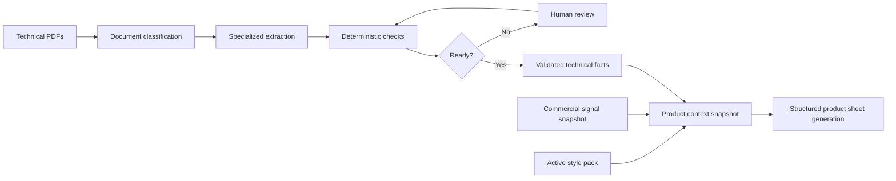

# Factory Writer

Factory Writer is a GenAI proof of concept for automating premium e-commerce product sheets from factory technical dossiers, brand style rules, and commercial signals.

The project was built for the **Outdoor Axolotl** role-play scenario: a premium B2C garden brand wants to reduce product sheet creation from roughly three weeks to a few minutes, while keeping technical facts reliable and the brand voice consistent.

## What This POC Demonstrates

Factory Writer does not ask a language model to read raw PDFs and invent a product sheet. The system first builds a controlled product context:

1. It ingests factory technical PDFs.
2. It classifies each PDF by document type.
3. It extracts candidate facts with document AI processors.
4. It validates facts deterministically.
5. It sends uncertain cases to human review.
6. It ingests and validates a brand style guide.
7. It combines validated technical facts, active style rules, and commercial signals into a product context snapshot.
8. It generates a structured product sheet from that snapshot.

The core idea is simple: **the LLM writes, but it is not the source of truth**.

## Product Flow



## Main Capabilities

- **Technical dossier ingestion**
  - Upload multiple PDF sources for one product.
  - Classify each PDF as technical sheet, material specification, assembly notice, mixed dossier, out-of-scope document, or unknown.
  - Route valid technical documents to the right custom extractor.
  - Display labels, confidence scores, extraction candidates, source values, and PDF evidence.

- **Deterministic technical validation**
  - Load a seeded product sheet requirement profile.
  - Check required fields, confidence thresholds, unit normalization, bounds, and contradictions.
  - Promote only validated facts.
  - Open review cases when a fact is missing, low confidence, contradictory, or out of range.

- **Human-on-the-loop review**
  - Let the system continue automatically when checks pass.
  - Ask a human only when a blocking issue appears.
  - Support manual correction or selection of an extracted candidate.
  - Resume the workflow after the decision.

- **Style guide ingestion**
  - Upload a brand style guide PDF.
  - Extract candidate tone-of-voice rules through a structured LLM output.
  - Validate and activate a reusable style pack.
  - Keep source evidence available for review.

- **Product sheet generation**
  - Build a product context snapshot from validated facts, active style rules, and commercial signals.
  - Generate a structured product sheet through LiteLLM and Vertex AI.
  - Persist the prompt inputs, LLM output, status, and review metadata.

## Architecture

Factory Writer follows a pragmatic hexagonal architecture:

```text
frontend/
  React admin UI for upload, review, evidence, and generated sheets

backend/src/factory_writer/
  api/              FastAPI routes
  application/      use cases, ports, validation, prompt registry
  domain/           domain enums and value objects
  infrastructure/   SQLAlchemy, GCP, LiteLLM adapters
  temporal/         durable workflows and activities
```

The POC uses durable workflows to coordinate long-running product operations:

- `ProductLifecycleWorkflow`
- `TechnicalDossierIngestionWorkflow`
- `StyleGuideIngestionWorkflow`
- `ProductSheetGenerationWorkflow`

Workflows orchestrate. Activities perform I/O: database writes, Document AI calls, object storage, and LLM calls.

## Technology Stack

| Area | Technologies |
|---|---|
| Frontend | React 19, TypeScript, Vite, React Router |
| UI state and validation | TanStack Query, Zod, Tailwind CSS, Lucide, Radix primitives |
| PDF preview | React PDF, PDF.js, IndexedDB via `idb` |
| Backend API | Python 3.12, FastAPI, Uvicorn, Pydantic |
| Orchestration | Temporal Python SDK, Temporal workers, Temporal UI |
| Database | PostgreSQL, SQLAlchemy, Alembic, psycopg |
| Document storage | Google Cloud Storage |
| Document intelligence | Google Document AI |
| LLM gateway | LiteLLM |
| LLM provider used in POC | Vertex AI / Gemini |
| Prompting | Local Mustache prompt registry, Pydantic structured outputs |
| Tests and quality | pytest, Testcontainers, Ruff, mypy, Vitest, Playwright, MSW |

## Important POC Design Choices

- **Document AI is used for document understanding**, not a generic VLM as the main extraction layer. This gives better control over document classes, field schemas, processor versions, and source evidence.
- **The LLM never receives raw PDFs as its main source of truth**. It receives a product context snapshot.
- **Commercial signals are persuasive only**. They can influence the angle of the copy, but they cannot create technical claims.
- **Technical facts are authoritative**. Dimensions, materials, certifications, and assembly constraints must come from validated facts.
- **Human review is targeted**. The user corrects specific uncertain facts rather than rewriting the whole sheet.
- **Prompt recipes are versioned**. The POC uses local prompt manifests and structured output schemas as a lightweight prompt registry.

## Repository Highlights

| Path | Purpose |
|---|---|
| `docs/CLIENT_REQUEST.md` | Original role-play customer request |
| `docs/tech_extraction/` | Technical dossier fixtures, extractor schemas, readiness profile |
| `docs/brand_style_extraction/` | Style guide fixtures and prompt notes |
| `docs/diagrams/` | Mermaid and generated architecture diagrams |
| `backend/alembic/versions/20260427_0001_latest_poc_schema.py` | Latest POC schema and seed data |
| `backend/src/factory_writer/application/prompts/` | Local prompt registry |
| `backend/src/factory_writer/temporal/` | Temporal workflows and activities |
| `frontend/src/features/product-sheets/` | Product sheet admin experience |
| `frontend/src/features/style-guide/` | Style guide admin experience |

## Local Development

### Prerequisites

- Python 3.12
- `uv`
- Node.js and npm
- Docker
- Google Cloud credentials if you want to run real Document AI / GCS / Vertex calls

### Install Dependencies

```bash
cd backend
uv sync --extra dev

cd ../frontend
npm install
```

### Configure Environment

Copy the local example:

```bash
cp .env.local.example .env.local
```

For the full real POC path, configure:

- `GCP__PROJECT_ID`
- `GCP__DOCUMENT_AI_LOCATION`
- Document AI classifier and extractor processor IDs
- GCS buckets for style guide and technical dossiers
- Temporal address and namespace
- Vertex AI / LiteLLM authentication through your local Google credentials

The original cloud project used during development is not part of this repository. Recreate your own GCP project and processors before running real cloud calls.

### Start Local Infrastructure

```bash
make infra-up
make db-migrate
make db-seed
```

This starts:

- PostgreSQL on `localhost:5432`
- Temporal dev server on `localhost:7233`
- Temporal UI on `http://localhost:8233`

### Run The Application

In separate terminals:

```bash
make api
make worker-style
make worker-product
make frontend-real
```

Open:

```text
http://127.0.0.1:5173
```

For frontend-only work with mocked API responses:

```bash
make frontend
```

## Quality Checks

Backend:

```bash
make backend-check
```

Frontend:

```bash
cd frontend
npm run typecheck
npm test
```

E2E:

```bash
cd frontend
npm run test:e2e
```

## POC Limitations

This repository is a proof of concept, not a production platform.

Known simplifications:

- Some business data is seeded rather than integrated from real enterprise systems.
- The prompt registry is local files, not a managed prompt platform.
- The commercial signal snapshot is mocked/seeded for demo purposes.
- There is no CMS/PIM publication connector.
- There is no admin CRUD for requirement profiles.
- The original GCP resources used for the demo were intentionally removed to avoid billing.

The target production architecture would add stronger platform capabilities: managed prompt registry, evaluation datasets, offline prompt optimization, commercial data pipelines, quotas and rate limits per provider, richer audit trails, and deployment observability.

## Why This Project Matters

Factory Writer shows how to build a GenAI workflow where the model is useful without becoming uncontrolled.

The important engineering pattern is not "send everything to the LLM". It is:

```text
extract -> validate -> review when needed -> snapshot -> generate -> post-check
```

That pattern is what makes the generated product sheet faster to produce, easier to audit, and safer for a premium retail brand.
