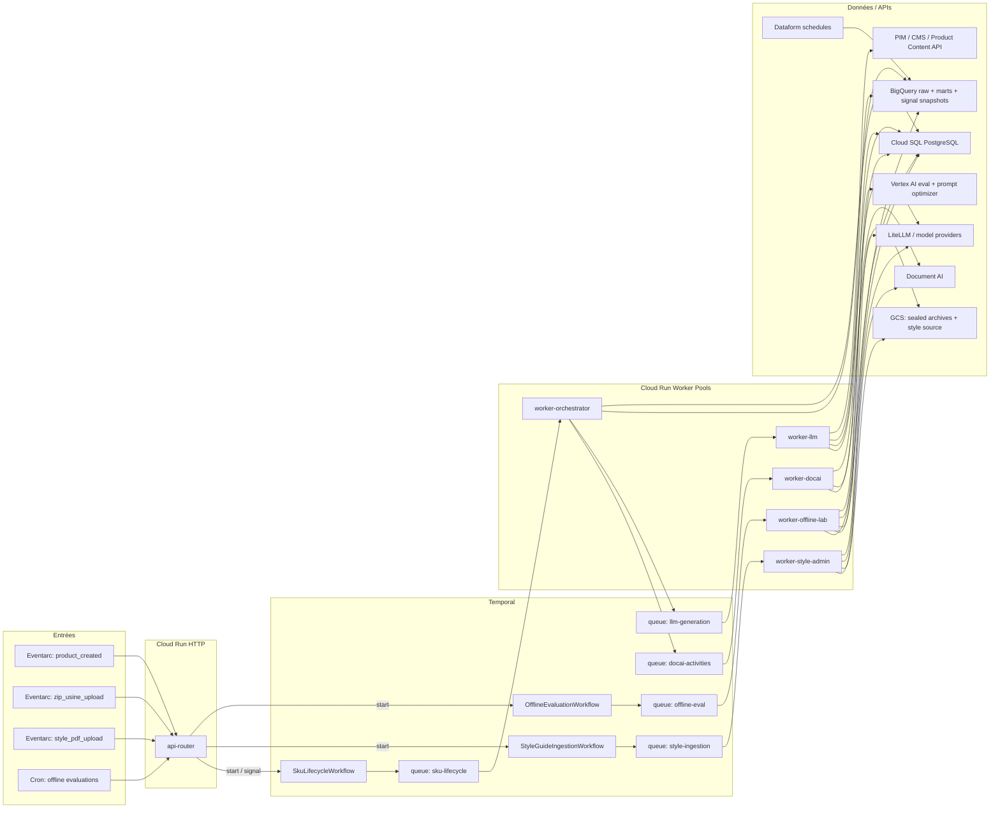
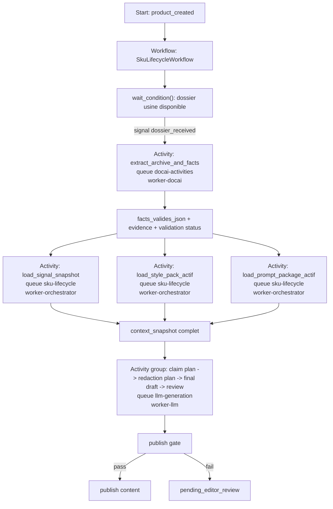
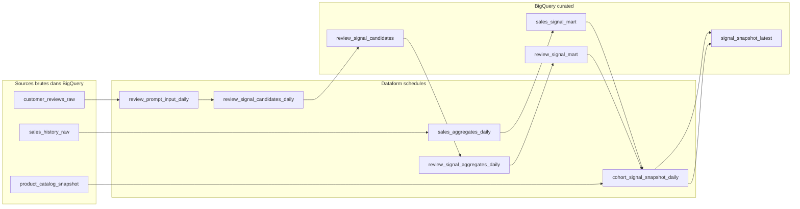

# Architecture SOTA Avril 2026 : Factory Writer Axolotl

Ce document remplace la version précédente et reformule l'architecture cible avec les recommandations les plus solides au 15 avril 2026, en s'appuyant sur :

- les patterns officiels **Temporal**
- les patterns officiels **Google Cloud**
- les contraintes métier décrites dans [CLIENT_REQUEST.md](/Users/floriansollami/Documents/GitHub/factory-writer/docs/CLIENT_REQUEST.md)
- la vision d'ensemble décrite dans [FINAL_ARCHITECTURE.md](/Users/floriansollami/Documents/GitHub/factory-writer/docs/FINAL_ARCHITECTURE.md)

## 0. Position d'architecture

La bonne architecture pour Axolotl n'est pas :

- un seul pipeline GenAI monolithique
- ni un seul workflow Temporal qui fait tout
- ni des appels LLM à la volée sur chaque source dans le hot path

La bonne architecture est une architecture en **4 flux séparés** :

1. **runtime produit online**
2. **ingestion admin du style guide**
3. **signal factory data** pour ventes et reviews
4. **offline lab** pour évaluer et optimiser

Le principe clé est :

**Temporal orchestre les cycles de vie métier et les attentes événementielles.  
BigQuery + Dataform préparent les données analytiques réutilisables.  
Le runtime ne consomme que des contextes déjà structurés, validés et versionnés.**

## 1. Les décisions structurantes

| Sujet | Décision recommandée |
| --- | --- |
| Synchronisation produit | `1 workflow Temporal par SKU` |
| Attente d'événements tardifs | `Signals Temporal` |
| Traitements lourds | `activities routées vers des task queues spécialisées` |
| Extraction facts usine | `Document AI + validation déterministe + evidence` |
| Style guide | `workflow admin séparé + style pack versionné` |
| Signaux ventes/reviews | `pipeline BigQuery/Dataform batch + snapshots matérialisés` |
| Extraction GenAI des reviews | `AI.GENERATE_TABLE ou équivalent batch, jamais en hot path` |
| Génération produit | `LiteLLM + prompt package actif promu offline` |
| Évaluations / optimizers | `Vertex AI dans le offline lab` |
| Déploiement workers | `Cloud Run worker pools pour le POC, malgré leur maturité plus faible` |
| Gouvernance Temporal | `Worker Versioning + Replay Testing + Continue-As-New` |

## 2. Pourquoi cette séparation est la meilleure approche

Le besoin client combine quatre réalités différentes :

- un produit peut être créé **avant** que le dossier technique n'arrive
- le guide de style change rarement, mais il est **très critique**
- les signaux ventes/reviews demandent une logique **batch analytique**
- l'optimisation des prompts et des modèles n'a rien à faire dans le SLA `< 2 min`

Donc :

- **Temporal** doit posséder le cycle de vie du SKU
- **Dataform + BigQuery** doivent posséder la fabrication des signaux marketing
- **un workflow admin séparé** doit posséder l'ingestion du style guide
- **un lab offline séparé** doit posséder les évaluations et promotions de variantes

## 3. Le schéma global cible



## 4. Comment lire ce schéma

Il faut le lire comme quatre couloirs indépendants.

### Couloir 1. Runtime produit

Il commence avec :

- `product_created`
- `zip_usine_upload`

Le rôle de ce couloir est :

- attendre les prérequis
- extraire les facts
- récupérer les signaux déjà préparés
- charger le style pack actif
- lancer la génération
- publier ou envoyer en review

Le cœur de ce couloir est `SkuLifecycleWorkflow`.

### Couloir 2. Style guide admin

Il commence avec :

- `style_pdf_upload`

Le rôle de ce couloir est :

- lire un PDF source
- le découper proprement
- en extraire des règles structurées
- faire valider par l'humain métier
- publier un `style_pack` versionné

Le cœur de ce couloir est `StyleGuideIngestionWorkflow`.

### Couloir 3. Signal factory data

Il ne dépend pas d'un SKU unique.

Son rôle est de produire en continu :

- des agrégats de ventes
- des extractions structurées sur reviews
- des signaux marketing comparables
- des snapshots prêts à consommer par le runtime

Ce couloir est possédé par :

- **BigQuery**
- **Dataform**

et non par Temporal.

### Couloir 4. Offline lab

Il sert à :

- relire les traces de production
- évaluer les variantes
- utiliser Vertex AI pour comparer et optimiser
- promouvoir un nouveau `prompt_package_actif`

Le cœur de ce couloir est `OfflineEvaluationWorkflow`.

## 5. Le runtime produit : la vraie logique Temporal

Le vrai pattern Temporal recommandé ici est :

- `1 workflow durable par SKU`
- `Signals` pour les événements externes tardifs
- `activities` routées vers des queues spécialisées
- pas de child workflows partout par défaut

### Schéma du flux SKU



### Pourquoi cette forme est meilleure

- le workflow garde l'état métier
- les activities font le vrai travail
- les queues spécialisées isolent les profils de charge
- on évite de transformer chaque étape en child workflow sans vraie raison

## 6. Où mettre les signaux ventes et reviews

C'est ici que l'ancienne version n'était pas assez claire.

### La bonne réponse concrète

Pour Axolotl, je recommande :

- **Dataform + BigQuery** pour produire les signaux en batch
- **Temporal runtime** pour consommer les snapshots déjà calculés

Je **ne recommande pas** :

- de recalculer les signaux reviews à la volée dans le workflow produit
- ni de faire tourner `AI.GENERATE_TABLE` dans le hot path

### Pourquoi

Le sujet ventes/reviews est un sujet de **produit de données**, pas de synchronisation d'événements SKU.

Il faut :

- lire beaucoup de données historiques
- calculer des cohortes
- agréger
- classifier des reviews
- republier des tables propres

Ça correspond exactement à ce que Google documente pour :

- **BigQuery**
- **Dataform**
- **scheduled pipelines**

Temporal n'est pas le meilleur moteur pour ce travail récurrent de transformation analytique.

Temporal doit plutôt :

- attendre le bon moment pour un SKU
- aller lire le snapshot final
- fallback si le snapshot manque

## 7. Architecture recommandée pour la signal factory



### Comment fonctionne ce pipeline

#### Étape 1. Ventes

On calcule de manière déterministe :

- top performances
- taux de conversion
- ventes par famille / sous-famille / segment
- signaux forts par cohorte comparable

Ici, il faut privilégier :

- SQL
- agrégations déterministes
- tests Dataform

#### Étape 2. Reviews

On prépare des entrées structurées review par review :

- review brute
- SKU source
- langue
- contexte produit

Puis on utilise une extraction GenAI **en batch**, pas au runtime.

#### Étape 3. Extraction GenAI des reviews

Ici, oui, tu peux utiliser :

- `AI.GENERATE_TABLE` dans BigQuery

mais dans un rôle précis :

- extraire des `review_signal_candidates`
- avec un schéma strict
- avec un output structuré
- avec échantillonnage QA offline

Donc on n'utilise pas `AI.GENERATE_TABLE` comme fondation critique du runtime.  
On l'utilise comme **étape de fabrication batch** du produit de données reviews.

#### Étape 4. Agrégation finale

Après l'extraction review par review, on repasse en SQL déterministe pour :

- agréger les signaux
- fusionner avec les ventes
- produire un `signal_snapshot_latest`

Ce snapshot est ensuite lu par le runtime produit.

## 8. Ce que je recommande concrètement pour `AI.GENERATE_TABLE`

### Oui, je le garde

Parce que dans ton cas :

- les reviews sont déjà en BigQuery
- tu veux des signaux structurés
- tu veux un pipeline analytique batch

Donc `AI.GENERATE_TABLE` est cohérent pour un POC.

### Mais je l'encadre fortement

Je recommande de l'utiliser avec :

- schéma de sortie strict
- température faible
- prompts versionnés
- statut et traces de génération conservés
- benchmark offline sur échantillons annotés
- agrégation SQL après extraction

### Sortie cible recommandée

Par review, la sortie doit ressembler à quelque chose comme :

```json
{
  "signaux_detectes": [
    {
      "code_signal": "stabilite",
      "polarite": "positive",
      "confiance": 0.87,
      "extrait_preuve": "la table reste tres stable meme sur terrasse"
    }
  ],
  "resume_structured": "review principalement positive sur la stabilite",
  "statut_extraction": "ok"
}
```

Ensuite seulement, tu agrèges.

### Pourquoi ce cadrage est important

Parce que le contrat stable de ton architecture n'est pas :

- la fonction BigQuery GenAI elle-même

Le contrat stable, c'est :

- la table `review_signal_candidates`
- la table `signal_snapshot_latest`

Si un jour tu remplaces `AI.GENERATE_TABLE` par :

- un worker batch LiteLLM orchestré par Temporal
- un autre moteur d'inférence

le runtime ne change pas.

## 9. Dataform ou Temporal pour les signaux ?

### Réponse courte

- **Dataform** pour le pipeline régulier
- **Temporal** seulement pour les cas exceptionnels

### Répartition recommandée

| Sujet | Outil principal |
| --- | --- |
| agrégats de ventes quotidiens | `Dataform + BigQuery` |
| extraction batch des reviews | `Dataform + BigQuery AI.GENERATE_TABLE` |
| fusion et snapshots de cohortes | `Dataform + BigQuery` |
| lecture du snapshot par SKU | `Temporal runtime` |
| backfill exceptionnel / rerun manuel | `Temporal admin workflow` optionnel |

### Pourquoi cette répartition est la meilleure

Parce que :

- Dataform est fait pour les transformations planifiées, testées et versionnées sur BigQuery
- Temporal est fait pour les workflows durables, pilotés par événements, sur des entités métier

Le bon design 2026 consiste à **ne pas faire faire à Temporal le travail de Dataform**, et inversement.

## 10. Le style guide : flux séparé et versionné

Le style guide ne doit pas vivre dans l'offline lab.

Il doit avoir son propre workflow :

- `StyleGuideIngestionWorkflow`

son propre worker :

- `worker-style-admin`

sa propre queue :

- `queue: style-ingestion`

### Pourquoi

Parce que le style guide est :

- rare
- métier critique
- validé par humain
- utilisé directement en production

Donc ce n'est pas une expérience de lab.

### Flux style guide recommandé

1. upload du PDF dans GCS
2. start du workflow admin
3. parse via Document AI Layout Parser
4. structured extraction via LiteLLM
5. validation déterministe
6. review humaine
7. publication d'un `style_pack_version`
8. activation d'un seul pack à la fois

## 11. Offline lab : ce qu'il doit faire exactement

L'offline lab doit être séparé et posséder :

- les datasets d'évaluation
- les traces de production
- les variantes de prompts
- les appels Vertex AI Eval
- les prompt optimizers
- la promotion du `prompt_package_actif`

### Ce qu'il lit

- traces runtime en base ou BigQuery
- sorties humaines corrigées
- cas gold annotés

### Ce qu'il produit

- `prompt_package_v2`, `v3`, etc.
- métriques comparatives
- statut baseline / candidate / active

## 12. Worker pools Cloud Run : position pragmatique pour le POC

Le choix de **Cloud Run worker pools** est maintenu ici volontairement pour le POC.

### Position honnête

Ce n'est pas la brique la plus conservatrice de toute l'architecture.

Mais pour un POC, ce choix reste acceptable si tu assumes trois choses :

- tu privilégies la simplicité de déploiement GCP-native
- tu acceptes une surface produit encore moins mature que les services Cloud Run HTTP classiques
- tu pilotes explicitement le nombre d'instances

### Reco pratique

Pour le POC :

- `worker-orchestrator` : faible volumétrie, toujours vivant
- `worker-docai` : capacité modérée, pilotée manuellement
- `worker-llm` : capacité plus large, pilotée manuellement
- `worker-style-admin` : très faible capacité
- `worker-offline-lab` : très faible capacité

Le point important est :

**dans ce POC, les worker pools servent à isoler les rôles et les ressources, pas à démontrer un autoscaling parfait.**

## 13. Les garde-fous SOTA qu'il faut absolument ajouter

### Côté Temporal

- `Worker Versioning`
- `Replay Testing`
- `Continue-As-New` sur les workflows longs
- idempotence sur les signaux d'événements

### Côté extraction facts

- evidence / provenance par fact
- validation déterministe forte
- review si facts critiques manquants

### Côté signaux marketing

- snapshots versionnés
- fallback de cohorte si exact match absent
- QA sur extraction review

### Côté génération

- prompt package actif versionné
- style pack actif versionné
- publish gate avant publication storefront

## 14. Le fallback si un signal snapshot manque

Le runtime produit ne doit pas casser si le `signal_snapshot_latest` exact n'existe pas encore.

Il faut une stratégie de fallback :

1. cohorte exacte : `famille + sous_famille + segment + matériau`
2. cohorte élargie : `famille + sous_famille + segment`
3. cohorte large : `famille + segment`
4. pas de signal fiable : génération facts + style uniquement, puis `pending_editor_review`

Cette logique est importante pour respecter :

- le SLA
- la robustesse
- le principe "context-first"

## 15. La phrase simple à dire au client

Tu peux résumer l'architecture comme ça :

> Nous séparons Factory Writer en quatre flux complémentaires. Temporal orchestre le cycle de vie de chaque SKU et attend les événements métier tardifs. Dataform et BigQuery fabriquent à l'avance les signaux marketing à partir des ventes et des reviews, y compris la partie GenAI sur les reviews, mais toujours hors du hot path. Le style guide est ingéré et validé dans un flux admin distinct pour publier un style pack versionné. Enfin, un lab offline séparé utilise Vertex AI pour évaluer et optimiser les prompts sans impacter le SLA de production.

## 16. Conclusion

La version la plus solide de l'architecture Axolotl en avril 2026 est donc :

- **Temporal** pour le cycle de vie produit et les workflows métiers durables
- **Cloud Run worker pools** pour exécuter des workers spécialisés dans le POC
- **Document AI** pour les facts usine et le parsing structurel du style guide
- **BigQuery + Dataform** pour la fabrication récurrente des signaux ventes/reviews
- **AI.GENERATE_TABLE** uniquement comme brique batch d'enrichissement review, jamais comme dépendance runtime
- **LiteLLM** pour la chaîne de génération
- **Vertex AI** pour l'évaluation et l'optimisation offline

Ce n'est pas une architecture "LLM partout".  
C'est une architecture où chaque brique a un rôle précis, stable et justifiable.

## Sources

- [Temporal Workers](https://docs.temporal.io/workers)
- [Temporal Task Queues](https://docs.temporal.io/task-queue)
- [Temporal Workflow message passing](https://docs.temporal.io/encyclopedia/workflow-message-passing)
- [Temporal Child Workflows](https://docs.temporal.io/child-workflows)
- [Temporal Worker performance](https://docs.temporal.io/develop/worker-performance)
- [Temporal Safe deployments](https://docs.temporal.io/develop/safe-deployments)
- [Cloud Run worker pools](https://docs.cloud.google.com/run/docs/deploy-worker-pools)
- [Manage Cloud Run worker pools](https://docs.cloud.google.com/run/docs/managing/workerpools)
- [BigQuery orchestrate workloads](https://docs.cloud.google.com/bigquery/docs/orchestrate-workloads)
- [BigQuery schedule pipelines](https://cloud.google.com/bigquery/docs/schedule-pipelines)
- [BigQuery AI.GENERATE_TABLE](https://docs.cloud.google.com/bigquery/docs/generate-table)
- [Document AI Gemini layout parser](https://docs.cloud.google.com/document-ai/docs/layout-parse-chunk)
- [Vertex AI evaluation overview](https://docs.cloud.google.com/vertex-ai/generative-ai/docs/models/evaluation-overview)
- [Vertex AI prompt optimizer](https://docs.cloud.google.com/vertex-ai/generative-ai/docs/learn/prompts/prompt-optimizer)
