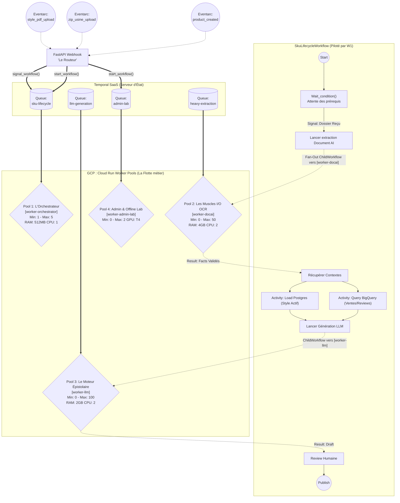

# Design d'Architecture Global : L'Écosystème Axolotl (SOTA 2026)

L'architecture *Silicon Valley 2026* recommande formellement l'utilisation du **"Domain-Driven Fleet Segmentation" (Task Queue Partitioning)** allié au **"Entity Workflow Pattern"**. 

Ce document explique comment gérer le paradoxe du "Je dois générer une fiche produit, mais je dois attendre d'avoir absolument toutes les briques (Ventes, Retours, PDF Usine, Style de Marque)".

## 1. La Problématique de Synchronicité

- **Le Style Guide** : Mis à jour 1 fois par an.
- **Les Ventes et Reviews Client** : Pipeline BigQuery qui tourne en tâche de fond (Cron/Batch) en permanence ou généré à la volée.
- **Le Produit PIM (`product_created`)** : Le département catalogue crée le SKU dans le PIM (mais le dossier d'usine n'est pas encore prêt).
- **Le Dossier Technique Usine** : Arrive 2 semaines plus tard dans Google Cloud Storage en `.zip`.

**Comment faire sans faire exploser la base de données ou créer des usines à gaz ?**
Réponse : Le **Pattern "Entity Workflow" de Temporal**. 
On ne crée pas un script qui "essaye" de générer et s'arrête si ça manque. On démarre un Workflow immortel *dès la création du produit*, qui se met en pause mathématique jusqu'à ce que tous les feux soient au vert.

---

## 2. Le Diagramme Macro-Architectural

Voici le plan exact pour répartir l'intelligence applicative sur Google Cloud Run. 

> *À noter sur la flotte de Workers* : Nous avons un seul Monorepo (le même code source), mais nous allons déployer **4 instances physiques Cloud Run (Cloud Run Worker Pools)** différentes. Chacune aura des règles de CPU/RAM d'auto-scaling adaptées à son métier pour un coût Google Cloud optimisé au centime près.

---

## 3. Comprendre le Processus Étape par Étape

### 1. La Naissance (`product_created`)
Dès qu'un produit est créé dans le système Axolotl, un webhook FastAPI lance le `SkuLifecycleWorkflow` sur la **[sku-lifecycle-queue]**. Ce workflow est orchestré par le **Pool 1** (peu gourmand en ressources, car son but n'est que de "Penser et Attendre").
Le Worker 1 exécute `await workflow.wait_condition(lambda: self.tech_dossier_received == True)`. 
*Temporal "gèle" (endort) ce programme, et il consomme 0 CPU de ton serveur.* Il peut attendre 3 ans s'il le faut.

### 2. Le Déclic (L'archive GCS Usine)
Des semaines plus tard, l'usine uploade le `.zip`. Eventarc frappe l'API FastAPI. FastAPI reconnait le SKU, et dit :
`await client.get_workflow_handle("sku-123").signal("dossier_received", gcs_uri)`
Le Worker 1 se réveille !

### 3. Le Délégat (Fan-Out vers d'autres Queues)
Le Worker 1 ne fait **pas** le traitement de l'OCR. C'est l'Orchestrateur (SOTA Rule: *Workflows orchestrate, they don't do heavy lifting*).
Le Worker 1 va donc lancer un **Child Workflow** sur la queue **[heavy-extraction]**.
Bimm ! Ça réveille le **Pool 2 (worker-docai)** ! C'est ce Pool là, gonflé avec 4Go de RAM, qui va extraire le ZIP, appeler Document AI, compiler les Facts, valider l'Idempotence, et renvoyer le Master JSON au Worker 1. 

### 4. L'Enrichissement (Ventes, Retours, Marque)
Dès que le Pool 2 a fini l'extraction (les muscles), l'Orchestrateur (Pool 1) reprend la main et lance en parallèle (`asyncio.gather`) :
1. Une activité pour récupérer auprès de **BigQuery** la *Table Mart* des ventes et des classifications des reviews clients pour une cohorte comparable au produit.
2. Une activité pour récupérer auprès de **PostgreSQL** le *Versionné* du Guide de Style actuellement ACTIF (créé par le worker-admin-lab un jour). 

### 5. La Génération Fiche Produit
Une fois que le Worker 1 détient TOUTES les briques (Style + Facts Usine + Sales/Reviews), il ordonne un Child Workflow sur la queue **[llm-generation]**.
C'est le **Pool 3 (worker-llm)** qui scalera de manière agressive à 100 instances pour appeler LiteLLM via des chaînes structurées intensives sans ralentir le reste du système.

---

## 4. Et pour le LAB d'Amélioration (Offline) ?

Le Lab offline (pour évaluer les prompts, pour juger avec un LLM Judge, pour l'extraction administrative exceptionnelle du Style Guide) est isolé sur le **Pool 4 (worker-admin-lab)** tournant sur la queue `admin-lab-queue`. 
- Pourquoi ? Parce qu'on peut allouer une instance GPU à ce Cloud Run ou utiliser des instances très lentes / bas de gamme selon le budget. 
- Les "Traces" générées par le *Pool 3* iront dans Bigquery. Le *Pool 4* se réveillera toutes les nuits (Cron Temporal) pour analyser la qualité, optimiser un prompt via Vertex AI, et mettre à jour la BDD pour dire : "Voici le nouveau Prompt de Génération V2". Le lendemain, le Pool 3 piochera naturellement cette V2 !

## Conclusion Stratégique
Tout réside dans un seul répertoire `backend/`. Mais en production, l'architecture est **Fractale**. Chaque métier a son "Gouverneur de ressources" et ses "Limites API", gérés par un `WORKER_ROLE` au démarrage du container Cloud Run. C'est ça, la vraie maîtrise de Temporal en 2026.
