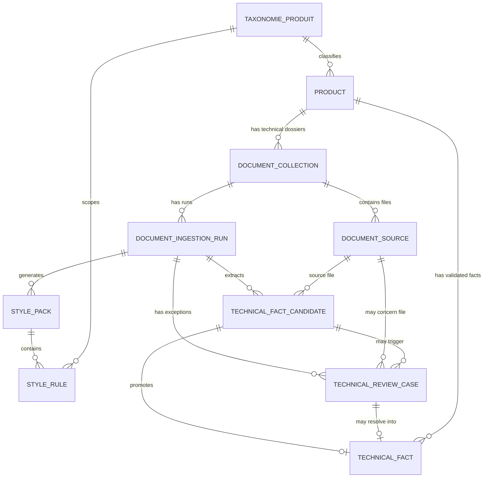

# ERD POC final simplifie

Ce document fige le modele POC simplifie pour l'ingestion du guide de style et des dossiers techniques usine.

Le perimetre POC est volontairement limite :

- style guide : un dossier global, un PDF, extraction via Document AI Layout Parser, generation d'un pack candidat, validation humaine regle par regle ;
- dossiers techniques usine : un dossier par produit, plusieurs PDFs separes, Custom Classifier, Enterprise OCR, Custom Extractor Foundation Model, validation deterministe et review humaine par exception ;
- pas de Custom Splitter ;
- pas de table de preuves abstraite ;
- une preuve principale denormalisee dans `style_rule` et `technical_fact_candidate`.

## ERD final simplifie



## Enums simplifies

| Enum | Valeurs |
| --- | --- |
| `collection_kind` | `STYLE_GUIDE`, `TECHNICAL_DOSSIER` |
| `document_type` | `STYLE_GUIDE`, `TECHNICAL_SHEET`, `BLUEPRINT`, `ECO_CERTIFICATE`, `ASSEMBLY_NOTICE`, `MATERIAL_SPECIFICATION`, `UNKNOWN` |
| `document_collection.statut` | `EN_ATTENTE`, `EN_COURS`, `A_VALIDER`, `TERMINE`, `ERREUR` |
| `document_source.statut` | `EN_ATTENTE`, `EN_COURS`, `TERMINE`, `ERREUR` |
| `document_ingestion_run.statut` | `EN_ATTENTE`, `EN_COURS`, `A_VALIDER`, `TERMINE`, `ERREUR`, `ANNULE` |
| `current_step` | `UPLOAD`, `DOCUMENT_CLASSIFICATION`, `OCR_PROOF`, `LAYOUT_PARSE`, `FACT_EXTRACTION`, `DETERMINISTIC_VALIDATION`, `LLM_DRAFT_PACK`, `HUMAN_REVIEW`, `PROMOTION`, `DONE` |
| `style_pack.statut` | `BROUILLON`, `ACTIF`, `ARCHIVE` |
| `style_rule.decision_editoriale` | `A_VALIDER`, `APPROUVEE`, `DESACTIVEE` |
| `style_rule.origine` | `LLM`, `MODIFIEE` |
| `type_regle` | `VOIX`, `TON`, `FORMATAGE`, `PROMESSE_INTERDITE` |
| `niveau_contrainte` | `HARD`, `SOFT` |
| `technical_fact_candidate.validation_status` | `AUTO_VALIDATED`, `NEEDS_REVIEW`, `REJECTED`, `PROMOTED` |
| `technical_review_case.case_type` | `CLASSIFICATION_UNCERTAIN`, `LOW_OCR_QUALITY`, `DOCUMENT_UNREADABLE`, `MISSING_REQUIRED_FIELD`, `LOW_CONFIDENCE`, `VALUE_OUT_OF_RANGE`, `EXACT_MATCH_FAILED`, `CONTRADICTION`, `LLM_SELF_CHECK_FLAG` |
| `technical_review_case.trigger_source` | `CLASSIFIER`, `OCR`, `CUSTOM_EXTRACTOR`, `PYTHON_VALIDATOR`, `LLM_SELF_CHECK` |
| `technical_review_case.severity` | `BLOCKING`, `WARNING` |
| `technical_review_case.status` | `A_TRAITER`, `APPROUVE`, `CORRIGE`, `REJETE`, `DOCUMENT_A_REMPLACER` |
| `technical_review_case.resolution_action` | `APPROVE_DETECTED_VALUE`, `CORRECT_VALUE`, `REJECT_VALUE`, `REQUEST_NEW_DOCUMENT` |
| `technical_fact.validation_source` | `SYSTEM`, `HUMAN` |
| `extraction_method` | `EXTRACT`, `DERIVE` |

## 1. `product`

| Champ | Exemple complet |
| --- | --- |
| `id` | `prod_001` |
| `sku` | `AXO-TABLE-TECK-190` |
| `name` | `Table en teck 190 cm` |
| `taxonomie_produit_id` | `taxo_mobilier_jardin` |
| `created_at` | `2026-04-20T10:00:00Z` |
| `updated_at` | `2026-04-20T10:00:00Z` |

## 2. `document_collection`

| Champ | Exemple style guide | Exemple dossier usine |
| --- | --- | --- |
| `id` | `coll_style_001` | `coll_tech_001` |
| `collection_kind` | `STYLE_GUIDE` | `TECHNICAL_DOSSIER` |
| `product_id` | `null` | `prod_001` |
| `statut` | `A_VALIDER` | `A_VALIDER` |
| `replaced_by_collection_id` | `null` | `null` |
| `dernier_message_erreur` | `null` | `Certification FSC manquante` |
| `created_at` | `2026-04-20T10:00:00Z` | `2026-04-20T10:10:00Z` |
| `updated_at` | `2026-04-20T10:30:00Z` | `2026-04-20T10:30:00Z` |

Contraintes :

```text
STYLE_GUIDE => product_id IS NULL

TECHNICAL_DOSSIER => product_id IS NOT NULL
```

## 3. `document_source`

| Champ | Exemple style guide | Exemple dossier usine |
| --- | --- | --- |
| `id` | `src_style_pdf_001` | `src_tech_sheet_001` |
| `collection_id` | `coll_style_001` | `coll_tech_001` |
| `original_file_name` | `AXOLOTL_STYLE_GUIDE_V4.pdf` | `fiche_technique.pdf` |
| `storage_uri` | `gs://factory-writer/style-guide.pdf` | `gs://factory-writer/fiche_technique.pdf` |
| `storage_bucket` | `factory-writer` | `factory-writer` |
| `storage_object_name` | `sources/style-guides/style-guide.pdf` | `technical-dossiers/prod_001/fiche_technique.pdf` |
| `storage_generation` | `1776626134167000` | `1776627000000000` |
| `storage_metageneration` | `1` | `1` |
| `storage_content_type` | `application/pdf` | `application/pdf` |
| `storage_size_bytes` | `842139` | `1934021` |
| `document_type` | `STYLE_GUIDE` | `TECHNICAL_SHEET` |
| `classification_confidence` | `null` | `0.94` |
| `quality_score_min` | `null` | `0.82` |
| `quality_score_avg` | `null` | `0.93` |
| `quality_metadata_json` | `null` | `{"defects":[]}` |
| `statut` | `TERMINE` | `TERMINE` |
| `replaced_by_source_id` | `null` | `null` |
| `dernier_message_erreur` | `null` | `null` |
| `created_at` | `2026-04-20T10:00:00Z` | `2026-04-20T10:10:00Z` |
| `updated_at` | `2026-04-20T10:20:00Z` | `2026-04-20T10:20:00Z` |

## 4. `document_ingestion_run`

| Champ | Exemple style guide | Exemple dossier usine |
| --- | --- | --- |
| `id` | `run_style_001` | `run_tech_001` |
| `collection_id` | `coll_style_001` | `coll_tech_001` |
| `pipeline_kind` | `STYLE_GUIDE_EXTRACTION` | `TECHNICAL_DOSSIER_EXTRACTION` |
| `statut` | `A_VALIDER` | `A_VALIDER` |
| `current_step` | `HUMAN_REVIEW` | `HUMAN_REVIEW` |
| `temporal_workflow_id` | `style-guide-ingestion-run_style_001` | `technical-dossier-ingestion-run_tech_001` |
| `temporal_run_id` | `7c1a...` | `8d2b...` |
| `extraction_steps_json` | voir exemple ci-dessous | voir exemple ci-dessous |
| `validation_summary_json` | `{"rules_generated":12,"rules_to_review":12}` | `{"auto_validated":8,"review_cases":2}` |
| `error_message` | `null` | `null` |
| `started_at` | `2026-04-20T10:02:00Z` | `2026-04-20T10:15:00Z` |
| `completed_at` | `null` | `null` |
| `created_at` | `2026-04-20T10:02:00Z` | `2026-04-20T10:15:00Z` |
| `updated_at` | `2026-04-20T10:28:00Z` | `2026-04-20T10:28:00Z` |

Exemple `extraction_steps_json` style guide :

```json
[
  {
    "step_kind": "LAYOUT_PARSE",
    "provider": "google_document_ai",
    "processor_kind": "layout_parser",
    "processor_version": "pretrained-layout-parser-v1.6-pro-2025-12-01",
    "provider_job_id": "projects/.../operations/123",
    "status": "SUCCEEDED",
    "output_uri": "gs://.../style-guide-layout/run_style_001/",
    "request_config": {
      "chunking_config": {
        "chunk_size": 1000,
        "include_ancestor_headings": true
      }
    }
  },
  {
    "step_kind": "LLM_DRAFT_PACK",
    "provider": "litellm_sdk",
    "model": "vertex_ai/gemini-3-pro-preview",
    "status": "SUCCEEDED"
  }
]
```

Exemple `extraction_steps_json` dossier usine :

```json
[
  {
    "step_kind": "DOCUMENT_CLASSIFICATION",
    "provider": "google_document_ai",
    "processor_kind": "custom_classifier",
    "processor_version": "classifier-v1",
    "status": "SUCCEEDED"
  },
  {
    "step_kind": "OCR_PROOF",
    "provider": "google_document_ai",
    "processor_kind": "enterprise_ocr",
    "request_config": {
      "enableNativePdfParsing": true,
      "enableImageQualityScores": true
    },
    "status": "SUCCEEDED"
  },
  {
    "step_kind": "FACT_EXTRACTION",
    "provider": "google_document_ai",
    "processor_kind": "custom_extractor_foundation_model",
    "processor_version": "foundation-v1",
    "status": "SUCCEEDED"
  },
  {
    "step_kind": "DETERMINISTIC_VALIDATION",
    "provider": "factory_writer",
    "status": "NEEDS_REVIEW"
  }
]
```

## 5. `style_pack`

| Champ | Exemple complet |
| --- | --- |
| `id` | `pack_001` |
| `ingestion_run_id` | `run_style_001` |
| `statut` | `BROUILLON` |
| `est_actif` | `false` |
| `prompt_registry_provider` | `local` |
| `prompt_name` | `style_guide_extract_rules` |
| `prompt_version` | `v1` |
| `llm_model` | `vertex_ai/gemini-3-pro-preview` |
| `llm_temperature` | `0.0` |
| `llm_max_tokens` | `8192` |
| `llm_response_format_name` | `style_pack_candidate_v1` |
| `rendered_system_prompt_hash` | `sha256:abc...` |
| `rendered_user_prompt_hash` | `sha256:def...` |
| `validation_summary_json` | `{"rules_validated":12,"deduplicated":1}` |
| `approuve_le` | `null` |
| `created_at` | `2026-04-20T10:05:00Z` |
| `updated_at` | `2026-04-20T10:05:00Z` |

## 6. `style_rule`

| Champ | Exemple complet |
| --- | --- |
| `id` | `rule_001` |
| `pack_id` | `pack_001` |
| `taxonomie_produit_id` | `taxo_mobilier_jardin` |
| `type_regle` | `TON` |
| `niveau_contrainte` | `SOFT` |
| `texte_regle_original` | `Favoriser matière, stabilité et scène extérieure.` |
| `texte_regle` | `Favoriser la matière, la stabilité et l’usage extérieur.` |
| `decision_editoriale` | `A_VALIDER` |
| `est_actif` | `false` |
| `origine` | `LLM` |
| `source_evidence_text` | `SR-01 mobilier_jardin Favoriser matière, stabilité, confort d'usage et scène de vie extérieure.` |
| `source_evidence_provider_id` | `c1` |
| `source_evidence_page_start` | `1` |
| `source_evidence_page_end` | `1` |
| `source_evidence_json` | `{"chunkId":"c1","pageSpan":{"pageStart":1,"pageEnd":1}}` |
| `commentaire_review` | `null` |
| `reviewed_at` | `null` |
| `reviewed_by` | `null` |
| `created_at` | `2026-04-20T10:05:10Z` |
| `updated_at` | `2026-04-20T10:05:10Z` |

## 7. `technical_fact_candidate`

| Champ | Exemple complet |
| --- | --- |
| `id` | `fact_cand_001` |
| `ingestion_run_id` | `run_tech_001` |
| `source_id` | `src_tech_sheet_001` |
| `field_name` | `dimension_width_cm` |
| `raw_value` | `190 cm` |
| `normalized_value` | `190` |
| `unit` | `cm` |
| `extractor_confidence` | `0.96` |
| `extraction_method` | `EXTRACT` |
| `validation_status` | `AUTO_VALIDATED` |
| `review_required` | `false` |
| `review_reason` | `null` |
| `source_evidence_text` | `190 cm` |
| `source_page` | `2` |
| `source_bbox_json` | `{"left":0.12,"top":0.43,"width":0.04,"height":0.02}` |
| `raw_entity_json` | `{"type":"dimension_width_cm","mentionText":"190 cm","confidence":0.96}` |
| `created_at` | `2026-04-20T10:24:00Z` |
| `updated_at` | `2026-04-20T10:24:00Z` |

## 8. `technical_review_case`

| Champ | Exemple complet |
| --- | --- |
| `id` | `case_001` |
| `ingestion_run_id` | `run_tech_001` |
| `source_id` | `src_tech_sheet_001` |
| `fact_candidate_id` | `fact_cand_001` |
| `case_type` | `VALUE_OUT_OF_RANGE` |
| `trigger_source` | `PYTHON_VALIDATOR` |
| `severity` | `BLOCKING` |
| `status` | `A_TRAITER` |
| `field_name` | `dimension_width_cm` |
| `title` | `Largeur hors bornes attendues` |
| `description` | `La valeur 1900 cm dépasse la borne maximale attendue pour mobilier_jardin.` |
| `detected_value` | `1900` |
| `detected_unit` | `cm` |
| `suggested_value` | `190` |
| `suggested_unit` | `cm` |
| `corrected_value` | `null` |
| `corrected_unit` | `null` |
| `resolution_action` | `null` |
| `resolution_comment` | `null` |
| `resolved_fact_id` | `null` |
| `resolved_by` | `null` |
| `resolved_at` | `null` |
| `metadata_json` | `{"bounds":{"min":40,"max":400}}` |
| `created_at` | `2026-04-20T10:25:00Z` |
| `updated_at` | `2026-04-20T10:25:00Z` |

## 9. `technical_fact`

| Champ | Exemple complet |
| --- | --- |
| `id` | `fact_001` |
| `product_id` | `prod_001` |
| `source_candidate_id` | `fact_cand_001` |
| `field_name` | `dimension_width_cm` |
| `value` | `190` |
| `unit` | `cm` |
| `validation_source` | `SYSTEM` |
| `validated_at` | `2026-04-20T10:26:00Z` |
| `validated_by` | `system` |
| `created_at` | `2026-04-20T10:26:00Z` |
| `updated_at` | `2026-04-20T10:26:00Z` |

## 10. `taxonomie_produit`

| Champ | Exemple complet |
| --- | --- |
| `id` | `taxo_mobilier_jardin` |
| `famille_code` | `mobilier_jardin` |
| `libelle_fr` | `Mobilier de jardin` |
| `parent_id` | `null` |
| `created_at` | `2026-04-20T09:00:00Z` |
| `updated_at` | `2026-04-20T09:00:00Z` |

## Contraintes cles

```text
document_collection.collection_kind = STYLE_GUIDE
=> product_id IS NULL

document_collection.collection_kind = TECHNICAL_DOSSIER
=> product_id IS NOT NULL

product.taxonomie_produit_id
=> FK taxonomie_produit.id

document_source.storage_bucket + storage_object_name + storage_generation
=> unique

document_ingestion_run.temporal_workflow_id
=> unique

style_pack.est_actif = true
=> unique global pour le POC

technical_fact.product_id + field_name
=> unique

technical_review_case.resolved_fact_id
=> nullable, FK technical_fact.id

technical_review_case.fact_candidate_id
=> nullable, car certains cas n'ont aucun fact candidat

technical_review_case.source_id
=> nullable, car certains cas peuvent etre globaux au dossier
```

## Positionnement POC

Ce modele garde :

- le guide de style ;
- les dossiers techniques multi-PDF ;
- la review humaine ;
- les facts valides ;
- les preuves principales ;
- le lien produit-taxonomie.

Il evite volontairement :

- une table de preuves abstraite ;
- une table de preuves style-rule ;
- le Custom Splitter ;
- une table `document_extraction_step` separee.

Les details providers et configs restent dans `document_ingestion_run.extraction_steps_json`.
