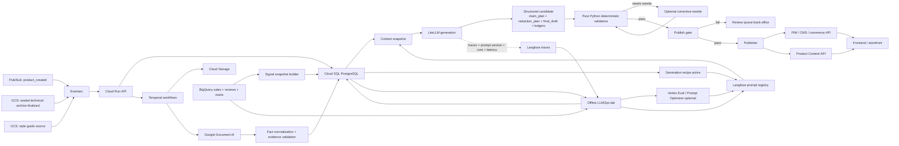
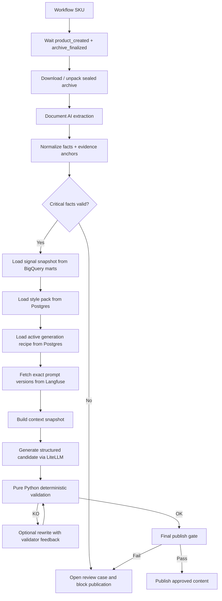
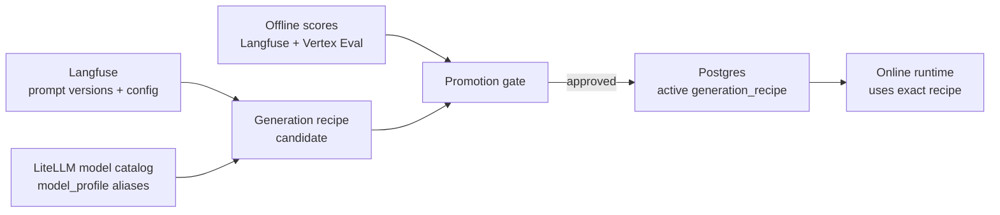
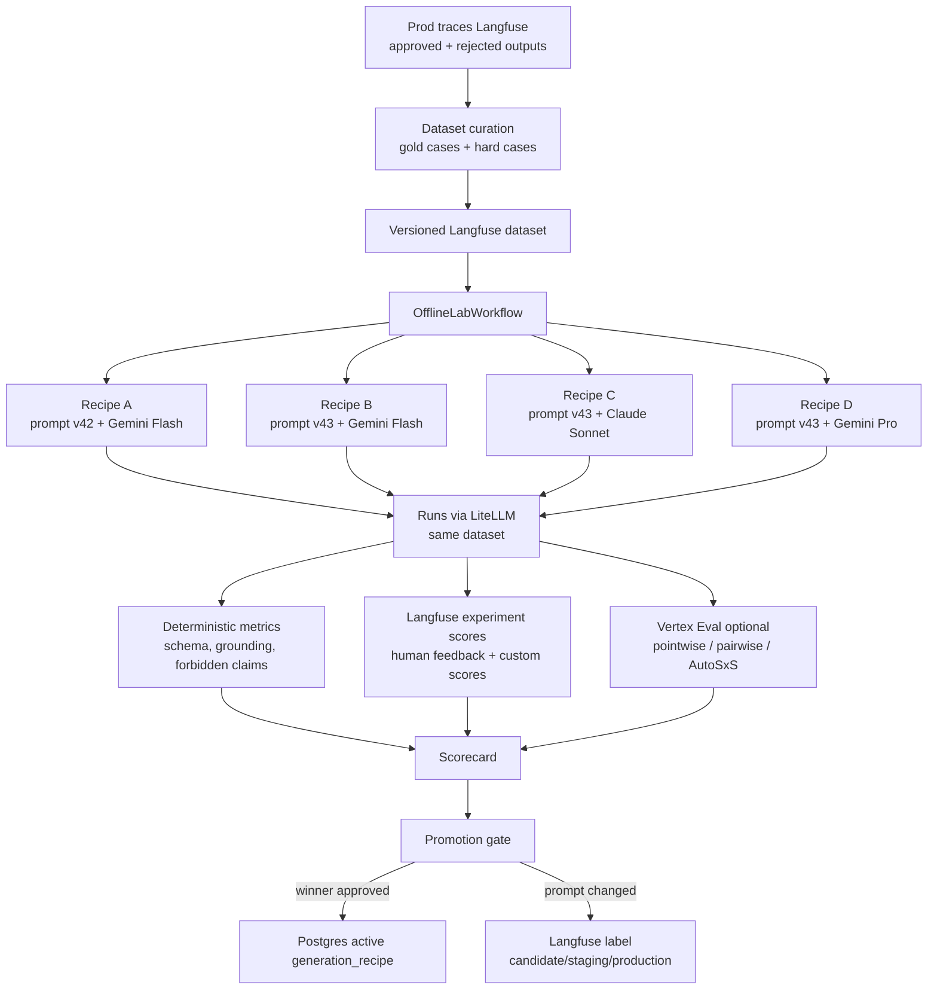
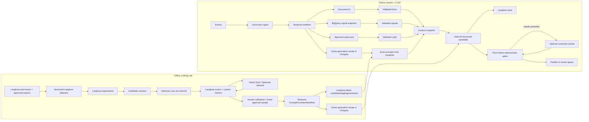
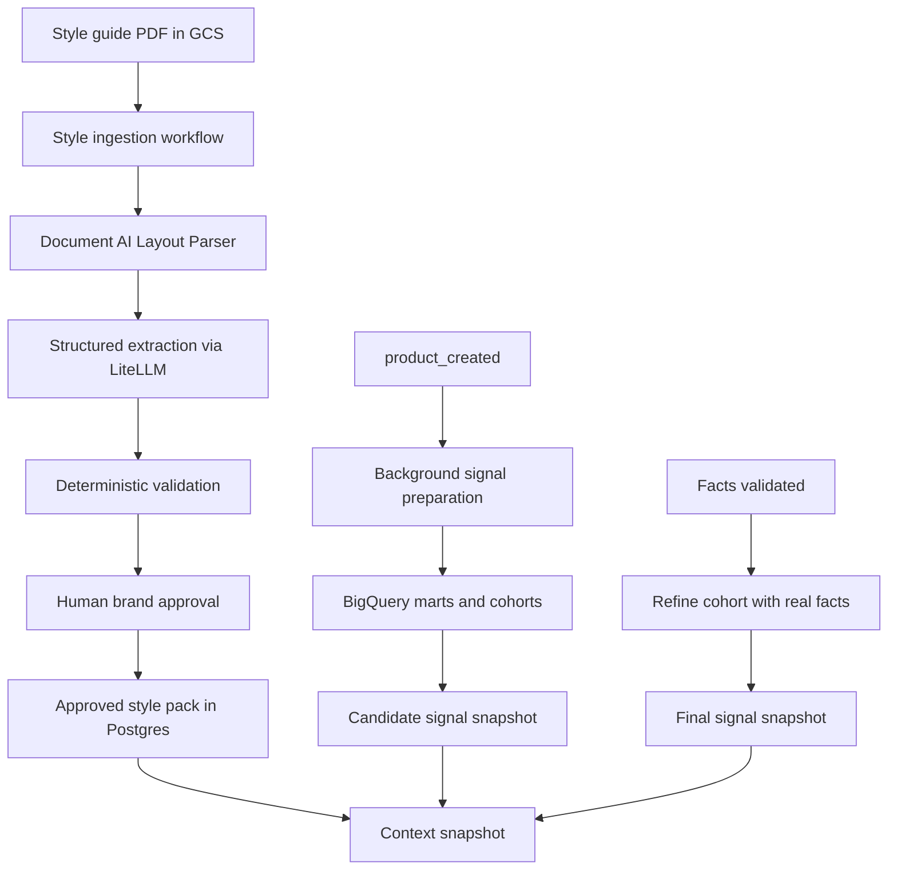

# Architecture Cible

Pour Axolotl, l’architecture cible la plus solide en 2026 est une architecture en **deux vitesses** :

1. **un runtime online** orienté SLA `< 2 min`
2. **un lab offline / LLMOps** orienté traces, datasets, évaluations, optimisation et promotion contrôlée des variantes

C’est le point clé.  
Si tu mélanges optimisation, judge LLM, pairwise, calibrations humaines et génération client dans le même flux, tu casses ton SLA et tu rends le système ingérable.

Le point qui manquait dans ma réponse précédente est celui-ci :

**le online ne part pas d’un prompt “brut non optimisé”.**  
Le online utilise toujours une **`generation_recipe_active` déjà promue offline**.

Autrement dit :

- l’**offline** sert à choisir la meilleure recette
- l’**online** applique cette recette au nouveau SKU en moins de 2 minutes

Donc le nouveau produit n’est pas “non optimisé” ; il est généré avec la **meilleure version connue à date**.  
Ce qui reste vrai, en revanche, c’est que le SKU est nouveau, donc il peut encore y avoir des cas limites. C’est pour ça qu’il faut un **publish gate** et, au début, une **mise en production progressive**.

---

## 1. Décision d’architecture

### Ce qui doit être vrai

- **zéro hallucination technique** : seules les infos extraites et validées depuis le dossier usine peuvent devenir des facts publiables
- **vendor lock-in minimal** : la génération passe par **LiteLLM**
- **orchestration robuste** : **Temporal** pilote tout le workflow par SKU
- **LLMOps SOTA 2026** : **Langfuse** porte le prompt registry, les traces, les datasets et les scores
- **évaluation avancée** : **Vertex AI Eval / Prompt Optimizer** reste une brique offline optionnelle, jamais dans le hot path
- **control plane métier** : **Postgres** décide quelle `generation_recipe` exacte est autorisée en production
- **scalabilité saisonnière** : un workflow indépendant par SKU, piloté par files Temporal
- **distribution frontend propre** : le storefront ne lit pas directement le moteur GenAI

### Ce que ça veut dire concrètement pour le client

Il faut distinguer trois moments :

1. **bootstrapping initial**
2. **runtime de génération pour un nouveau produit**
3. **amélioration continue du moteur**

### 1. Bootstrapping initial

Avant de publier la première vraie fiche automatiquement, tu construis :

- un dataset de départ avec historiques Axolotl
- quelques cas annotés manuellement
- quelques cas synthétiques difficiles
- une `generation_recipe_v1` pour :
  - `generate_sheet_candidate`
  - `rewrite_with_validator_feedback`
  - extraction style guide
  - extraction signaux reviews, si nécessaire

Puis tu fais tourner l’offline lab :

- Langfuse stocke les prompts, traces, datasets et scores
- Vertex AI Eval / Prompt Optimizer peut être utilisé pour les benchmarks avancés
- Postgres promeut la `generation_recipe_v1` active

Donc, le premier vrai SKU en prod n’utilise **pas** un prompt improvisé.  
Il utilise déjà une **v1 évaluée offline**.

### 2. Runtime pour un nouveau produit

Quand un nouveau SKU arrive :

- on ne ré-optimise pas les prompts pour ce SKU
- on applique la **meilleure version active**
- on valide fortement les sorties
- on décide :
  - soit `published`
  - soit `pending_editor_review`

### 3. Amélioration continue

Ensuite, les traces de prod, les sorties validées, les corrections humaines et les cas ratés repartent dans le lab offline pour produire :

- `generation_recipe_v2`
- puis `v3`
- etc.

### Rôle des outils LLMOps

| Outil | Rôle |
| --- | --- |
| `LiteLLM` | Gateway d'exécution des modèles : routing, fallback, clés, budgets, provider abstraction. |
| `Langfuse` | Prompt registry, traces LLM, datasets, experiments, scores, human feedback. |
| `Vertex AI Eval` | Moteur offline avancé pour pointwise, pairwise, rubrics, grounding, instruction following. |
| `Vertex Prompt Optimizer` | Générateur de prompts candidats, jamais mécanisme de promotion automatique. |
| `Postgres` | Source officielle de la `generation_recipe` active et des décisions de promotion. |

La règle d'architecture est :

```text
Langfuse garde la mémoire LLMOps.
Vertex aide à évaluer ou optimiser en offline.
Postgres décide ce qui est autorisé en production.
LiteLLM exécute au runtime.
```

---

## 2. Vue d’ensemble



---

## 2 bis. Comment on extrait le style guide

C’était un angle mort dans la réponse précédente.  
Le style guide ne doit **pas** être consommé tel quel au runtime.

Le bon pattern est :

- le PDF source vit dans **GCS**
- mais ce PDF est transformé en **style pack structuré versionné**
- le runtime lit uniquement ce **style pack approuvé**

### Outil recommandé

Pour le style guide, je recommande une pipeline séparée :

1. **Document AI Layout Parser** pour lire le PDF, récupérer :
   - titres
   - sections
   - sous-sections
   - chunks cohérents
2. **LiteLLM avec structured outputs** pour transformer ces chunks en JSON métier
3. **validation déterministe**
4. **review / approbation humaine**
5. **publication d’un `style_pack_version` dans Postgres**

### Pourquoi Document AI Layout Parser ici

Parce que le problème du style guide n’est pas d’extraire des dimensions ou des tables comme dans un dossier usine.  
Le problème est de :

- préserver la structure du document
- comprendre les sections
- chunker proprement
- ensuite laisser un LLM mapper ces sections vers ton schéma métier

Le Layout Parser est très adapté à ça, parce qu’il extrait justement :

- headings
- listes
- blocs
- structure de page
- chunks utiles à la récupération

### Puis transformation LLM structurée

Ensuite tu fais une extraction structurée du type :

```json
{
  "voice_rules": [],
  "tone_profiles": [],
  "forbidden_lexicon": [],
  "preferred_lexicon": [],
  "formatting_rules": [],
  "category_specific_rules": []
}
```

Le LLM ne doit pas produire du texte libre.  
Il doit produire un JSON de type :

- `VOICE` : règles globales
- `TONE` : règles par catégorie ou gamme
- `rule_type`
- `criticite`
- `texte`
- `target_tone_id` nullable

### Puis gouvernance humaine

Sophie, la guardian de la marque, doit pouvoir :

- supprimer une règle mal extraite
- corriger une règle
- ajouter un tone spécifique
- republier une nouvelle version

Donc le flow style guide est en réalité un **workflow admin/offline**, pas un workflow produit.

### Conclusion style guide

Donc :

- **GCS** stocke la source
- **Document AI Layout Parser** lit et structure
- **LiteLLM structured output** transforme en règles
- **humain approuve**
- **Postgres** stocke le style pack normalisé
- **runtime** consomme seulement la version approuvée

Vertex n’est pas obligatoire ici.  
Tu peux l’utiliser plus tard pour optimiser le prompt d’ingestion du style guide, mais la chaîne pragmatique de base est :

**Document AI + LiteLLM + validation + humain**

---

## 3. Flow online recommandé

### Entrées

Tu as deux signaux métier principaux :

- `product_created` via **Pub/Sub**
- `archive technique finalisé` via **event GCS**

Le bon pattern, aligné avec ton doc PLM, c’est :

- le PLM/quality process compile les PDFs en **un seul zip scellé**
- seul ce zip final déclenche l’event GCS
- on évite totalement les triggers sur uploads partiels

C’est beaucoup plus propre que de réagir à chaque PDF.

### Ingestion

**Eventarc** route les événements vers **Cloud Run API** en HTTP.

Cloud Run ne fait pas le travail lourd.  
Il fait seulement :

- validation CloudEvent
- déduplication idempotente
- persistance d’état dans Postgres
- démarrage ou signal d’un workflow **Temporal**

Le bon pattern Temporal ici est :

- **1 workflow par SKU**
- le workflow attend que toutes les pièces soient présentes :
  - métadonnées produit
  - archive technique finale
  - style pack applicable
  - snapshot de signaux marketing

Et là, il faut clarifier un point important :  
le snapshot de signaux marketing ne doit pas être calculé au dernier moment si on peut l’éviter.

---

## 3 bis. Comment s’enchaînent online et offline

C’est probablement la zone la plus importante à expliquer au client.

### Ce qu’il ne faut pas imaginer

Il ne faut pas imaginer :

- offline fait l’optimisation
- online ignore totalement l’offline
- puis on pousse automatiquement au frontend

Ce serait faux.

### Le vrai enchaînement

Le vrai cycle est :

1. **offline** fabrique et promeut une `generation_recipe_active`
2. **online** utilise cette recette active pour générer les nouveaux SKU
3. **online** applique des gates :
   - facts OK
   - plans structurés OK
   - claims interdits absents
   - grounding suffisant
4. si la politique de publication le permet, on publie
5. les traces de prod repartent en **offline** pour améliorer la prochaine version

### Donc le publish vers le frontend ne se fait pas toujours immédiatement

Tu as en réalité plusieurs modes de déploiement possibles.

#### Mode 1. `draft_only`
Au démarrage du projet :

- on génère en moins de 2 min
- mais la fiche va dans un back-office éditorial
- pas directement au frontend

#### Mode 2. `human_approved_publish`
Ensuite :

- si tout passe techniquement
- la fiche est “ready for editor review”
- un humain approuve
- puis publication CMS/PIM

#### Mode 3. `auto_publish_low_risk`
À maturité :

- certaines familles stables peuvent auto-publier
- d’autres restent en revue humaine

C’est la vraie approche sérieuse.

### Donc la bonne réponse au client est

Oui, le SLA 2 minutes est respecté pour **générer** la fiche.  
Mais cela ne veut pas dire :

- “toutes les fiches sont instantanément visibles sur le site”

Au début, la bonne stratégie est :

- génération rapide
- validation forte
- publication progressive selon le niveau de confiance

---

## 4. Workflow Temporal par SKU



Le pipeline conceptuel reste :

```text
facts/signaux/style -> claim plan -> redaction plan -> final draft -> review
```

Mais en production, il ne faut pas matérialiser chaque étape par un appel LLM séparé. Pour tenir le SLA, le runtime produit un **candidat structuré** en un appel :

```text
claim_plan compact
redaction_plan compact
final_draft
fact_usage_ledger
style_usage_ledger
```

Puis les validateurs Python purs vérifient le JSON et le texte final. Un second appel LLM de rewrite n'est déclenché que si les validateurs remontent une erreur corrigeable.

---

## 5. Comment garantir le “zero technical hallucination”

Le point le plus important à expliquer au client :

**le LLM ne doit jamais inventer la vérité technique.**  
La vérité technique vient uniquement de la chaîne :

`dossier usine -> Document AI -> facts validés -> validators -> contexte`

### Recommandation GCP / SOTA

Pour les facts techniques :

- utiliser **Document AI** pour extraire
- conserver les **evidences** :
  - page
  - text anchor
  - parfois bounding polygon / provenance
- valider ensuite de façon **déterministe**
- si un fact critique est ambigu ou absent :
  - on bloque la publication
  - on ouvre une review humaine

### Donc, concrètement

On stocke par fact :

- `id_fact`
- `cle`
- `valeur`
- `unite`
- `confiance`
- `processor_version`
- `request_config_snapshot`
- `source_document`
- `page_number`
- `text_anchor`
- `evidence_excerpt`

Et on ajoute des règles dures :

- dimensions obligatoires si attendues pour la famille
- unités cohérentes
- certifications dans référentiel autorisé
- pas de doublons contradictoires
- cohérence inter-champs

### Ce qu’il ne faut pas faire

Ne jamais dire :

- “Document AI extrait, donc c’est forcément vrai”

Non.  
Même en 2026, la bonne pratique GCP est :

- extraction
- normalisation
- validation métier
- human review si nécessaire

### Point important sur les features GenAI de Document AI

Les capacités GenAI / derived fields peuvent aider pour des champs complexes, mais pour Axolotl :

- **elles ne doivent pas devenir la source de vérité des facts critiques**
- surtout si tu perds une partie de la traçabilité fine vers le document

Pour les dimensions, matériaux, certifications, contraintes d’assemblage :
- source de vérité = extraction ancrée + validation métier
- pas génération libre

---

## 6. Comment traiter ventes et reviews sans hallucination

Ici, il faut séparer deux choses.

### 1. Les signaux ventes

Pour les ventes, la meilleure approche n’est pas LLM-first.  
C’est **SQL-first** dans **BigQuery**.

Exemples :

- top conversion rate par famille
- top SKU margin
- top repeated benefits by season
- uplift par angle merchandising
- performance par matériau, gamme, prix, usage

Ces signaux doivent être construits par :

- vues SQL
- modèles Dataform
- tables mart versionnées
- scheduled queries si besoin

Donc :

- **pas de prompt optimization nécessaire** pour les signaux ventes
- c’est du calcul analytique déterministe

### 2. Les signaux reviews

Pour les reviews, il y a deux niveaux.

#### Niveau A. Basique et robuste
Tu fais un pipeline déterministe / semi-déterministe :

- nettoyage
- langue
- segmentation
- taxonomie contrôlée
- dictionnaires

#### Niveau B. Plus SOTA 2026
Tu utilises **BigQuery `AI.GENERATE_TABLE`** pour enrichir des reviews en signaux structurés, par exemple :

- `code_signal`
- `sentiment`
- `snippet_evidence`
- `confidence`
- `taxonomy_version`

Mais ici la règle est très importante :

- ces signaux sont **marketing**
- ils servent à **prioriser**
- ils ne créent jamais des facts techniques

Donc si un signal review dit “semble très robuste” :
- ça peut influencer le message
- mais ça ne permet pas d’inventer “acier marine grade” ou “résiste 20 ans”

---

## 6 bis. Comment faire pour un nouveau produit

C’était ton autre vraie question.

Un nouveau SKU n’a souvent :

- ni ventes propres
- ni reviews propres

Donc on ne calcule pas les signaux sur le SKU lui-même.  
On les calcule sur un **groupe comparable**.

### Il faut donc introduire la notion de “cohorte comparable”

Par exemple, à partir de :

- famille produit
- sous-famille
- gamme prix
- collection
- matériau dominant
- usage
- ton cible
- dimensions proches

On construit un `profil_de_similarite_produit`.

### Ensuite BigQuery va chercher les comparables

Exemple :

- nouveau produit = table outdoor premium en teck 210 cm
- BigQuery va chercher :
  - tables premium outdoor
  - teck / bois nobles
  - taille proche
  - même segment prix
  - même usage repas extérieur

Donc les signaux peuvent venir de :

- produits similaires
- anciennes collections
- catégories analogues
- précédents modèles, si disponibles

Pas besoin que ce soit l’ancienne version exacte du même SKU.

### Recommandation de flow

Le bon design est en **deux temps** :

#### Temps 1. dès `product_created`
On lance une tâche de fond de préparation des signaux à partir des métadonnées déjà disponibles :

- famille
- collection
- segment prix
- merchandising metadata

On obtient un premier `candidate_signal_snapshot`.

#### Temps 2. après facts validés
Une fois Document AI terminé, on affine avec :

- matériau réel
- dimensions réelles
- certifications
- contraintes d’usage

On recalcule ou raffine le `final_signal_snapshot`.

### Donc oui : cette partie doit être préparée en tâche de fond

C’est même préférable.

Comme ça, quand le workflow de génération a :

- facts validés
- style pack
- produit créé

il a déjà soit :

- un snapshot prêt
- soit un snapshot presque prêt à être finalisé

### Et si le produit est vraiment nouveau

Si Axolotl lance une catégorie totalement nouvelle et qu’il n’y a pas assez d’historique :

- on fallback sur une cohorte plus large
- ou on met les signaux à `null`
- ou on réduit leur poids dans le claim plan

C’est très important :  
**mieux vaut peu de signaux que de faux signaux.**

Le produit peut toujours être généré correctement avec :

- facts validés
- style pack
- et peu ou pas de signaux marketing

---

## 7. Où mettre Langfuse, LiteLLM et Vertex AI

Le bon design n’est pas “Vertex partout” ni “Langfuse fait tout”.
Le bon design est une séparation stricte :

- **LiteLLM** comme gateway canonique de génération
- **Langfuse** comme plateforme LLMOps : prompts, traces, datasets, experiments, scores
- **Vertex AI** comme moteur offline avancé d'évaluation et d'optimisation
- **Postgres** comme control plane métier des promotions

### Donc

#### Online
Tu utilises :

- `generation_recipe` active déjà promue dans Postgres
- versions exactes de prompts récupérées depuis Langfuse
- modèles appelés via LiteLLM
- traces envoyées à Langfuse
- validateurs déterministes Python purs
- éventuellement un rewrite correctif si budget SLA disponible

Le runtime ne doit pas charger `latest`. Il charge une version exacte :

```text
generation_recipe_version
-> prompt_name + prompt_version
-> model_profile
-> temperature + max_tokens
-> response_format / output_schema
-> validation_policy
```

### Recette de génération

Le bon objet à promouvoir n'est pas un prompt seul.
Le bon objet à promouvoir est une **recette de génération**.

Une recette de génération regroupe tout ce qui peut changer la sortie :

| Champ | Exemple | Rôle |
| --- | --- | --- |
| `generation_recipe_version` | `sheet_generation_recipe_v7` | Version de la combinaison validée offline. |
| `prompt_name` | `generate_product_sheet_candidate` | Nom du prompt stocké dans Langfuse. |
| `prompt_version` | `42` | Version exacte Langfuse, pas `latest`. |
| `model_profile` | `product-sheet-writer-gemini25pro-eu-v1` | Alias modèle stable appelé par Factory Writer. |
| `resolved_provider_model` | `vertex_ai/gemini-2.5-pro` | Vrai modèle exécuté derrière LiteLLM, tracé après appel. |
| `temperature` | `0.2` | Paramètre de génération testé offline. |
| `max_tokens` | `4096` | Limite de sortie testée offline. |
| `response_format` | `product_sheet_candidate_v3` | Schéma strict attendu par le validateur. |
| `evaluation_profile` | `product-sheet-eval-v4` | Grille de métriques qui a validé la recette. |

La séparation importante est :

```text
Langfuse stocke prompt + version + config déclarative.
LiteLLM possède le catalogue des model_profile autorisés.
Postgres active une generation_recipe complète.
```

Donc si l'offline lab découvre que Claude est meilleur que Gemini pour une étape, on ne modifie pas le code. On crée une nouvelle recette :

```text
sheet_generation_recipe_v7 = prompt v42 + product-sheet-writer-gemini25pro-eu-v1
sheet_generation_recipe_v8 = prompt v43 + product-sheet-writer-claude-sonnet-eu-v1
```

Puis `PromptPromotionWorkflow` promeut `v8` si les scores et la review sont bons.



#### Offline
Tu utilises Langfuse pour :

- stocker les prompts individuels
- gérer les labels `candidate`, `staging`, `production`
- collecter les traces de prod
- construire les datasets depuis les cas réels
- lancer ou visualiser des experiments
- stocker les scores et feedbacks humains

Tu utilises Vertex, seulement si nécessaire, pour :

- `zero-shot optimizer`
- `few-shot optimizer`
- `data-driven optimizer`
- pointwise metrics
- pairwise / AutoSxS
- calibration du judge contre ratings humains

C’est exactement le pattern moderne :
- runtime stable et rapide
- Langfuse comme mémoire LLMOps
- Vertex comme moteur avancé optionnel
- Postgres comme arbitre de production

### Règle de promotion

```text
Langfuse peut proposer et tracer.
Vertex peut scorer et optimiser.
Temporal orchestre.
Postgres décide la version active.
```

Vertex Prompt Optimizer ne doit jamais auto-promouvoir un prompt de copywriting premium. Il peut proposer un candidat, mais la promotion doit passer par :

- scores offline
- validation déterministe
- review humaine si le ton de marque est impacté
- `PromptPromotionWorkflow`
- mise à jour explicite de la `generation_recipe_active`

### Où mettre l’évaluation des signaux reviews

Si tu utilises un prompt BigQuery/LLM pour classifier les reviews, cette évaluation doit elle aussi aller en offline :

- dataset annoté de reviews
- prompt candidates
- custom metrics
- exact match / F1 sur `code_signal`
- validation des snippets
- promotion du meilleur prompt de classification

Donc oui, il peut y avoir un petit sous-lab offline pour la couche “signal mining review”.

---

## 8. Pipeline offline recommandé

Pour Axolotl, le pipeline offline cible est :

```text
traces Langfuse
-> dataset versionné
-> baseline generation recipe vs candidate generation recipes
-> experiments Langfuse
-> Vertex Eval / Prompt Optimizer optionnel
-> scores
-> human approval si nécessaire
-> promotion Postgres
```

Le pipeline conceptuel évalué reste :

```text
facts/signaux/style -> claim plan -> redaction plan -> final draft -> review
```

Mais il faut distinguer :

- **objets évalués** : claim plan, redaction plan, draft, review
- **appels runtime** : idéalement 1 appel structuré + 1 rewrite optionnel

La bonne stratégie est :

- **évaluation de chaque étage critique**
- puis **évaluation end-to-end finale**
- puis promotion

### Pourquoi

Si tu n’évalues que le texte final :

- tu ne sais pas si le problème vient du claim plan
- ou du redaction plan
- ou du draft
- ou du review

Tu perds toute capacité d’optimisation fine.

### Donc la reco SOTA

- **stage-level optimization** pour diagnostiquer et améliorer
- **end-to-end promotion gate** pour décider quelle chaîne devient active

### Ce que l’offline produit exactement

L’offline ne produit pas directement une fiche frontend.  
Il produit surtout :

- `generation_recipe_version`
- `prompt_registry_refs`
- `model_profile`
- `exemplar_pack`
- `routing_policy`
- `publish_policy`

C’est ça qui devient actif pour le online.

### Matrice de variantes testées offline

Le lab ne doit pas tester uniquement “prompt v1 vs prompt v2”.
Il doit tester des variantes complètes :

| Recette | Prompt | Modèle | Paramètres | Usage |
| --- | --- | --- | --- | --- |
| `recipe_v1_baseline` | `generate_product_sheet_candidate:v42` | `product-sheet-writer-gemini25flash-eu-v1` | `temperature=0.2` | Baseline production. |
| `recipe_v2_prompt_only` | `generate_product_sheet_candidate:v43` | `product-sheet-writer-gemini25flash-eu-v1` | `temperature=0.2` | Vérifie si le nouveau prompt suffit. |
| `recipe_v3_model_swap` | `generate_product_sheet_candidate:v43` | `product-sheet-writer-claude-sonnet-eu-v1` | `temperature=0.2` | Vérifie si un autre modèle améliore le copywriting. |
| `recipe_v4_quality_max` | `generate_product_sheet_candidate:v43` | `product-sheet-writer-gemini25pro-eu-v1` | `temperature=0.1` | Mesure le plafond qualité, potentiellement plus cher. |

La promotion compare donc :

```text
prompt + modèle + paramètres + schéma + validations + coût + latence
```

et pas seulement le texte du prompt.



### Boucle Langfuse + Vertex

La boucle recommandée est :

```text
1. Langfuse collecte les traces de prod.
2. Les cas utiles deviennent un dataset Langfuse versionné.
3. OfflineLabWorkflow construit plusieurs recettes candidates.
4. Chaque recette combine prompt version + model_profile + paramètres + schema.
5. Les runs passent par LiteLLM pour tester les mêmes chemins modèle que la prod.
6. Langfuse stocke les traces, experiments et scores.
7. Vertex AI Eval peut produire des scores avancés.
8. Vertex Prompt Optimizer peut proposer une variante.
9. La variante est importée comme nouvelle version de prompt dans Langfuse.
10. PromptPromotionWorkflow active ou refuse la recette dans Postgres.
```

Le point important est que les traces prod ne doivent pas être utilisées brutes. Elles doivent être filtrées, annotées ou curées en dataset stable, sinon le lab optimise sur du bruit.

---

## 9. Mapping online vs offline

### Online obligatoire

À garder dans le SLA :

- validateurs déterministes sur facts
- chargement de la `generation_recipe_active`
- récupération des versions exactes de prompts Langfuse
- génération structurée via LiteLLM
- validateurs déterministes sur le candidat structuré
- rewrite correctif optionnel
- review gate
- publication ou review queue

### Offline obligatoire

À sortir du SLA :

- mining et curation des traces Langfuse
- datasets Langfuse versionnés
- experiments Langfuse
- pointwise judge massif
- pairwise comparaisons massives
- AutoSxS
- calibration judge/humains
- benchmark multi-modèles
- Vertex Prompt Optimizer, seulement pour proposer des candidats

### Donc la jonction online/offline est

- offline choisit la meilleure version
- Postgres active cette version comme `generation_recipe_active`
- online exécute cette version exacte
- online collecte les traces dans Langfuse
- offline réapprend à partir de ces traces

---

## 10. Temporal : comment le découper proprement

Temporal est central ici.

Il faut **plusieurs task queues**, pas un worker monolithique.

### Recommandation

- `ingestion_queue`
- `style_ingestion_queue`
- `document_ai_queue`
- `fact_validation_queue`
- `signal_snapshot_queue`
- `generation_queue`
- `publish_queue`
- `offline_lab_queue`
- `prompt_registry_queue`

### Pourquoi

Parce que :

- le style guide est un workflow rare et administratif
- Document AI a ses propres limites / latences
- LiteLLM a ses propres quotas
- les jobs offline ne doivent jamais bloquer le runtime
- tu veux pouvoir scaler différemment chaque type de travail

### Activités Temporal typiques

- `telecharger_archive_gcs`
- `decompresser_archive`
- `lancer_extraction_document_ai`
- `normaliser_facts`
- `valider_facts_critiques`
- `charger_snapshot_signaux`
- `charger_pack_style`
- `charger_generation_recipe_active`
- `charger_prompts_langfuse`
- `construire_context_snapshot`
- `generer_candidat_structure`
- `valider_candidat_structure`
- `rewrite_avec_feedback_validateur`
- `tracer_appel_langfuse`
- `publier_contenu`
- `ouvrir_review_case`
- `ingester_style_guide`
- `publier_style_pack_version`
- `creer_dataset_langfuse`
- `lancer_experiment_langfuse`
- `lancer_eval_vertex`
- `importer_prompt_optimise_dans_langfuse`
- `promouvoir_generation_recipe`

---

## 11. Comment tenir le SLA < 2 minutes

Il faut être très clair avec le client :

**le SLA < 2 minutes est réaliste seulement pour le happy path.**

C’est-à-dire :

- archive technique complète et propre
- extraction Document AI correcte
- pas de fact critique ambigu
- signaux déjà pré-calculés dans BigQuery
- prompts déjà optimisés offline
- pas de revue humaine nécessaire

### Budget temps réaliste

- Event ingest + Temporal start : `2-5s`
- Download/unpack archive : `5-10s`
- Document AI : `30-60s`
- Fact normalization + validation : `5-10s`
- Signal fetch BigQuery mart : `2-5s`
- Prompt fetch Langfuse cache + generation recipe : `<1-2s`
- Génération candidat structuré via LiteLLM : `15-35s`
- Validation Python pure + rewrite optionnel : `5-30s`
- Persist + publish : `5-10s`

Donc oui, tu peux viser `< 2 min` sur le happy path.

Mais tu dois aussi dire :

- **si les facts critiques sont ambigus, on bloque et on route en review**
- sinon la promesse “zero technical hallucination” n’est pas crédible

---

## 12. Comment exposer la fiche au frontend

Ici, la pratique 2026 la plus sérieuse n’est pas :

- “le frontend appelle directement le moteur GenAI”

Ce serait une mauvaise architecture.

### Recommandation cible

Le moteur Factory Writer est une **supply chain de contenu**, pas un endpoint frontend public.

Le bon pattern est :

1. le pipeline génère et valide la fiche
2. la fiche approuvée est publiée dans une **couche de diffusion**
3. le frontend lit cette couche de diffusion

### Deux options

#### Option A. Architecture cible retail sérieuse
Publier dans un :

- **PIM**
- **CMS headless**
- ou **commerce backend**

Puis le frontend lit :

- API CMS/PIM
- cache/CDN
- éventuellement moteur de search/indexation

C’est la meilleure option pour :
- gouvernance contenu
- multi-canal
- preview
- merchandising
- workflows éditoriaux
- internationalisation future

#### Option B. POC rapide
Publier dans Postgres puis exposer via :

- `GET /products/{sku}/content`

C’est acceptable pour un POC.  
Mais ce n’est pas la meilleure cible long terme.

### Donc ma reco

- **POC** : Product Content API sur Cloud Run + Postgres
- **Target architecture** : Publisher vers CMS/PIM/commerce, frontend lit le CMS/PIM

### Et surtout

Le frontend ne voit que :

- `published_content`

Il ne voit pas :

- les drafts
- les sorties intermédiaires
- les variantes offline
- les contenus en review

C’est ce point qui règle le problème que tu soulevais :  
**on ne pousse pas au frontend une fiche simplement “générée”. On pousse une fiche “générée + passée par la politique de publication”.**

---

## 13. Diagramme runtime vs lab



---

## 14. Diagramme spécifique style + signaux



---

## 15. Architecture de données minimale

Pour rester clair et démontrable, je recommande ces objets canonique côté Postgres :

- `product_intake_state`
- `dossier_archive`
- `style_guide_source`
- `style_pack_version`
- `document_extraction_run`
- `product_fact`
- `fact_evidence`
- `analytics_snapshot`
- `context_snapshot`
- `generation_recipe`
- `generation_recipe_step`
- `prompt_eval_run`
- `prompt_eval_metric`
- `prompt_promotion`
- `generation_job`
- `llm_trace_ref`
- `claim_plan`
- `redaction_plan`
- `content_draft`
- `review_result`
- `review_case`
- `published_content`

### Point important

La décision de production doit porter sur une `generation_recipe` complète :

```text
prompt versions + model_profile + paramètres + response_format + validation_policy
```

Tu avais déjà soulevé un bon point dans tes reviews :

- il faut tracer `processor_version` et `request_config_snapshot` pour Document AI
- il faut aussi tracer la télémétrie runtime des appels LLM :
  - latence
  - tokens
  - retries
  - coût
  - cache hit/miss
  - statut
- si Langfuse est utilisé, Postgres ne duplique pas toutes les traces, mais conserve seulement les clés de corrélation dans `llm_trace_ref` ou `generation_job` :
  - `langfuse_trace_id`
  - `langfuse_observation_id`
  - `prompt_name`
  - `prompt_version`
  - `generation_recipe_version`
  - `model_profile`
  - `resolved_provider_model`
  - `system_prompt_hash`
  - `user_prompt_hash`
- si Langfuse n'est pas activé, une table locale `llm_call_trace` peut temporairement jouer ce rôle, mais ce n'est pas la cible LLMOps recommandée

Sinon tu ne peux pas piloter proprement le SLA ni optimiser le routing.

---

## 16. Recommandation finale à présenter au client

La meilleure proposition Axolotl est :

### Online
- Event-driven via Pub/Sub + GCS + Eventarc
- Cloud Run comme façade d’ingestion
- Temporal comme colonne vertébrale d’orchestration
- Document AI pour extraire les facts techniques
- BigQuery marts pour produire les signaux ventes/reviews
- Postgres pour charger la `generation_recipe_active`
- Langfuse pour récupérer les versions exactes de prompts et tracer les appels
- LiteLLM pour exécuter la génération modèle
- génération d'un candidat structuré en 1 appel + rewrite optionnel
- validateurs Python purs sur le candidat structuré
- publication seulement si le publish gate passe

### Offline
- datasets de production / historiques / cas annotés
- Langfuse datasets, experiments, prompt registry, scores
- Vertex evaluation optionnelle :
  - pointwise
  - pairwise
  - AutoSxS
  - calibration judge/humains
- Vertex Prompt Optimizer optionnel et encadré, jamais en auto-promotion copywriting
- promotion des meilleures variantes vers la config active

### Distribution
- POC : Product Content API
- cible : CMS/PIM/commerce API
- le storefront lit la couche de diffusion, pas le moteur GenAI

---

## 17. Position claire sur les points sensibles

### Document AI
Oui, il faut l’utiliser.  
Non, il ne suffit pas à lui seul pour garantir le zéro hallucination.  
Il faut **evidence + validation + review queue**.

### BigQuery + GenAI pour les signaux
Oui, possible surtout pour les reviews.  
Mais uniquement pour des **signaux marketing non autoritatifs**.  
Les facts techniques n’en dépendent jamais.

### Vertex
Oui, recommandé pour l’offline eval/prompt lab avancé.
Non, pas comme cœur du runtime si ton objectif est no vendor lock-in et SLA serré.

### LiteLLM
Oui, c’est le bon choix pour le runtime no-lock-in.  
Il faut juste le piloter avec :
- model profiles
- fallback policy
- generation recipe versioning
- runtime traces

### Langfuse
Oui, c’est la brique recommandée pour le LLMOps :
- prompt registry
- traces
- datasets
- experiments
- scores
- lien prompt version -> output -> coût -> latence

Mais Langfuse ne doit pas décider seul de la production. La `generation_recipe_active` reste promue dans Postgres via Temporal.

### Style guide
Le PDF de style guide n’est pas le contexte runtime.  
Le contexte runtime est le **style pack structuré, validé et versionné** dérivé de ce PDF.

---

## Sources

Contexte interne utilisé :
- [COURSE_RETAIL_PLM_LIFECYCLE.md](/Users/floriansollami/Documents/GitHub/factory-writer/docs/COURSE_RETAIL_PLM_LIFECYCLE.md)
- [INGESTION_STYLE_GUIDE.md](/Users/floriansollami/Documents/GitHub/factory-writer/docs/INGESTION_STYLE_GUIDE.md)
- [COURSE_VOICE_VS_TONE.md](/Users/floriansollami/Documents/GitHub/factory-writer/docs/COURSE_VOICE_VS_TONE.md)

Sources officielles :
- [Eventarc triggers for Cloud Storage](https://cloud.google.com/eventarc/docs/run/create-trigger-storage-gcloud)
- [Eventarc Pub/Sub to Cloud Run](https://cloud.google.com/eventarc/docs/run/route-trigger-cloud-pubsub)
- [Document AI extraction overview](https://docs.cloud.google.com/document-ai/docs/extracting-overview)
- [Document AI Layout Parser](https://cloud.google.com/document-ai/docs/layout-parse-chunk)
- [Document AI custom extractor overview](https://docs.cloud.google.com/document-ai/docs/custom-extractor-overview)
- [Document AI custom extraction and evaluation](https://docs.cloud.google.com/document-ai/docs/custom-based-extraction)
- [Document AI review documents](https://cloud.google.com/document-ai/docs/review-documents)
- [BigQuery AI.GENERATE_TABLE](https://docs.cloud.google.com/bigquery/docs/reference/standard-sql/bigqueryml-syntax-generate-table)
- [Generate structured data with AI.GENERATE_TABLE](https://docs.cloud.google.com/bigquery/docs/generate-table)
- [BigQuery prompt design](https://cloud.google.com/bigquery/docs/prompt-design)
- [BigQuery scheduled queries](https://cloud.google.com/bigquery/docs/scheduling-queries)
- [Dataform overview](https://docs.cloud.google.com/dataform/docs/overview)
- [Vertex AI evaluation overview](https://docs.cloud.google.com/vertex-ai/generative-ai/docs/models/evaluation-overview)
- [Vertex AI determine eval metrics](https://docs.cloud.google.com/vertex-ai/generative-ai/docs/models/determine-eval)
- [Vertex AI rubric metric details](https://docs.cloud.google.com/vertex-ai/generative-ai/docs/models/rubric-metric-details)
- [Vertex AI evaluate a judge model](https://docs.cloud.google.com/vertex-ai/generative-ai/docs/models/evaluate-judge-model)
- [Vertex AI zero-shot optimizer](https://docs.cloud.google.com/vertex-ai/generative-ai/docs/learn/prompts/zero-shot-optimizer)
- [Vertex AI few-shot optimizer](https://docs.cloud.google.com/vertex-ai/generative-ai/docs/learn/prompts/few-shot-optimizer)
- [Vertex AI data-driven optimizer](https://docs.cloud.google.com/vertex-ai/generative-ai/docs/learn/prompts/data-driven-optimizer)
- [Vertex AI structured output](https://docs.cloud.google.com/vertex-ai/generative-ai/docs/multimodal/control-generated-output)
- [Vertex AI system instructions](https://docs.cloud.google.com/vertex-ai/generative-ai/docs/learn/prompts/system-instruction-introduction)
- [Langfuse prompt management overview](https://langfuse.com/docs/prompt-management/overview)
- [Langfuse prompt get started](https://langfuse.com/docs/prompt-management/get-started)
- [Langfuse prompt version control](https://langfuse.com/docs/prompt-management/features/prompt-version-control)
- [Langfuse link prompts to traces](https://langfuse.com/docs/prompt-management/features/link-to-traces)
- [Langfuse datasets](https://langfuse.com/docs/evaluation/experiments/datasets)
- [Langfuse experiments via SDK](https://langfuse.com/docs/evaluation/experiments/experiments-via-sdk)
- [Langfuse scores via SDK/API](https://langfuse.com/docs/evaluation/evaluation-methods/scores-via-sdk)
- [Langfuse LiteLLM integration](https://langfuse.com/integrations/frameworks/litellm-sdk)
- [Langfuse OpenTelemetry SDK](https://langfuse.com/docs/observability/sdk/overview)
- [Temporal workers](https://docs.temporal.io/workers)
- [Temporal workflow definition](https://docs.temporal.io/workflow-definition)
- [Temporal task queues](https://docs.temporal.io/task-queue)
- [Composable commerce / headless CMS pattern](https://docs.commercetools.com/learning-composable-commerce-developer-journey/components-of-composable-commerce/using-a-headless-cms)

Si tu veux, je peux maintenant te faire la **version “présentation client” en 8 slides**, avec :
- 1 slide problème / enjeux
- 1 slide architecture cible
- 1 slide online vs offline
- 1 slide Temporal
- 1 slide style guide + signaux BigQuery
- 1 slide zero hallucination
- 1 slide publication frontend
- 1 slide roadmap POC -> prod.
