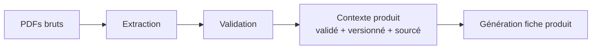
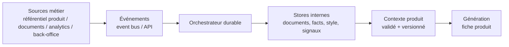
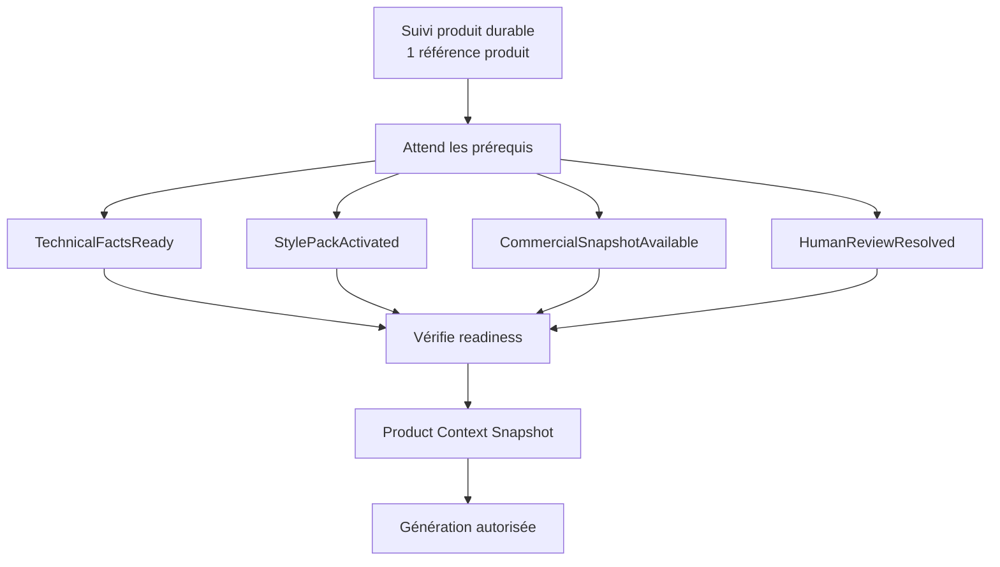
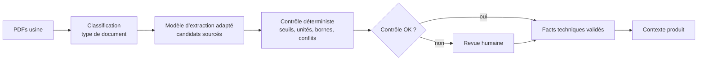
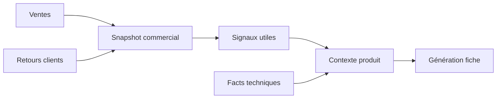
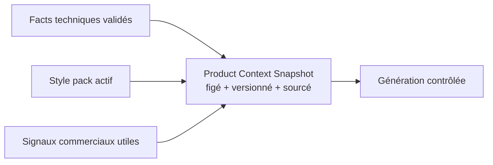
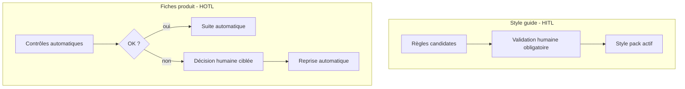
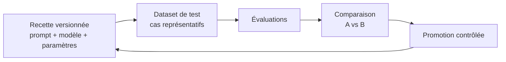

# Plan de présentation client - Factory Writer

| # | Slide | Message clé |
| --- | --- | --- |
| 1 | Contexte | Outdoor Axolotl veut automatiser les fiches produit sans perdre le ton premium ni la fiabilité technique. |
| 2 | Objectifs client | 10x productivité, zéro hallucination technique, scalabilité Spring/Summer, architecture context-first. |
| 3 | Principe directeur | On ne génère jamais depuis des PDFs bruts. On génère depuis un contexte validé, versionné, sourcé. |
| 4 | Vue globale cible | Flux fonctionnel : sources -> événements -> orchestrateur -> contexte produit -> génération contrôlée. |
| 5 | Architecture technique cible | Vue technique légère : API, event bus, orchestrateur, files de tâches, workers, services IA, stores et observabilité. |
| 6 | Pourquoi un orchestrateur durable | Un suivi durable par référence produit, attente des prérequis, signaux métier, HOTL/HITL sans polling fragile. |
| 7 | Ingestion technique et zéro hallucination | Classification documentaire -> modèle d’extraction adapté -> candidats -> validation déterministe -> facts promus, seuls facts utilisables par le LLM. |
| 8 | Style guide | Ingestion séparée, ruleset versionné, activation humaine, puis disponibilité pour tous les produits. |
| 9 | Signaux commerciaux | Sales history et customer feedback passent par BigQuery/Dataform/GenAI batch, puis snapshots non autoritaires. |
| 10 | Contexte produit | Snapshot immuable : facts techniques validés + style pack actif + signaux commerciaux. C’est la seule entrée autorisée pour la génération. |
| 11 | Génération contrôlée | Prompt registry + LLM Gateway + structured output + post-check déterministe. Le LLM rédige, le backend contrôle. |
| 12 | Human-on-the-loop | L’humain n’écrit pas tout, il arbitre uniquement les cas incertains : confiance faible, contradiction, champ requis absent. |
| 13 | LLMOps et offline lab | Prompts, modèles et recettes sont testés offline sur datasets d’évaluation avant promotion. |
| 14 | Provider agnostic et choix technos | Mapping concepts -> outils recommandés et alternatives : IDP, orchestrateur durable, gateway LLM, prompt registry, évaluation, data pipelines. |
| 15 | Scalabilité | Files de tâches spécialisées, pools de workers, limites de débit IDP/LLM, backpressure et retries. |
| 16 | Audit et traçabilité | Chaque fiche est explicable : sources, facts, décisions humaines, contexte, prompt rendu, modèle, réponse structurée et post-checks. |
| 17 | Transition demo | Montrer que le POC incarne déjà les principes : upload, extraction, validation, contexte, génération, audit. |

## 1. Contexte

**Durée cible : 1 min à 1 min 10**

### Message à afficher sur la slide

Outdoor Axolotl crée des fiches produit premium à partir de dossiers techniques usine. Aujourd’hui, ce travail reste manuel, long et sensible, car chaque donnée doit être fiable.

### Script en texte normal

**Temps de lecture estimé : 1 min à 1 min 10 à débit naturel.**

Bonjour à tous. Je me présente, Florian, consultant GenAI chez SFEIR.

Vous avez missionné SFEIR pour réfléchir avec vous à Factory Writer, votre projet de génération automatisée de fiches produit. L’idée aujourd’hui, c’est de poser le problème, puis de vous proposer une solution cible pour y répondre.

Je commence par le contexte. Vous êtes une marque B2C premium dans l’univers du jardin, avec du mobilier extérieur haut de gamme et des outils de jardin ergonomiques.

Vos produits sont conçus en interne. La fiche produit doit donc refléter à la fois la réalité technique du produit et le ton Axolotl.

Aujourd’hui, les équipes partent de dossiers techniques usine, puis doivent vérifier les données et les reformuler en fiche e-commerce. Ce processus prend environ trois semaines.

C’est ce contexte qui crée le besoin Factory Writer : réduire un goulot d’étranglement éditorial, sans banaliser la fiche produit ni perdre la confiance dans les informations utilisées.

### Script en mode prompteur

**Temps de lecture estimé : 1 min à 1 min 10, pauses incluses.**

Bonjour à tous.

Je me présente, Florian,

consultant GenAI chez SFEIR.

[pause courte]

Vous avez missionné SFEIR pour réfléchir avec vous à Factory Writer,

votre projet de génération automatisée de fiches produit.

L’idée aujourd’hui,

c’est de poser le problème,

puis de vous proposer une solution cible pour y répondre.

[pause]

Je commence par le contexte.

Vous êtes une marque B2C premium dans l’univers du jardin,

avec du mobilier extérieur haut de gamme,

et des outils de jardin ergonomiques.

[pause courte]

Vos produits sont conçus en interne.

Une fiche produit

doit refléter à la fois la réalité technique du produit

et le ton Axolotl.

Aujourd’hui,

les équipes partent de dossiers techniques usine,

puis doivent vérifier les données

et les reformuler en fiche e-commerce.

Ce processus prend environ trois semaines.

[pause]

C’est ce contexte qui crée le besoin Factory Writer :

réduire un goulot d’étranglement éditorial,

sans banaliser la fiche produit,

ni perdre la confiance dans les informations utilisées.

### Slide

**Titre conseillé**

Contexte : un processus manuel long et sensible

**Contenu à mettre sur la slide**

- 3 semaines aujourd’hui pour produire une fiche produit complète.
- Processus actuel : dossiers usine -> vérification -> reformulation -> fiche produit.
- Point de tension : le volume augmente, mais la qualité attendue reste premium.

**Visuel conseillé**

Un schéma très simple suffit. L’idée est de montrer le processus actuel, sans encore parler de l’architecture cible.


**Image éventuelle**

Si tu veux ajouter une image, je mettrais quelque chose de sobre : une table de jardin premium ou une terrasse extérieure élégante, pas une image trop “IA”. L’objectif est de rappeler l’univers Axolotl, pas de faire une slide technologique dès le début.

**Prompt pour générer la slide**

```text
Crée une slide PowerPoint 16:9 professionnelle mais sobre pour introduire le contexte métier du projet Factory Writer.

Titre : "Contexte : un processus manuel long et sensible"

Message principal : Outdoor Axolotl crée des fiches produit premium à partir de dossiers techniques usine. Aujourd’hui, ce travail reste manuel, long et sensible, car chaque donnée utilisée doit être fiable.

Contenu visible :
- Processus actuel : dossiers techniques usine -> lecture / vérification -> reformulation marketing -> fiche produit e-commerce
- Temps actuel : environ 3 semaines
- Point de tension : le volume augmente, mais la qualité attendue reste premium

Visuel :
Créer un schéma horizontal simple du processus actuel :
1. "Dossiers techniques usine"
2. "Lecture + vérification"
3. "Reformulation marketing"
4. "Fiche produit e-commerce"
5. "Environ 3 semaines"

Style visuel :
Univers premium outdoor, sobre et élégant. Utiliser des tons naturels : vert profond, teck, lin, beige clair. Ajouter éventuellement une image discrète ou une illustration de terrasse extérieure premium, mais ne pas surcharger. Éviter les visuels futuristes ou trop "IA". Le slide doit rester centré sur le contexte métier actuel.
```

### Transition vers le point 2

À partir de ce contexte, les objectifs client se résument en quatre contraintes fortes : productivité, fiabilité technique, passage à l’échelle et indépendance vis-à-vis d’un fournisseur IA unique.

## 2. Objectifs client

**Durée cible : 1 min à 1 min 10**

### Message à afficher sur la slide

Les objectifs sont clairs : produire beaucoup plus vite, sans hallucination technique, à l’échelle d’une collection, et sans verrouiller l’architecture sur un seul fournisseur IA.

### Script en texte normal

**Temps de lecture estimé : 1 min à 1 min 10 à débit naturel.**

À partir de ce contexte, il y a quatre objectifs à garder en tête.

Le premier, c’est la productivité : passer d’un cycle autour de trois semaines à une fiche prête à relire en moins de deux minutes après l’import des documents.

Le deuxième, c’est la fiabilité technique. Une dimension, une matière ou une certification fausse peut directement nuire à la marque. Donc l’IA ne doit pas inventer ou corriger seule les données techniques.

Le troisième, c’est la scalabilité. La solution doit fonctionner sur un produit, mais aussi sur plusieurs centaines de références lors d’un lancement Spring/Summer.

Et le quatrième, c’est l’approche context-first. L’idée n’est pas d’entraîner un modèle qui ferait tout, mais de construire un contexte propre, validé, versionné, puis de générer à partir de ce contexte.

Ces quatre objectifs donnent la direction : on veut aller vite, mais sans perdre le contrôle.

### Script en mode prompteur

**Temps de lecture estimé : 1 min à 1 min 10, pauses incluses.**

À partir de ce contexte,

il y a quatre objectifs à garder en tête.

[pause courte]

Le premier,

c’est la productivité :

passer d’un cycle autour de trois semaines,

à une fiche prête à relire en moins de deux minutes après l’import des documents.

[pause]

Le deuxième,

c’est la fiabilité technique.

Si une dimension,

une matière,

ou une certification est fausse,

la fiche produit devient dangereuse pour la marque.

Donc l’IA ne doit pas inventer

ou corriger seule les données techniques.

[pause]

Le troisième,

c’est la scalabilité.

La solution doit fonctionner sur un produit,

mais aussi sur plusieurs centaines de références

lors d’un lancement de collection Spring/Summer.

[pause]

Et le quatrième,

c’est l’approche context-first.

L’idée n’est pas d’entraîner un modèle qui ferait tout.

L’idée est plutôt de construire un contexte propre,

validé,

versionné,

puis de laisser le modèle générer uniquement à partir de ce contexte.

[pause]

Ces quatre objectifs donnent la direction :

on veut aller vite,

mais sans perdre le contrôle.

### Slide

**Titre conseillé**

Objectifs : aller vite sans perdre le contrôle

**Contenu à mettre sur la slide**

Présenter les 4 objectifs sous forme de grille 2x2 :

- Productivité : `3 semaines -> < 2 minutes`
- Fiabilité technique : `0 hallucination sur dimensions, matières, certifications`
- Scalabilité : `centaines de SKU Spring/Summer`
- Context-first : `contexte validé, versionné, multi-provider`

**Visuel conseillé**

Pas besoin de diagramme technique sur cette slide. Le plus lisible est une grille de 4 cartes, chacune avec une icône simple :

- chronomètre pour productivité ;
- bouclier ou check pour fiabilité ;
- pile de produits ou grille pour scalabilité ;
- base de données ou blocs de contexte pour context-first.

Garder le schéma d’architecture pour la slide 4.

**Image éventuelle**

Pas nécessaire. Si tu veux une image, elle doit rester en arrière-plan très discret : texture de bois, terrasse premium ou détail matière. Le contenu doit rester très lisible.

**Prompt pour générer la slide**

```text
Crée une slide PowerPoint 16:9 sobre et premium pour présenter les objectifs client du projet Factory Writer.

Titre : "Objectifs : aller vite sans perdre le contrôle"

Créer une grille 2x2 avec quatre cartes bien lisibles :

1. Productivité
Texte court : "De 3 semaines à moins de 2 minutes après import"
Icône : chronomètre ou accélération sobre.

2. Fiabilité technique
Texte court : "Zéro hallucination sur dimensions, matières, certifications"
Icône : bouclier, preuve ou check de validation.

3. Scalabilité
Texte court : "Absorber des centaines de SKU lors des lancements Spring/Summer"
Icône : collection produit, grille ou file d’attente.

4. Context-first
Texte court : "Générer depuis un contexte validé, versionné et multi-provider"
Icône : base de données, blocs de contexte ou réseau de sources.

Style visuel :
Univers Outdoor Axolotl premium : vert profond, teck, lin, beige clair, typographie élégante, beaucoup d’espace blanc. Ne pas utiliser de visuel futuriste ou robotique. La slide doit être lisible en visio et donner une impression de maîtrise, pas de complexité.
```

### Transition vers le point 3

La conséquence directe, c’est qu’on ne peut pas générer directement depuis les PDFs bruts. Il faut d’abord construire un contexte fiable, validé et traçable.

## 3. Principe directeur

**Durée cible : 1 min à 1 min 10**

### Message à afficher sur la slide

Le principe clé : ne jamais demander au LLM de deviner depuis des PDFs bruts. On lui donne un contexte validé, versionné et sourcé.

### Script en texte normal

**Temps de lecture estimé : 1 min à 1 min 10 à débit naturel.**

La conséquence directe des objectifs précédents, c’est qu’on ne peut pas générer une fiche produit directement depuis des PDFs bruts.

Si on donne simplement les documents à un LLM en lui demandant d’écrire la fiche, on gagne du temps, mais on perd le contrôle. On ne sait pas toujours quelle information a été utilisée, si une valeur a été mal lue, ou si le modèle a complété une information absente.

Le principe directeur que je propose est donc simple : avant de générer, on construit un contexte produit fiable.

Ce contexte contient les faits techniques validés, les règles du guide de style actif et les signaux commerciaux utiles.

Ensuite seulement, le modèle peut rédiger. Il ne part pas d’un PDF brut ; il part d’un contexte clair, versionné, sourcé et contrôlé.

C’est ce principe qui permet d’aller vite, tout en gardant une vraie barrière contre l’hallucination.

### Script en mode prompteur

**Temps de lecture estimé : 1 min à 1 min 10, pauses incluses.**

La conséquence directe des objectifs précédents,

c’est qu’on ne peut pas générer une fiche produit directement depuis des PDFs bruts.

[pause courte]

Si on donne simplement les documents à un LLM

en lui demandant d’écrire la fiche,

on gagne du temps,

mais on perd le contrôle.

On ne sait pas toujours quelle information a été utilisée,

si une valeur a été mal lue,

ou si le modèle a complété une information absente.

[pause]

Le principe directeur que je propose est donc simple :

avant de générer,

on construit un contexte produit fiable.

[pause courte]

Ce contexte contient les faits techniques validés,

les règles du guide de style actif,

et les signaux commerciaux utiles.

[pause]

Ensuite seulement,

le modèle peut rédiger.

Il ne part pas d’un PDF brut.

Il part d’un contexte clair,

versionné,

sourcé,

et contrôlé.

[pause]

C’est ce principe qui permet d’aller vite,

tout en gardant une vraie barrière contre l’hallucination.

### Slide

**Titre conseillé**

Principe directeur : générer depuis un contexte contrôlé

**Contenu à mettre sur la slide**

- `PDFs bruts -> extraction -> validation -> contexte produit -> génération`
- Le LLM rédige, mais ne décide pas seul de ce qui est vrai.
- Chaque donnée importante doit être validée, versionnée et sourcée.

**Visuel conseillé**

Un pipeline horizontal très simple suffit. La slide doit faire comprendre la séparation entre les sources brutes, la construction du contexte et la génération.



**Image éventuelle**

Pas nécessaire. Si tu veux ajouter un visuel, je mettrais plutôt une texture discrète de papier technique ou de matière naturelle, pour ne pas détourner l’attention du pipeline.

**Prompt pour générer la slide**

```text
Crée une slide PowerPoint 16:9 sobre et premium pour présenter le principe directeur de l’architecture Factory Writer.

Titre : "Principe directeur : générer depuis un contexte contrôlé"

Message principal : On ne génère jamais directement depuis des PDFs bruts. On construit d’abord un contexte produit validé, versionné et sourcé, puis le LLM rédige uniquement à partir de ce contexte.

Créer un pipeline horizontal avec 5 étapes :
1. PDFs bruts
2. Extraction
3. Validation
4. Contexte produit validé + versionné + sourcé
5. Génération fiche produit

Ajouter une phrase courte sous le pipeline :
"Le LLM rédige, mais ne décide pas seul de ce qui est vrai."

Style visuel :
Univers Outdoor Axolotl premium, sobre et naturel : vert profond, teck, lin, beige clair. Utiliser des blocs simples, beaucoup d’espace blanc, et éviter les visuels trop futuristes ou robotisés. La slide doit être très lisible en visio.
```

### Transition vers le point 4

Maintenant que ce principe est posé, on peut regarder l’architecture cible qui permet de construire ce contexte de manière robuste.

## 4. Vue globale cible

**Durée cible : 1 min 20 à 1 min 30**

### Message à afficher sur la slide

Architecture cible : une chaîne event-driven qui transforme des sources externes en contexte produit validé, puis en fiche générée.

### Script en texte normal

**Temps de lecture estimé : 1 min 20 à 1 min 30 à débit naturel.**

Maintenant qu’on a posé le principe du contexte contrôlé, voici la vue globale de l’architecture cible.

L’idée, c’est d’avoir une chaîne event-driven : les informations arrivent depuis les systèmes existants, puis un orchestrateur durable les capte sous forme d’événements et déclenche la bonne étape quand les bons prérequis sont disponibles. On va le détailler juste après.

Chaque étape produit ou met à jour une donnée interne : un document source, un fact technique, un pack de style, un signal commercial, puis un snapshot de contexte.

La génération arrive seulement à la fin de cette chaîne.

Donc à ce niveau, il faut surtout retenir le flux : sources, événements, orchestration, contexte produit, génération contrôlée.

### Script en mode prompteur

**Temps de lecture estimé : 1 min 20 à 1 min 30, pauses incluses.**

Maintenant qu’on a posé

le principe du contexte contrôlé,

voici la vue globale

de l’architecture cible.

[pause courte]

L’idée,

c’est d’avoir une chaîne event-driven :

les informations arrivent depuis les systèmes existants,

puis un orchestrateur les capte

sous forme d’événements

et déclenche la bonne étape

quand les bons prérequis sont disponibles.

[pause courte]

Dans l’architecture proposée,

ce sera un orchestrateur durable,

on va le détailler juste après.

[pause]

Chaque étape produit

ou met à jour une donnée interne :

un document source,

un fact technique,

un pack de style,

un signal commercial,

puis un snapshot de contexte.

[pause courte]

La génération arrive seulement

à la fin de cette chaîne.

[pause]

Donc à ce niveau,

il faut surtout retenir le flux :

sources,

événements,

orchestrateur,

contexte produit,

génération contrôlée.

### Slide

**Titre conseillé**

Vue globale cible : une chaîne event-driven

**Contenu à mettre sur la slide**

- `Sources métier -> événements -> orchestrateur durable -> stores internes -> contexte produit -> génération`
- Le runtime ne génère qu’à partir d’un contexte déjà structuré et validé.
- Les données externes sont intégrées, normalisées et versionnées côté Factory Writer.

**Visuel conseillé**

Un schéma horizontal simple suffit. Il faut éviter le grand diagramme complet à ce stade, car le détail arrive dans les slides suivantes.



**Image éventuelle**

Pas nécessaire. Le schéma doit être le visuel principal. Tu peux éventuellement garder une texture très légère en fond, mais rien qui réduise la lisibilité.

**Prompt pour générer la slide**

```text
Crée une slide PowerPoint 16:9 sobre et premium pour présenter la vue globale cible de l’architecture Factory Writer.

Titre : "Vue globale cible : une chaîne event-driven"

Message principal : Factory Writer consomme les données venant des systèmes existants, orchestre les traitements, construit un contexte produit validé et versionné, puis génère la fiche produit.

Créer un schéma horizontal simple avec 6 blocs :
1. Sources métier : référentiel produit / documents / analytics / back-office
2. Événements : event bus / API
3. Orchestrateur durable
4. Stores internes : documents, facts, style, signaux
5. Contexte produit : validé + versionné
6. Génération : fiche produit

Ajouter deux phrases courtes :
- "Le runtime ne génère qu’à partir d’un contexte structuré et validé."
- "Les données externes sont intégrées et gouvernées côté Factory Writer."

Style visuel :
Univers Outdoor Axolotl premium : vert profond, teck, lin, beige clair. Faire une architecture claire, lisible en visio, avec peu de texte dans les blocs. Ne pas créer un diagramme trop technique ou trop dense. Garder les détails pour les slides suivantes.
```

### Transition vers le point 5

Je vais maintenant zoomer légèrement sur la vue technique cible, pour montrer où se placent l’API, l’event bus, l’orchestrateur, les workers, les stores et les services IA.

## 5. Architecture technique cible

**Durée cible : 1 min 15 à 1 min 25**

### Message à afficher sur la slide

Cette vue C4 Container montre les grandes briques de Factory Writer : une entrée événementielle, un orchestrateur durable, quatre workers d’exécution, les services IA et les stores internes.

### Script en texte normal

**Temps de lecture estimé : 1 min 15 à 1 min 25 à débit naturel.**

Sur cette slide, on zoome d’un cran. Le schéma est un C4 Container Diagram : il ne montre pas le code, il montre les grandes briques applicatives qui s’exécutent ou qui stockent les données.

La lecture se fait de gauche à droite. Les systèmes externes et le back-office envoient des événements ou des commandes à l’API / Event Gateway. C’est le point d’entrée unique.

Ensuite, l’orchestrateur durable suit le cycle de vie d’une référence produit. Il ne fait pas les appels externes lui-même ; il planifie le travail dans des files de tâches, puis délègue aux workers d’exécution.

Ces workers sont séparés par responsabilité. Document Processing appelle Document Intelligence pour classifier et extraire. Style Guide gère les règles de marque. Commercial Signals prépare les signaux issus des ventes et des retours clients. Product Sheet Generation arrive à la fin, pour générer la fiche.

À droite, les stores gardent les traces importantes : les PDFs et preuves, les facts et snapshots, les signaux analytics, et l’audit. L’Operational DB matérialise ensuite le Product Context Snapshot.

Le point clé du schéma, c’est celui-là : le LLM Gateway ne lit ni les PDFs, ni les stores bruts. Il est appelé uniquement par le worker de génération, à partir d’un Product Context Snapshot déjà validé.

### Script en mode prompteur

**Temps de lecture estimé : 1 min 15 à 1 min 25, pauses incluses.**

Sur cette slide,

on zoome d’un cran.

Le schéma est un C4 Container Diagram :

il ne montre pas le code,

il montre les grandes briques applicatives

qui s’exécutent

ou qui stockent les données.

[pause courte]

La lecture se fait

de gauche à droite.

Les systèmes externes

et le back-office

envoient des événements

ou des commandes

à l’API / Event Gateway.

C’est le point d’entrée unique.

[pause]

Ensuite,

l’orchestrateur durable suit le cycle de vie d’une référence produit.

Il ne fait pas les appels externes lui-même.

Il planifie le travail dans des files de tâches,

puis délègue aux workers d’exécution.

[pause]

Ces workers sont séparés

par responsabilité.

Document Processing

appelle Document Intelligence

pour classifier et extraire.

Style Guide

gère les règles de marque.

Commercial Signals

prépare les signaux issus des ventes

et des retours clients.

Product Sheet Generation

arrive à la fin,

pour générer la fiche.

[pause courte]

À droite,

les stores gardent les traces importantes :

les PDFs et preuves,

les facts et snapshots,

les signaux analytics,

et l’audit.

L’Operational DB

matérialise ensuite

le Product Context Snapshot.

[pause]

Le point clé du schéma,

c’est celui-là :

le LLM Gateway

ne lit ni les PDFs,

ni les stores bruts.

Il est appelé uniquement

par le worker de génération,

à partir d’un Product Context Snapshot

déjà validé.

### Slide

**Titre conseillé**

Architecture technique cible : les containers Factory Writer

**Contenu à mettre sur la slide**

- API / Event Gateway : point d’entrée unique des commandes et événements.
- Orchestrateur durable : suit le cycle de vie produit, les retries et les attentes humaines.
- Workers spécialisés : documents, style guide, signaux commerciaux, génération.
- Stores : PDFs et preuves, facts, snapshots, signaux analytics, audit.
- Product Context Snapshot : frontière de confiance matérialisée depuis l’Operational DB.
- LLM Gateway : génération structurée uniquement depuis le contexte validé.

**Visuel conseillé**

Utiliser le C4 Container Diagram validé. Il doit rester lisible : pas plus de détails que nécessaire, pas de flèche PDF vers le LLM, et une séparation claire entre services IA et stores internes.

**Ce qu’il faut expliquer oralement sur le schéma**

- La lecture se fait de gauche à droite.
- L’API/Event Gateway absorbe les événements et commandes.
- L’orchestrateur durable coordonne, mais ne contient pas la logique métier lourde.
- Les workers exécutent les traitements, chacun avec une responsabilité séparée.
- Les services IA sont appelés par les workers, jamais directement par l’utilisateur.
- Les stores gardent les preuves, les facts, les snapshots et l’audit.
- Le LLM Gateway génère uniquement depuis le Product Context Snapshot.

**Prompt pour générer la slide**

```text
Crée une slide PowerPoint 16:9 avec un C4 Container Diagram clair et lisible pour Factory Writer.

Titre : "Architecture technique cible : les containers Factory Writer"

Message principal : Factory Writer repose sur une API événementielle, un orchestrateur durable, des workers spécialisés, des services IA, et des stores internes. Le LLM ne lit jamais les PDFs : il génère uniquement depuis un Product Context Snapshot validé.

Utiliser le diagramme C4 fourni comme visuel principal.

Mettre en évidence visuellement :
- API / Event Gateway
- Orchestrateur durable
- Files de tâches
- Document Processing Worker
- Style Guide Worker
- Commercial Signals Worker
- Product Sheet Generation Worker
- Document Intelligence
- LLM Gateway
- Operational Database
- Product Context Snapshot
- Observability & Audit

Contraintes :
- Le schéma doit être lisible en visio.
- Ne pas ajouter de nouvelles briques.
- Ne pas afficher de flèche des PDFs vers le LLM.
- Montrer que le Product Sheet Generation Worker lit le Product Context Snapshot.
- Montrer que le Product Context Snapshot est matérialisé depuis l’Operational Database.
- Garder une palette premium et naturelle : vert profond, sauge, beige, sable, bleu pâle, accent doré pour le Product Context Snapshot.
```

### Transition vers le point 6

Le rôle central ici, c’est donc l’orchestrateur. La slide suivante explique pourquoi ce type d’orchestrateur durable est particulièrement adapté à un processus long, événementiel et avec validation humaine.

## 6. Pourquoi un orchestrateur durable

**Durée cible : 1 min 20 à 1 min 30**

### Message à afficher sur la slide

Un orchestrateur durable permet de suivre chaque référence produit dans le temps : il attend les prérequis, reprend après validation humaine, et évite les jobs fragiles ou le polling permanent.

### Script en texte normal

**Temps de lecture estimé : 1 min 20 à 1 min 30 à débit naturel.**

Le cycle de vie d’une fiche produit n’est pas un simple appel API.

Pour une référence produit, on peut recevoir les dossiers techniques maintenant, valider le guide de style plus tard, recalculer les signaux commerciaux ensuite, et parfois attendre une correction humaine.

Sans un système d’orchestration durable, ça devient vite compliqué : il faut savoir ce qui est déjà prêt, ce qui manque encore, et où reprendre le traitement.

Avec un orchestrateur durable, chaque référence produit a un suivi durable. L’orchestrateur garde l’état, attend des signaux métier, et reprend quand un prérequis arrive.

Les signaux typiques sont : `TechnicalFactsReady`, `StylePackActivated`, et `CommercialSnapshotAvailable`.

Si tout est prêt, l’orchestrateur crée le Product Context Snapshot. Si quelque chose manque, il attend. Si une revue humaine est nécessaire, il attend la décision puis reprend au bon endroit.

Le point important, c’est qu’on évite les scripts fragiles, les cron jobs qui repassent en boucle, ou les états perdus entre deux services. L’orchestrateur durable devient la mémoire fiable du cycle de vie produit.

### Script en mode prompteur

**Temps de lecture estimé : 1 min 20 à 1 min 30, pauses incluses.**

Le cycle de vie d’une fiche produit

n’est pas un simple appel API.

[pause courte]

Pour une référence produit,

on peut recevoir les dossiers techniques maintenant,

valider le guide de style plus tard,

recalculer les signaux commerciaux ensuite,

et parfois attendre une correction humaine.

[pause]

Sans un système d’orchestration durable,

ça devient vite compliqué :

il faut savoir ce qui est déjà prêt,

ce qui manque encore,

et où reprendre le traitement.

[pause]

Avec un orchestrateur durable,

chaque référence produit

a un suivi durable.

L’orchestrateur garde l’état,

attend des signaux métier,

et reprend quand un prérequis arrive.

[pause courte]

Les signaux typiques sont :

TechnicalFactsReady,

StylePackActivated,

et CommercialSnapshotAvailable.

[pause]

Si tout est prêt,

l’orchestrateur crée le Product Context Snapshot.

Si quelque chose manque,

il attend.

Si une revue humaine est nécessaire,

il attend la décision,

puis reprend au bon endroit.

[pause]

Le point important,

c’est qu’on évite les scripts fragiles,

les cron jobs qui repassent en boucle,

ou les états perdus entre deux services.

L’orchestrateur durable devient la mémoire fiable

du cycle de vie produit.

### Slide

**Titre conseillé**

Pourquoi un orchestrateur durable ?

**Contenu à mettre sur la slide**

- 1 suivi durable par référence produit.
- Attente par signaux métier, pas par polling fragile.
- Reprise après correction humaine ou incident technique.
- Création du Product Context Snapshot uniquement quand tous les prérequis sont prêts.

**Visuel conseillé**

Un schéma simple centré sur le suivi durable du produit, pas un nouveau C4.



**Prompt pour générer la slide**

```text
Crée une slide PowerPoint 16:9 sobre et lisible pour expliquer pourquoi un orchestrateur durable est utilisé dans l’architecture Factory Writer.

Titre : "Pourquoi un orchestrateur durable ?"

Message principal : une fiche produit n’est pas un simple appel API. Pour chaque référence produit, un orchestrateur durable garde l’état, attend les prérequis, reçoit des signaux métier, reprend après validation humaine et crée le Product Context Snapshot uniquement quand tout est prêt.

Créer un schéma simple, pas un diagramme C4 :
- Suivi produit durable : 1 référence produit
- Attend les prérequis
- Signaux métier : TechnicalFactsReady, StylePackActivated, CommercialSnapshotAvailable, HumanReviewResolved
- Vérifie readiness
- Product Context Snapshot
- Génération autorisée

Ajouter 3 bullets :
- "Pas de polling fragile"
- "Reprise fiable après correction humaine"
- "État produit conservé dans le temps"

Style visuel :
Premium, clair, peu de texte, palette Outdoor Axolotl : vert profond, sauge, beige, accent doré pour Product Context Snapshot. Le slide doit être compréhensible en moins de 30 secondes.
```

### Transition vers le point 7

Maintenant qu’on a l’orchestration, on peut détailler la première chaîne métier : l’ingestion technique, depuis les PDFs usine jusqu’aux facts validés utilisables par le LLM.

## 7. Ingestion technique et zéro hallucination

**Durée cible : 1 min 20 à 1 min 30**

### Message à afficher sur la slide

On ne transforme pas directement des PDFs en texte marketing. On transforme les PDFs en candidats, puis en facts techniques validés par des contrôles déterministes et, si besoin, par revue humaine.

### Script en texte normal

**Temps de lecture estimé : 1 min 20 à 1 min 30 à débit naturel.**

Ici, on zoome sur la chaîne technique.

L’idée est simple : on ne demande pas au LLM de lire les PDFs et de se débrouiller tout seul.

D’abord, on classe chaque document. Est-ce que c’est une fiche technique ? Une fiche matière ? Une notice de montage ? Ou est-ce que le document est hors périmètre ?

Ensuite, selon le type détecté, on envoie le PDF vers le bon modèle d’extraction.

Et là, point important : le modèle d’extraction ne produit pas directement une vérité finale. Il propose des candidats, avec une valeur, une source, une page, et un score de confiance quand il est disponible.

Après ça, le backend reprend la main avec des contrôles déterministes. Est-ce que le champ est requis ? Est-ce que l’unité est lisible ? Est-ce que la valeur est réaliste ? Est-ce qu’une autre source dit autre chose ?

Si tout est cohérent, la donnée devient un fact technique validé.

Sinon, elle part en revue humaine.

Et c’est seulement cette couche de facts techniques validés qui pourra ensuite être utilisée pour générer la fiche.

### Script en mode prompteur

**Temps de lecture estimé : 1 min 20 à 1 min 30, pauses incluses.**

Ici,

on zoome sur la chaîne technique.

[pause courte]

L’idée est simple :

on ne demande pas au LLM

de lire les PDFs

et de se débrouiller tout seul.

[pause courte]

D’abord,

on classe chaque document.

Est-ce que c’est une fiche technique ?

Une fiche matière ?

Une notice de montage ?

Ou est-ce que le document est hors périmètre ?

[pause]

Ensuite,

selon le type détecté,

on envoie le PDF

vers le bon modèle d’extraction.

[pause]

Et là,

point important :

le modèle d’extraction ne produit pas directement

une vérité finale.

Il propose des candidats,

avec une valeur,

une source,

une page,

et un score de confiance

quand il est disponible.

[pause]

Après ça,

le backend reprend la main

avec des contrôles déterministes.

Est-ce que le champ est requis ?

Est-ce que l’unité est lisible ?

Est-ce que la valeur est réaliste ?

Est-ce qu’une autre source dit autre chose ?

[pause]

Si tout est cohérent,

la donnée devient un fact technique validé.

Sinon,

elle part en revue humaine.

[pause]

Et c’est seulement cette couche

de facts techniques validés

qui pourra être utilisée

pour générer la fiche.

### Slide

**Titre conseillé**

Ingestion technique : des PDFs aux facts validés

**Contenu à mettre sur la slide**

- Classification : identifier le type de PDF ou bloquer le hors périmètre.
- Extraction : produire des candidats sourcés, pas des vérités finales.
- Contrôle déterministe : scores, champs requis, unités, bornes, contradictions.
- Revue humaine uniquement si nécessaire.
- Le LLM ne voit que les facts validés.

**Visuel conseillé**

Un pipeline horizontal simple, avec une barrière visuelle entre `candidats` et `facts validés`.



**Encadré à mettre sur la slide**

`Candidats ≠ facts validés`

`Le LLM ne voit que les facts validés.`

**Prompt pour générer la slide**

```text
Crée une slide PowerPoint 16:9 sobre et claire pour expliquer l’ingestion technique dans Factory Writer.

Titre : "Ingestion technique : des PDFs aux facts validés"

Message principal : les PDFs usine ne vont jamais directement au LLM. Ils sont classifiés, extraits en candidats sourcés, contrôlés de manière déterministe, puis promus en facts techniques validés.

Créer un pipeline horizontal :
1. PDFs usine
2. Classification : type de document
3. Modèle d’extraction adapté : candidats sourcés
4. Contrôle déterministe : seuils, unités, bornes, conflits
5. Revue humaine si nécessaire
6. Facts techniques validés
7. Contexte produit

Ajouter un encadré très visible :
"Candidats ≠ facts validés"
"Le LLM ne voit que les facts validés."

Mettre en évidence la barrière entre les candidats extraits et les facts validés.

Style visuel :
Premium Outdoor Axolotl : vert profond, sauge, beige, sable, accent doré pour les facts validés. Très lisible en visio. Pas de diagramme C4. Peu de texte, pipeline clair, flèches simples.
```

### Transition vers le point 8

Une fois les facts techniques sécurisés, il faut aussi sécuriser la voix de marque. C’est le rôle du style guide : transformer des exemples et règles éditoriales en un pack actif réutilisable par la génération.

## 8. Style guide

**Durée cible : 1 min à 1 min 10**

### Message à afficher sur la slide

Le style guide devient un pack actif, versionné et réutilisable. Il sécurise la voix de marque comme les facts techniques sécurisent la vérité produit.

### Script en texte normal

**Temps de lecture estimé : 1 min à 1 min 10 à débit naturel.**

Après la partie technique, il y a un autre sujet important : la voix de marque.

Une fiche Axolotl doit être juste, mais elle doit aussi avoir le bon ton. Elle doit rester premium, claire, cohérente, et éviter les formulations qui ne correspondent pas à la marque.

Donc on ne veut pas simplement écrire dans le prompt : “écris comme Axolotl”, et espérer que le modèle comprenne toujours la même chose.

L’approche cible, c’est de traiter le style guide comme une vraie source. On en extrait des règles de ton, de vocabulaire et de structure. Ces règles sont relues, validées, puis activées dans un style pack.

Une fois actif, ce style pack peut être réutilisé pour toutes les fiches produit.

Comme pour les facts techniques, on ne laisse pas tout au modèle. On transforme la voix de marque en règles contrôlées, versionnées et réutilisables.

### Script en mode prompteur

**Temps de lecture estimé : 1 min à 1 min 10, pauses incluses.**

Après la partie technique,

il y a un autre sujet important :

la voix de marque.

[pause courte]

Une fiche Axolotl

doit être juste,

mais elle doit aussi avoir le bon ton.

Elle doit rester premium,

claire,

cohérente,

et éviter les formulations

qui ne correspondent pas à la marque.

[pause]

Donc on ne veut pas simplement écrire dans le prompt :

"écris comme Axolotl",

et espérer que le modèle

comprenne toujours la même chose.

[pause courte]

L’approche cible,

c’est de traiter le style guide

comme une vraie source.

On en extrait des règles de ton,

de vocabulaire

et de structure.

Ces règles sont relues,

validées,

puis activées dans un style pack.

[pause]

Une fois actif,

ce style pack peut être réutilisé

pour toutes les fiches produit.

[pause]

Comme pour les facts techniques,

on ne laisse pas tout au modèle.

On transforme la voix de marque

en règles contrôlées,

versionnées

et réutilisables.

### Slide

**Titre conseillé**

Style guide : de la voix de marque au style pack actif

**Contenu à mettre sur la slide**

- Le style guide est ingéré séparément des dossiers techniques.
- Les règles éditoriales sont extraites puis validées.
- Un style pack actif est versionné et réutilisé par les générations.
- Le style pack rejoint le Product Context Snapshot.

**Visuel conseillé**

Un pipeline simple, plus éditorial que technique.


**Encadré à mettre sur la slide**

`La voix de marque devient une donnée contrôlée.`

**Prompt pour générer la slide**

```text
Crée une slide PowerPoint 16:9 premium et très lisible en français.

Titre : "Style guide : de la voix de marque au style pack actif"

Message principal : le style guide n’est pas seulement un document lu par le LLM. Il est transformé en style pack actif, versionné et réutilisable dans le contexte produit.

Créer un pipeline horizontal simple avec 6 étapes :
1. Guide de style
2. Règles candidates
3. Validation humaine
4. Style pack actif
5. Contexte produit
6. Génération fiche

Ajouter un encadré court :
"La voix de marque devient une donnée contrôlée."

Le visuel doit être simple, avec peu de texte. Ne pas parler de provider cloud. Ne pas afficher de détails techniques internes.

Style visuel :
Outdoor Axolotl premium : vert profond, sauge, beige, lin, accent doré pour "Style pack actif". Beaucoup d’espace blanc, typographie lisible, pas de surcharge.
```

### Transition vers le point 9

On a maintenant les facts techniques et la voix de marque. Il reste une troisième famille de contexte : les signaux commerciaux, qui permettent d’orienter la fiche sans devenir une source de vérité technique.

## 9. Signaux commerciaux

**Durée cible : 1 min à 1 min 10**

### Message à afficher sur la slide

Les signaux commerciaux aident à choisir les bons arguments, mais ils ne remplacent jamais les facts techniques.

### Script en texte normal

**Temps de lecture estimé : 1 min à 1 min 10 à débit naturel.**

On a maintenant deux briques contrôlées : les facts techniques pour la vérité produit, et le style pack pour la voix de marque.

La troisième brique, ce sont les signaux commerciaux.

Par exemple : les ventes, les retours clients, les questions fréquentes, les objections, ou les arguments qui fonctionnent bien sur une famille de produits.

Ces signaux sont utiles pour orienter la fiche. Ils peuvent aider à choisir quel bénéfice mettre en avant, quel vocabulaire utiliser, ou quelle objection traiter dans la description.

Mais ils ne doivent jamais devenir une source de vérité technique.

Si un retour client dit qu’une table est légère, mais que le dossier technique indique 58 kilos, c’est le dossier technique qui gagne.

Donc on injecte ces signaux dans le contexte produit comme des signaux d’orientation commerciale, pas comme des facts.

La séparation est simple : les facts techniques disent ce qui est vrai, le style guide dit comment parler, et les signaux commerciaux aident à choisir l’angle.

### Script en mode prompteur

**Temps de lecture estimé : 1 min à 1 min 10, pauses incluses.**

On a maintenant deux briques contrôlées :

les facts techniques

pour la vérité produit,

et le style pack

pour la voix de marque.

[pause courte]

La troisième brique,

ce sont les signaux commerciaux.

[pause courte]

Par exemple :

les ventes,

les retours clients,

les questions fréquentes,

les objections,

ou les arguments qui fonctionnent bien

sur une famille de produits.

[pause]

Ces signaux sont utiles

pour orienter la fiche.

Ils peuvent aider à choisir

quel bénéfice mettre en avant,

quel vocabulaire utiliser,

ou quelle objection traiter

dans la description.

[pause]

Mais ils ne doivent jamais devenir

une source de vérité technique.

[pause courte]

Si un retour client dit

qu’une table est légère,

mais que le dossier technique indique 58 kilos,

c’est le dossier technique qui gagne.

[pause]

Donc on injecte ces signaux

dans le contexte produit

comme des signaux d’orientation commerciale,

pas comme des facts.

[pause]

La séparation est simple :

les facts techniques disent ce qui est vrai,

le style guide dit comment parler,

et les signaux commerciaux

aident à choisir l’angle.

### Slide

**Titre conseillé**

Signaux commerciaux : orienter sans inventer

**Contenu à mettre sur la slide**

- Ventes, retours clients, questions fréquentes, objections.
- Utiles pour choisir les arguments et l’angle rédactionnel.
- Jamais utilisés pour corriger dimensions, matières ou certifications.
- Injectés dans le contexte produit comme signaux non autoritaires.

**Visuel conseillé**

Un schéma simple avec deux entrées qui convergent vers un snapshot commercial, puis vers le contexte produit.



**Encadré à mettre sur la slide**

`Signaux commerciaux ≠ vérité technique`

**Prompt pour générer la slide**

```text
Crée une slide PowerPoint 16:9 premium et très lisible en français.

Titre : "Signaux commerciaux : orienter sans inventer"

Message principal : les ventes et retours clients aident à choisir l’angle de la fiche, mais ne remplacent jamais les facts techniques.

Créer un schéma simple :
- Entrée 1 : Ventes
- Entrée 2 : Retours clients
- Les deux alimentent : Snapshot commercial
- Le snapshot produit : Signaux utiles
- Les signaux utiles rejoignent : Contexte produit
- Le contexte produit mène à : Génération fiche

Ajouter une petite entrée séparée "Facts techniques" vers "Contexte produit" pour montrer que la vérité technique vient d’ailleurs.

Ajouter un encadré très visible :
"Signaux commerciaux ≠ vérité technique"

Le visuel doit rester simple et lisible en 10 secondes. Ne pas afficher de détails techniques internes. Ne pas parler de provider cloud.

Style visuel :
Outdoor Axolotl premium : vert profond, sauge, beige, lin, accent doré pour "Contexte produit". Beaucoup d’espace blanc, typographie lisible, pas de surcharge.
```

### Transition vers le point 10

À partir de ces trois familles de données, on peut créer le contexte produit : un snapshot figé qui rassemble la vérité technique, la voix de marque et les signaux commerciaux utiles.

## 10. Contexte produit

**Durée cible : 1 min à 1 min 10**

### Message à afficher sur la slide

Le contexte produit est la seule entrée autorisée pour la génération : il rassemble les facts techniques validés, le style pack actif et les signaux commerciaux utiles.

### Script en texte normal

**Temps de lecture estimé : 1 min à 1 min 10 à débit naturel.**

On arrive maintenant au point de jonction : le contexte produit.

Les facts techniques, le style pack et les signaux commerciaux ne partent pas séparément vers la génération. On les assemble d’abord dans un snapshot.

Ce snapshot est figé, versionné et sourcé.

Ça veut dire que pour une fiche générée, on peut retrouver quelles données techniques ont été utilisées, quel style pack était actif, et quels signaux commerciaux ont orienté la rédaction.

C’est important, parce que la génération ne doit pas dépendre d’un état flou ou d’un prompt qui va chercher un peu partout.

Le modèle reçoit un contexte clair : ce qui est vrai, comment parler, et quel angle commercial privilégier.

Donc le Product Context Snapshot devient la frontière d’entrée de la génération. Avant lui, on collecte et on contrôle. Après lui, on peut générer.

### Script en mode prompteur

**Temps de lecture estimé : 1 min à 1 min 10, pauses incluses.**

On arrive maintenant

au point de jonction :

le contexte produit.

[pause courte]

Les facts techniques,

le style pack

et les signaux commerciaux

ne partent pas séparément

vers la génération.

On les assemble d’abord

dans un snapshot.

[pause]

Ce snapshot est figé,

versionné

et sourcé.

[pause courte]

Ça veut dire que pour une fiche générée,

on peut retrouver

quelles données techniques ont été utilisées,

quel style pack était actif,

et quels signaux commerciaux

ont orienté la rédaction.

[pause]

C’est important,

parce que la génération

ne doit pas dépendre d’un état flou

ou d’un prompt

qui va chercher un peu partout.

[pause courte]

Le modèle reçoit un contexte clair :

ce qui est vrai,

comment parler,

et quel angle commercial privilégier.

[pause]

Donc le Product Context Snapshot

devient la frontière d’entrée

de la génération.

Avant lui,

on collecte et on contrôle.

Après lui,

on peut générer.

### Slide

**Titre conseillé**

Contexte produit : la seule entrée de génération

**Contenu à mettre sur la slide**

- Facts techniques validés : ce qui est vrai.
- Style pack actif : comment parler.
- Signaux commerciaux utiles : quel angle privilégier.
- Product Context Snapshot : figé, versionné, sourcé.

**Visuel conseillé**

Un schéma de convergence très simple.



**Encadré à mettre sur la slide**

`Pas de génération sans contexte produit.`

**Prompt pour générer la slide**

```text
Crée une slide PowerPoint 16:9 premium et très lisible en français.

Titre : "Contexte produit : la seule entrée de génération"

Message principal : la génération ne part jamais de sources dispersées. Elle part uniquement d’un Product Context Snapshot figé, versionné et sourcé.

Créer un schéma de convergence simple :
- Facts techniques validés → Product Context Snapshot
- Style pack actif → Product Context Snapshot
- Signaux commerciaux utiles → Product Context Snapshot
- Product Context Snapshot → Génération contrôlée

Ajouter trois petits tags sur le Product Context Snapshot :
"figé"
"versionné"
"sourcé"

Ajouter un encadré court :
"Pas de génération sans contexte produit."

Le visuel doit être simple, clair en 10 secondes, avec peu de texte.
Ne pas mentionner cloud providers, LLM providers, prompts, traces ou outils.

Style visuel :
Outdoor Axolotl premium : vert profond, sauge, beige, lin, accent doré pour "Product Context Snapshot". Beaucoup d’espace blanc, typographie lisible, pas de surcharge.
```

### Transition vers le point 11

Une fois ce contexte prêt, on peut lancer la génération. La slide suivante montre comment on garde cette génération contrôlée : prompt registry, gateway LLM, structured output et post-check déterministe.

## 11. Génération contrôlée

**Durée cible : 1 min 15 à 1 min 25**

### Message à afficher sur la slide

Le LLM rédige la fiche, mais dans un cadre strict : contexte validé, prompt versionné, gateway LLM, sortie structurée et post-check backend.

### Script en texte normal

**Temps de lecture estimé : 1 min 15 à 1 min 25 à débit naturel.**

Une fois le contexte produit prêt, on peut générer la fiche.

Mais la génération reste contrôlée. On ne fait pas un appel libre au modèle avec un prompt improvisé.

On part du Product Context Snapshot, puis on utilise une recette de prompt versionnée. Cette recette définit le rôle du modèle, le format attendu, les contraintes, et la manière d’utiliser les données du contexte.

Ensuite, l’appel passe par une LLM Gateway. L’intérêt, c’est de garder une interface stable avec les providers et les modèles : on peut router, tracer, limiter, ou changer de modèle sans réécrire toute l’application.

Le modèle renvoie ensuite une sortie structurée. Ce n’est pas juste un texte libre : le backend attend des champs précis, comme un titre, une description, des bénéfices, des spécifications et des raisons de relecture si besoin.

Enfin, le backend applique un post-check déterministe. Il vérifie par exemple les sections obligatoires, les claims interdits, les champs vides, ou les signaux de relecture.

Donc le LLM rédige, mais le système garde le contrôle du contexte, du format et du statut final.

### Script en mode prompteur

**Temps de lecture estimé : 1 min 15 à 1 min 25, pauses incluses.**

Une fois le contexte produit prêt,

on peut générer la fiche.

[pause courte]

Mais la génération reste contrôlée.

On ne fait pas un appel libre au modèle

avec un prompt improvisé.

[pause]

On part du Product Context Snapshot,

puis on utilise une recette de prompt versionnée.

Cette recette définit

le rôle du modèle,

le format attendu,

les contraintes,

et la manière d’utiliser les données du contexte.

[pause]

Ensuite,

l’appel passe par une LLM Gateway.

L’intérêt,

c’est de garder une interface stable

avec les providers et les modèles.

On peut router,

tracer,

limiter,

ou changer de modèle

sans réécrire toute l’application.

[pause]

Le modèle renvoie ensuite

une sortie structurée.

Ce n’est pas juste un texte libre :

le backend attend des champs précis,

comme un titre,

une description,

des bénéfices,

des spécifications,

et des raisons de relecture si besoin.

[pause]

Enfin,

le backend applique un post-check déterministe.

Il vérifie par exemple

les sections obligatoires,

les claims interdits,

les champs vides,

ou les signaux de relecture.

[pause]

Donc le LLM rédige,

mais le système garde le contrôle

du contexte,

du format,

et du statut final.

### Slide

**Titre conseillé**

Génération contrôlée : le LLM rédige, le backend contrôle

**Contenu à mettre sur la slide**

- Product Context Snapshot : seule entrée.
- Prompt registry : recette versionnée.
- LLM Gateway : routage, limites, traces, provider agnostic.
- Structured output : réponse exploitable par le backend.
- Post-check backend : claims interdits, champs vides, statut final.

**Visuel conseillé**

Un pipeline runtime simple.


**Encadré à mettre sur la slide**

`Le LLM rédige. Le backend décide si la fiche est exploitable.`

**Prompt pour générer la slide**

```text
Crée une slide PowerPoint 16:9 premium et très lisible en français.

Titre : "Génération contrôlée : le LLM rédige, le backend contrôle"

Message principal : la génération part uniquement du Product Context Snapshot, passe par une recette de prompt versionnée, une LLM Gateway, une sortie structurée, puis un post-check backend.

Créer un pipeline horizontal simple :
1. Product Context Snapshot
2. Prompt registry
   sous-texte : recette versionnée
3. LLM Gateway
   sous-texte : routage + traces
4. Modèle génératif
5. Structured output
6. Post-check backend
7. Fiche produit générée

Ajouter un encadré court :
"Le LLM rédige. Le backend décide si la fiche est exploitable."

Le visuel doit être clair en 10 secondes.
Ne pas ajouter de détails techniques internes.
Ne pas mentionner de provider spécifique.
Ne pas mettre de logos.

Style visuel :
Outdoor Axolotl premium : vert profond, sauge, beige, lin, accent doré pour "Product Context Snapshot" et "Fiche produit générée". Beaucoup d’espace blanc, typographie lisible, pas de surcharge.
```

### Transition vers le point 12

Même avec ces contrôles, il reste des cas où le système doit demander un arbitrage. La slide suivante explique le rôle du human-on-the-loop : intervenir seulement sur les points incertains.

## 12. Human-on-the-loop

**Durée cible : 1 min 10 à 1 min 20**

### Message à afficher sur la slide

Style guide : validation humaine obligatoire. Fiches produit : automatisation par défaut, humain seulement sur exceptions.

### Script en texte normal

**Temps de lecture estimé : 1 min 10 à 1 min 20 à débit naturel.**

Je fais une distinction importante ici : on n’utilise pas l’humain de la même manière partout.

Pour le style guide, on est plutôt sur du human-in-the-loop. Avant d’activer des règles de marque qui vont être réutilisées sur toutes les fiches, on veut une validation humaine explicite.

En revanche, pour les fiches produit, on vise du human-on-the-loop.

Le système avance automatiquement quand les contrôles passent. L’humain n’intervient que si un contrôle bloque : confiance faible, contradiction, champ requis absent, valeur incohérente, ou document hors périmètre.

Dans ce cas, il ne réécrit pas tout le processus. Il prend une décision ciblée : confirmer, corriger, rejeter ou demander un nouveau document.

Ensuite, le flow reprend automatiquement au bon endroit.

C’est cette différence qui permet de garder le contrôle, sans transformer chaque fiche produit en validation manuelle complète.

### Script en mode prompteur

**Temps de lecture estimé : 1 min 10 à 1 min 20, pauses incluses.**

Je fais une distinction importante ici :

on n’utilise pas l’humain

de la même manière partout.

[pause courte]

Pour le style guide,

on est plutôt sur du human-in-the-loop.

Avant d’activer des règles de marque

qui vont être réutilisées sur toutes les fiches,

on veut une validation humaine explicite.

[pause]

En revanche,

pour les fiches produit,

on vise du human-on-the-loop.

[pause courte]

Le système avance automatiquement

quand les contrôles passent.

L’humain n’intervient que si un contrôle bloque :

confiance faible,

contradiction,

champ requis absent,

valeur incohérente,

ou document hors périmètre.

[pause]

Dans ce cas,

il ne réécrit pas tout le processus.

Il prend une décision ciblée :

confirmer,

corriger,

rejeter,

ou demander un nouveau document.

[pause]

Ensuite,

le flow reprend automatiquement

au bon endroit.

[pause]

C’est cette différence

qui permet de garder le contrôle,

sans transformer chaque fiche produit

en validation manuelle complète.

### Slide

**Titre conseillé**

Human-on-the-loop : l’humain arbitre les exceptions

**Contenu à mettre sur la slide**

- Style guide : HITL, validation humaine obligatoire avant activation.
- Fiches produit : HOTL, happy path automatique.
- Intervention humaine seulement si un contrôle bloque.
- Reprise automatique après décision.

**Visuel conseillé**

Deux mini-flows côte à côte.



**Encadré à mettre sur la slide**

`HITL pour activer la marque. HOTL pour produire vite sans perdre le contrôle.`

**Prompt pour générer la slide**

```text
Crée une slide PowerPoint 16:9 premium et très lisible en français.

Titre : "Human-on-the-loop : l’humain arbitre les exceptions"

Message principal : le style guide utilise une validation humaine obligatoire avant activation, mais les fiches produit avancent automatiquement sauf exception.

Créer deux mini-flows côte à côte :

Bloc gauche : "Style guide - HITL"
Flow :
Règles candidates → Validation humaine obligatoire → Style pack actif

Bloc droit : "Fiches produit - HOTL"
Flow :
Contrôles automatiques → OK ?
Si oui : Suite automatique
Si non : Décision humaine ciblée → Reprise automatique

Ajouter un encadré court :
"HITL pour activer la marque. HOTL pour produire vite sans perdre le contrôle."

Le visuel doit être simple, clair en 10 secondes, avec peu de texte.
Ne pas mentionner de provider cloud.
Ne pas afficher de détails techniques internes.

Style visuel :
Outdoor Axolotl premium : vert profond, sauge, beige, lin, accent doré pour les décisions humaines. Beaucoup d’espace blanc, typographie lisible, pas de surcharge.
```

### Transition vers le point 13

Une fois ce fonctionnement en place, il faut pouvoir améliorer les prompts, les modèles et les recettes sans casser la production. C’est le rôle du LLMOps et de l’offline lab.

## 13. LLMOps et offline lab

### Message clé

Une fiche générée réussie ne dépend pas seulement d’un bon prompt. Elle dépend d’un cycle d’évaluation, de comparaison et de promotion contrôlée.

### Texte normal

**Temps de lecture estimé : 1 min 20 à 1 min 30 à débit naturel.**

Après les contrôles et les décisions humaines ciblées, il reste une question : comment améliorer la qualité de génération dans le temps.

Une recette de génération peut très bien fonctionner sur quelques produits, puis montrer ses limites sur une autre famille, une certification sensible, ou un document plus ambigu.

Donc la cible, c’est d’avoir une boucle d’amélioration contrôlée.

On versionne d’abord la recette : le prompt, le modèle, les paramètres, et les exemples éventuellement injectés.

Ensuite, on la teste sur un jeu de cas représentatifs : un produit simple, un produit avec certification, un document ambigu, une contradiction, un champ manquant.

Puis on regarde les résultats à plusieurs niveaux.

Le premier niveau, ce sont les règles déterministes : JSON valide, champs obligatoires présents, claims interdits absents, dimensions cohérentes. Là, il n’y a pas d’interprétation.

Le deuxième niveau, ce sont les rubriques métier : ton premium, clarté, fidélité aux facts, absence de survente.

Ces rubriques peuvent être notées par un juge LLM sur beaucoup de cas. Le juge ne décide pas de la vérité technique ; il sert à mesurer la qualité rédactionnelle et à comparer les versions plus vite.

Enfin, on compare les recettes : version actuelle contre version candidate, prompt A contre prompt B, modèle A contre modèle B.

Et une recette ne devient active que si elle progresse sur le jeu de tests, pas juste parce qu’un exemple isolé est convaincant.

### Script prompteur

**Temps de lecture estimé : 1 min 20 à 1 min 30, pauses incluses.**

Après les contrôles

et les décisions humaines ciblées,

il reste une question :

comment améliorer la qualité

de génération dans le temps.

[pause]

Une recette de génération

peut très bien fonctionner

sur quelques produits,

puis montrer ses limites

sur une autre famille,

une certification sensible,

ou un document plus ambigu.

[pause]

Donc la cible,

c’est d’avoir une boucle

d’amélioration contrôlée.

On versionne d’abord la recette :

le prompt,

le modèle,

les paramètres,

et les exemples éventuellement injectés.

[pause]

Ensuite,

on la teste

sur un jeu de cas représentatifs :

un produit simple,

un produit avec certification,

un document ambigu,

une contradiction,

un champ manquant.

[pause]

Puis on regarde les résultats

à plusieurs niveaux.

[pause]

Le premier niveau,

ce sont les règles déterministes :

JSON valide,

champs obligatoires présents,

claims interdits absents,

dimensions cohérentes.

Là,

il n’y a pas d’interprétation.

[pause]

Le deuxième niveau,

ce sont les rubriques métier :

ton premium,

clarté,

fidélité aux facts,

absence de survente.

[pause]

Ces rubriques peuvent être notées

par un juge LLM

sur beaucoup de cas.

Le juge ne décide pas

de la vérité technique.

Il sert à mesurer

la qualité rédactionnelle

et à comparer les versions

plus vite.

[pause]

Enfin,

on compare les recettes :

version actuelle contre version candidate,

prompt A contre prompt B,

modèle A contre modèle B.

[pause]

Et une recette

ne devient active

que si elle progresse

sur le jeu de tests,

pas juste parce qu’un exemple isolé

est convaincant.

### Slide

**Titre conseillé**

LLMOps : évaluer avant de promouvoir

**Contenu à mettre sur la slide**

- Recette versionnée : prompt, modèle, paramètres, exemples.
- Dataset de test : cas simples, certifications, ambiguïtés, contradictions.
- Familles d’évaluation : contrôles déterministes, rubriques métier, juge LLM, comparaison A/B.
- Promotion contrôlée : une recette devient active seulement si elle fait mieux.

**Visuel conseillé**

Une boucle d’amélioration simple.



Sous le bloc `Évaluations`, afficher quatre cartes :

- Contrôles déterministes
- Rubriques métier
- Juge LLM
- Comparaison A/B

**Prompt pour générer la slide**

```text
Crée une slide PowerPoint 16:9 premium et très lisible en français.

Titre : "LLMOps : évaluer avant de promouvoir"

Message principal : une bonne fiche générée ne dépend pas seulement d’un prompt. Elle dépend d’un cycle de versionnement, de tests, d’évaluations, de comparaison et de promotion contrôlée.

Créer un visuel central sous forme de boucle d’amélioration :
1. Recette versionnée
   Sous-texte : prompt + modèle + paramètres
2. Dataset de test
   Sous-texte : cas représentatifs
3. Évaluations
4. Comparaison
   Sous-texte : recette A vs recette B
5. Promotion contrôlée

Depuis le bloc "Évaluations", afficher quatre petites cartes :
- Contrôles déterministes
- Rubriques métier
- Juge LLM
- Comparaison A/B

Ajouter une phrase courte en bas :
"On promeut une recette seulement si elle améliore la qualité sans perdre le contrôle."

Ne pas mentionner de nom d’outil ou de provider sur cette slide.

Style visuel :
Outdoor Axolotl premium : vert profond, sauge, beige lin, accent doré. Beaucoup d’espace blanc, blocs arrondis, flèches simples, typographie très lisible. La slide doit être compréhensible en moins de 10 secondes.
```

### Transition vers le point 14

Maintenant qu’on a posé les mécanismes, on peut parler des choix d’outillage possibles : quels services utiliser pour l’extraction documentaire, l’orchestration, les prompts, l’évaluation et la génération.
