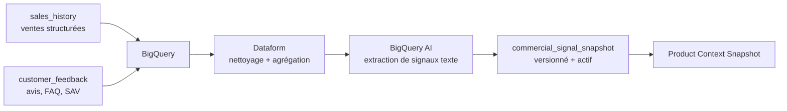

# Script prompteur - Factory Writer

## Slide 1 - Contexte

**Temps cible : 1 min à 1 min 10.**

Bonjour à tous. Je me présente, Florian, consultant GenAI chez SFEIR.

Vous avez missionné SFEIR pour réfléchir avec vous à Factory Writer, votre projet de génération automatisée de fiches produit.

[pause courte]

L’idée aujourd’hui, c’est simple.

Je vais d’abord poser le contexte.
Ensuite, je vous présente l’architecture cible.
Et à la fin, on passera sur la démo.

[pause]

Pour commencer, Outdoor Axolotl est une marque B2C premium dans l’univers du jardin.

Vous avez du mobilier extérieur haut de gamme,
et aussi des outils de jardin ergonomiques.

[pause]

Vos fiches produit ne doivent donc pas seulement être bien écrites.

Elles doivent refléter la réalité technique du produit,
et garder le ton Axolotl.

Aujourd’hui, pour produire une fiche,
les équipes partent de dossiers techniques usine.

Elles lisent,
elles vérifient,
elles recoupent,
puis elles reformulent en fiche e-commerce.

[pause]

Et ce processus prend environ trois semaines.

Le sujet n’est donc pas seulement d’écrire plus vite.

Le sujet, c’est d’accélérer sans perdre la confiance dans les informations utilisées.

## Slide 2 - Objectifs client

**Temps cible : 1 min à 1 min 10.**

À partir de ce contexte, il y a quatre objectifs à garder en tête.

[regarder les 4 cartes]

D’abord, la productivité.

On veut passer d’un cycle d’environ trois semaines
à une fiche prête à relire en moins de deux minutes après l’import des documents.

Ensuite, la fiabilité technique.

Si une dimension,
une matière,
ou une certification est fausse,
la fiche devient risquée pour la marque.

Donc l’IA ne doit pas inventer ou corriger seule les données techniques.

[pause]

Troisième objectif : la scalabilité.

La solution doit marcher pour un produit,
mais aussi pour plusieurs centaines de références lors d’un lancement Spring/Summer.

Et enfin, l’approche context-first.

L’idée n’est pas d’avoir un modèle qui fait tout.

L’idée, c’est de construire un contexte propre,
validé,
versionné,
puis de générer uniquement à partir de ce contexte.

[pause]

Donc la direction est claire : aller beaucoup plus vite, mais sans perdre le contrôle.

## Slide 3 - Principe directeur

**Temps cible : 1 min à 1 min 10.**

La conséquence directe de ces objectifs,
c’est qu’on ne peut pas générer une fiche produit directement depuis des PDFs bruts.

[pause courte]

Si on donne les documents à un LLM
en lui demandant simplement d’écrire la fiche,
on gagne du temps au début.

Mais on perd le contrôle.

On ne sait pas toujours quelle information a été utilisée.

On ne sait pas toujours si une valeur a été mal lue.

Et on ne sait pas toujours si le modèle a complété une information absente.

[regarder le schéma]

Donc le principe directeur est simple.

Avant de générer,
on construit un contexte produit fiable.

Ce contexte contient les faits techniques validés,
les règles du guide de style actif,
et les signaux commerciaux utiles.

[pause]

Ensuite seulement, le modèle peut rédiger.

Il ne part pas d’un PDF brut.

Il part d’un contexte clair,
versionné,
sourcé,
et contrôlé.

Et c’est ce principe qui permet d’aller vite,
sans laisser le modèle décider seul de ce qui est vrai.

## Slide 4 - Architecture technique cible

**Temps cible : 1 min 15 à 1 min 25.**

Ici, on zoome d’un cran.

Le schéma est un C4 Container Diagram.

Il ne montre pas le code.

Il montre les grandes briques applicatives,
et les endroits où l’on stocke les données.

[regarder de gauche à droite]

À gauche, on a les systèmes externes et le back-office.

Ils envoient des événements ou des commandes à l’API / Event Gateway.

C’est le point d’entrée.

Ensuite, l’orchestrateur durable suit le cycle de vie d’une référence produit.

Il ne fait pas tout lui-même.

Il planifie le travail,
puis il délègue aux workers d’exécution.

[pause]

Ces workers sont séparés par responsabilité.

Document Processing s’occupe des PDFs.

Style Guide s’occupe des règles de marque.

Commercial Signals prépare les signaux issus des ventes et des retours clients.

Et Product Sheet Generation arrive à la fin,
pour générer la fiche.

[regarder la droite du schéma]

À droite, les stores gardent les éléments importants :
PDFs,
preuves,
facts,
snapshots,
signaux analytics,
et audit.

Le point clé, c’est celui-ci :
le LLM Gateway ne lit pas directement les PDFs,
ni les données brutes.

Il est appelé uniquement par le worker de génération,
à partir d’un Product Context Snapshot déjà validé.

## Slide 5 - Pourquoi un orchestrateur durable

**Temps cible : 1 min 20 à 1 min 30.**

Le cycle de vie d’une fiche produit n’est pas un simple appel API.

Pour une référence produit,
on peut recevoir les dossiers techniques maintenant.

Le guide de style peut être validé plus tard.

Les signaux commerciaux peuvent arriver ensuite.

Et parfois, il faut attendre une correction humaine.

[pause]

Sans orchestration durable,
ça devient vite fragile.

Il faut savoir ce qui est prêt,
ce qui manque encore,
et où reprendre le traitement.

Donc on va avoir un orchestrateur durable par référence produit.

Il garde l’état.

Il attend les signaux métier.

Et il reprend quand un prérequis arrive.

[regarder les signaux]

Les signaux typiques sont :
facts techniques prêts,
style pack activé,
snapshot commercial disponible.

Si tout est prêt,
l’orchestrateur crée le Product Context Snapshot.

S’il manque quelque chose,
il attend.

Et si une revue humaine est nécessaire,
il attend la décision puis reprend au bon endroit.

[pause]

Le point important,
c’est qu’on évite les scripts fragiles,
les traitements qui repassent en boucle,
et les états perdus entre deux services.

L’orchestrateur durable devient la mémoire fiable du cycle de vie produit.

## Slide 6 - Ingestion technique et zéro hallucination

**Temps cible : 1 min 20 à 1 min 30.**

Ici, on zoome sur la chaîne technique.

L’idée est simple :
on ne demande pas au LLM de lire les PDFs
et de se débrouiller tout seul.

[regarder le pipeline]

D’abord, on classe chaque document.

Est-ce que c’est une fiche technique ?
Une fiche matière ?
Une notice de montage ?
Ou est-ce que le document est hors périmètre ?

Ensuite, selon le type détecté,
on envoie le PDF vers le bon modèle d’extraction.

[pause]

Et là, point important :
le modèle d’extraction ne produit pas directement une vérité finale.

Il propose des candidats :
une valeur,
une source,
une page,
et un score de confiance quand il est disponible.

Après ça, le backend reprend la main.

Il vérifie si le champ est requis,
si l’unité est lisible,
si la valeur est réaliste,
et si une autre source dit autre chose.

[pause]

Si tout est cohérent, la donnée devient un fact technique validé.

Sinon, elle part en revue humaine.

Et donc,
au moment de générer la fiche,
le modèle ne verra que ces facts validés.

## Slide 7 - Style guide

**Temps cible : 1 min à 1 min 10.**

Après la partie technique,
il y a un autre sujet important :
la voix de marque.

Une fiche Axolotl doit être juste.

Mais elle doit aussi avoir le bon ton.

Elle doit rester premium,
claire,
cohérente,
et éviter les formulations qui ne correspondent pas à la marque.

[pause]

Donc on ne veut pas simplement écrire dans le prompt :
“écris comme Axolotl”,
et espérer que le modèle comprenne toujours la même chose.

On va plutôt traiter le style guide comme une vraie source.

[regarder le pipeline]

On en extrait des règles de ton,
de vocabulaire,
et de structure.

Ensuite, ces règles sont relues,
validées,
puis activées dans un style pack.

Une fois actif,
ce style pack peut être réutilisé pour toutes les fiches produit.

[pause]

Comme pour les facts techniques,
on ne laisse pas tout au modèle.

On transforme la voix de marque en règles contrôlées,
versionnées,
et réutilisables.

## Slide 8 - Signaux commerciaux

**Temps cible : 1 min à 1 min 10.**

À ce stade, on a deux briques contrôlées.

Les facts techniques pour la vérité produit.

Et le style pack pour la voix de marque.

La troisième brique,
ce sont les signaux commerciaux.

[regarder le schéma]

Par exemple :
les ventes,
les retours clients,
les questions fréquentes,
les objections,
ou les arguments qui fonctionnent bien sur une famille de produits.

Ces signaux sont utiles pour orienter la fiche.

Ils peuvent aider à choisir quel bénéfice mettre en avant,
quel vocabulaire utiliser,
ou quelle objection traiter.

[pause]

Mais ils ne doivent jamais devenir une source de vérité technique.

Si un retour client dit qu’une table est légère,
mais que le dossier technique indique 58 kilos,
c’est le dossier technique qui gagne.

Et donc, on injecte ces signaux dans le contexte produit
comme des signaux d’orientation commerciale,
pas comme des facts.

[pause]

La séparation est simple :
les facts techniques disent ce qui est vrai,
le style guide dit comment parler,
et les signaux commerciaux aident à choisir l’angle.

## Slide 9 - Contexte produit

**Temps cible : 1 min à 1 min 10.**

On arrive maintenant au point de jonction : le contexte produit.

Les facts techniques,
le style pack,
et les signaux commerciaux
ne partent pas séparément vers la génération.

On les assemble d’abord dans un snapshot.

[regarder le schéma]

Ce snapshot est figé,
versionné,
et sourcé.

Ça veut dire que pour une fiche générée,
on peut retrouver quelles données techniques ont été utilisées,
quel style pack était actif,
et quels signaux commerciaux ont orienté la rédaction.

[pause]

C’est important,
parce que la génération ne doit pas dépendre d’un état flou,
ou d’un prompt qui va chercher un peu partout.

Le modèle reçoit un contexte clair :
ce qui est vrai,
comment parler,
et quel angle commercial privilégier.

## Slide 10 - Génération contrôlée

**Temps cible : 1 min 15 à 1 min 25.**

Une fois le contexte produit prêt, on peut générer la fiche.

Mais la génération reste contrôlée.

On ne fait pas un appel libre au modèle
avec un prompt improvisé.

[regarder le pipeline]

D’abord, on part du Product Context Snapshot.

Ensuite, on utilise une recette de prompt versionnée.

Cette recette définit le rôle du modèle,
le format attendu,
les contraintes,
et la manière d’utiliser les données du contexte.

Puis l’appel passe par une LLM Gateway.

L’intérêt,
c’est de garder une interface stable avec les providers et les modèles.

On peut router,
tracer,
limiter,
ou changer de modèle sans réécrire toute l’application.

[pause]

Le modèle renvoie une sortie structurée.

Ce n’est pas juste un texte libre.

Le backend attend des champs précis :
titre,
description,
bénéfices,
spécifications,
et raisons de relecture si besoin.

Enfin, le backend applique un post-check déterministe.

Il vérifie les sections obligatoires,
les claims interdits,
les champs vides,
ou les signaux de relecture.

[pause]

Donc le LLM rédige.

Mais le système garde le contrôle du contexte,
du format,
et du statut final.

## Slide 11 - Human-on-the-loop

**Temps cible : 1 min 10 à 1 min 20.**

Ici, je fais une distinction importante.

On n’utilise pas l’humain de la même manière partout.

Pour le style guide,
on est plutôt sur du human-in-the-loop.

Avant d’activer des règles de marque
qui vont être réutilisées sur toutes les fiches,
on veut une validation humaine explicite.

[regarder les deux zones]

En revanche, pour les fiches produit,
on vise du human-on-the-loop.

Le système avance automatiquement quand les contrôles passent.

L’humain intervient seulement si un contrôle bloque :
confiance faible,
contradiction,
champ requis absent,
valeur incohérente,
ou document hors périmètre.

[pause]

Dans ce cas,
il ne réécrit pas tout le processus.

Il prend une décision ciblée :
confirmer,
corriger,
rejeter,
ou demander un nouveau document.

Ensuite, le parcours reprend automatiquement au bon endroit.

[pause]

C’est cette différence qui permet de garder le contrôle,
sans transformer chaque fiche produit en validation manuelle complète.

## Slide 12 - LLMOps et offline lab

**Temps cible : 1 min 15 à 1 min 25.**

Après la génération,
il faut aussi faire progresser la qualité dans le temps.

Une recette peut bien marcher au début,
puis montrer ses limites sur une autre famille produit,
ou sur un document plus ambigu.

Donc on ne valide pas une nouvelle version trop vite.

[regarder la boucle]

D’abord, on part d’une recette versionnée :
prompt,
modèle,
paramètres.

Ensuite, on la teste sur quelques cas représentatifs.

Et après, on compare les résultats.

[regarder les familles d’évaluation]

Familles d’évaluation :

- Évaluations déterministes
  Contrôles par code, sans IA : JSON valide, champs requis, dimensions, claims interdits.

- Rubriques métier
  On transforme les attentes sur les fiches produit en critères : ton, clarté, fidélité aux facts.

- Juge LLM
  Il relit automatiquement beaucoup de fiches avec cette grille.
  Il aide à évaluer, mais ne remplace pas les contrôles techniques.

- Comparaison / A-B testing
  On compare la version actuelle avec une version candidate sur les mêmes cas de test.
  Exemple : prompt A vs prompt B, modèle A vs modèle B.

En résumé : on améliore les prompts comme du logiciel : on teste, on compare, puis seulement on active.

## Slide 13 - Choix technos

**Temps cible : 1 min 10 à 1 min 20.**

[regarder le tableau]

- Documents techniques

  Besoin :
  lire les PDFs usine de manière fiable.

  Recommandation :
  Google Document AI.

  Alternatives :
  Azure Document Intelligence,
  AWS Textract.

  Pourquoi :
  ce sont des outils OCR + IA spécialisés document.
  Ils gèrent l’OCR,
  le layout,
  la classification,
  l’extraction,
  les pages sources
  et les preuves.

  Un VLM,
  c’est un modèle vision-language généraliste.
  Il peut raisonner sur une image ou un PDF,
  mais il donne moins de structure,
  moins de preuves,
  et moins de traçabilité.

  Donc ici,
  je le déconseille comme brique principale d’extraction.

- Orchestration durable

  Besoin :
  suivre chaque SKU dans le temps.

  Recommandation :
  Temporal Cloud.

  Alternatives :
  AWS Step Functions,
  Azure Durable Functions,
  Google Workflows.

  Pourquoi :
  un orchestrateur durable garde l’état d’un processus métier long.
  Il sait attendre un signal,
  relancer une activité en erreur,
  et reprendre après une décision humaine.

  Temporal est particulièrement adapté
  quand on a un workflow long par SKU,
  des signaux métier,
  des retries,
  et un historique fiable.

- Gateway LLM

  Besoin :
  éviter que l’application parle directement aux providers LLM.

  Recommandation :
  LiteLLM.

  Alternatives :
  Portkey,
  Cloudflare AI Gateway,
  OpenRouter.

  Pourquoi :
  la gateway devient le point d’accès unique aux modèles.
  Elle centralise le routage,
  les traces,
  les budgets,
  les retries
  et les fallbacks.

  LiteLLM est simple à intégrer,
  compatible avec beaucoup de providers,
  et garde une interface proche d’OpenAI.

- Providers LLM

  Besoin :
  choisir les modèles de génération.

  Recommandation :
  les brancher derrière la gateway,
  pas directement dans le code métier.

  Options :
  Vertex AI,
  OpenAI,
  Anthropic,
  Bedrock,
  Mistral.

  Pourquoi :
  le modèle peut changer,
  mais l’application garde la même interface.

- LLMOps + évaluation

  Besoin :
  versionner les prompts,
  tracer les appels,
  évaluer les recettes.

  Recommandation :
  Langfuse.

  Alternatives :
  LangSmith,
  Braintrust,
  outils d’évaluation du provider.

  Pourquoi :
  on ne veut pas améliorer les prompts au ressenti.
  On veut tester,
  comparer,
  puis activer seulement si la version progresse.

- Signaux commerciaux

  Besoin :
  transformer les ventes et retours clients en signaux utilisables.

  Recommandation :
  partir du data stack déjà en place chez Axolotl.

  Options :
  BigQuery,
  Snowflake,
  Databricks,
  dbt.

  Pourquoi :
  ces signaux orientent l’angle commercial,
  mais ne deviennent jamais des faits techniques.

[pause]

Donc la logique, c’est celle-ci :
des services spécialisés,
mais branchés derrière des interfaces propres.

C’est ça qui permet de rester agnostique,
sans choisir des briques trop génériques.

## Slide 14 - Scalabilité

**Temps cible : 1 min 30 à 1 min 40.**

Pour la scalabilité,
le point important,
c’est qu’on ne lance pas un seul gros traitement
pour toute la collection.

On découpe le travail produit par produit.

[pause courte]

Si on a 250 SKU,
on lance 250 workflows indépendants.

Chaque SKU garde son propre état d’avancement.

Donc si une fiche est bloquée en revue humaine,
elle ne bloque pas les autres.

[regarder le schéma]

Ensuite,
le workflow ne fait pas lui-même les traitements lourds.

Il planifie des activités :
extraction PDF,
validation,
génération,
audit.

Ces activités partent dans des task queues Temporal.

[pause]

Et c’est là que le scaling devient propre.

On ne scale pas le workflow.

On scale les workers.

[pause courte]

Si l’extraction PDF est lente,
on ajoute des workers sur la queue document-processing.

Si la génération est lente,
on ajoute des workers sur la queue product-generation.

[pause]

Mais on ne laisse pas tout partir sans limite.

On garde des plafonds de concurrence
pour protéger les providers.

[pause]

Donc si 250 produits arrivent d’un coup,
les tâches attendent dans les queues.

Elles ne sont pas perdues.

Elles ne saturent pas les APIs externes.

Les workers les consomment au rythme autorisé.

[pause]

C’est ça le backpressure :
absorber un pic
sans casser le système.

## Annexe - Flux signaux commerciaux

Oui, je le ferais avec **2 tables sources principales**, puis une chaîne BigQuery/Dataform qui produit un **snapshot commercial versionné**.

**Flux Cible**


**1. Tables Sources**
`sales_history` contient les données chiffrées : ventes, conversion, retours, saison, segment prix, famille produit, canal.

`customer_feedback` contient les textes clients : avis, questions fréquentes, tickets SAV, objections, verbatims, note client, date, source.

Ces tables sont des sources analytiques. Elles ne sont pas directement envoyées au LLM de génération.

**2. BigQuery**
BigQuery sert de warehouse. On centralise les données commerciales et les retours clients dans un endroit requêtable à grande échelle.

Exemples de tables :
```text
raw.sales_history
raw.customer_feedback
```

**3. Dataform**
Dataform organise les transformations SQL dans BigQuery. Il sert à nettoyer, joindre, tester et documenter les tables.

Exemples de sorties Dataform :
```text
mart.sales_signals_by_segment
mart.feedback_chunks_by_segment
mart.commercial_signal_inputs
```

Concrètement, Dataform prépare des groupes exploitables :
```text
famille = mobilier_jardin
saison = printemps_ete
segment_prix = premium
```

**4. BigQuery AI / Data Mapper**
Ensuite, BigQuery AI peut transformer les textes clients en données structurées. Par exemple, avec `AI.GENERATE_TABLE`, tu peux demander une sortie tabulaire avec un schéma précis.

Exemple de signaux extraits :
```json
{
  "perceived_benefits": ["grande table familiale", "matière naturelle"],
  "customer_objections": ["entretien du bois", "poids"],
  "faq_topics": ["hivernage", "nombre de convives"],
  "recommended_angle": "art de vivre extérieur premium"
}
```

Le “data mapper”, dans cette architecture, c’est cette étape qui convertit des données brutes ou semi-structurées en signaux métier propres.

**5. Snapshot Commercial**
À la fin, on écrit un `commercial_signal_snapshot`.

Il doit être **append-only** : on ne modifie pas l’ancien snapshot, on en crée un nouveau.

Champs importants :
```json
{
  "snapshot_id": "uuid",
  "famille_code": "mobilier_jardin",
  "season_code": "spring_summer",
  "segment_prix_code": "premium",
  "source_window_start": "2026-03-01",
  "source_window_end": "2026-04-28",
  "is_active": true,
  "created_at": "2026-04-28T08:00:00Z",
  "sales_signals_json": {},
  "feedback_signals_json": {},
  "snapshot_hash": "..."
}
```

**Gestion Dans Le Temps**
On garde l’historique. Chaque nouveau run Dataform peut produire un nouveau snapshot pour une famille/saison/segment.

Un seul snapshot est actif pour un segment donné. Quand un nouveau snapshot est validé, l’ancien passe à `is_active=false`, le nouveau passe à `is_active=true`.

Les fiches déjà générées ne changent pas automatiquement. Le `product_context_snapshot` garde l’ID du snapshot commercial utilisé, donc on peut toujours expliquer pourquoi une fiche a été générée avec tel angle à tel moment.

**Déclenchement**
En production, je ferais tourner ce pipeline tous les jours ou toutes les semaines selon le volume.

Quand un nouveau snapshot actif est créé, on publie un événement métier :
```text
CommercialSnapshotAvailable
```

L’orchestrateur durable peut alors vérifier si certains produits en attente ont maintenant tous leurs prérequis.

**Point Clé**
Les signaux commerciaux orientent la rédaction, mais ne deviennent jamais des faits techniques. Ils disent “quel angle privilégier”, pas “ce qui est vrai techniquement”.

Sources : [Dataform overview](https://docs.cloud.google.com/dataform/docs/overview), [BigQuery AI.GENERATE_TABLE](https://docs.cloud.google.com/bigquery/docs/reference/standard-sql/bigqueryml-syntax-generate-table), [BigQuery scheduled queries](https://cloud.google.com/bigquery/docs/scheduling-queries).
