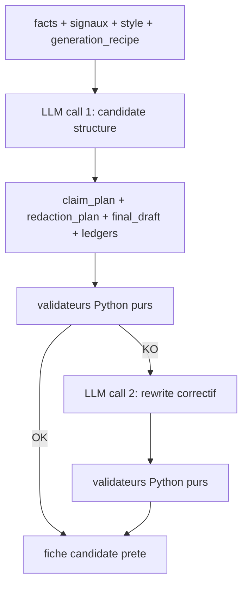

# Latence runtime, validation deterministe et risques d'optimisation

Ce document reprend une objection critique sur l'architecture Factory Writer, puis la reponse architecturale recommandee.

## Question / objection

### 1. Goulot d'etranglement de la latence

**Risk level : Critical**

Le runtime prevoit une chaine lourde :

```text
facts -> claim plan -> redaction plan -> final draft -> review -> validation
```

Cela represente 5 a 6 appels LLM sequentiels.

A raison de 10 a 20 secondes par appel, en incluant le Time-To-First-Token, la generation et les retries eventuels, le SLA de 2 minutes risque d'etre depasse, surtout si Temporal declenche un retry suite a un rate limit.

La solution proposee serait de fusionner les etapes de planification et de drafting. En 2026, avec des modeles dotes de capacites de raisonnement, on pourrait leur demander de produire un bloc de raisonnement interne qui combine le claim plan et le redaction plan, puis le final draft dans le meme appel API. Cela diviserait la latence par deux.

### 2. Illusion de la validation deterministe

**Risk level : Critical**

L'architecture mentionne une etape de validation deterministe a la fin.

Si cette validation est realisee par un LLM, elle n'est pas deterministe. Un LLM peut halluciner sa propre verification.

La solution proposee serait d'imposer les Structured Outputs avec JSON Schema strict via LiteLLM. Le modele devrait renvoyer le texte final et un tableau JSON des faits utilises, par exemple :

```text
materials_used
dimensions_used
claims_used
```

Ensuite, l'etape de validation deterministe doit etre un script Python pur qui verifie mathematiquement que les valeurs declarees sont strictement incluses dans les facts extraits par Document AI.

Si la validation echoue, Temporal relance le LLM avec un message correctif.

### 3. Risque Vertex Prompt Optimizer / Vertex Eval

**Risk level : Medium / Overkill**

Vertex AI Gen AI Eval est excellent pour l'Offline Lab, notamment pour AutoSxS, les rubrics et les evaluations avancees.

Mais cela peut etre de l'artillerie lourde pour demarrer, car Langfuse propose deja des capacites d'evaluation suffisantes pour un premier niveau de maturite.

Vertex Prompt Optimizer peut aussi etre dangereux pour l'image de marque. Les optimiseurs algorithmiques peuvent creer des prompts qui maximisent une metrique technique, mais degradent la subtilite litteraire attendue pour un ton premium et elegant.

Il est donc conseille de ne pas l'utiliser directement pour le copywriting final.

## Reponse architecturale

Je valide une grande partie de cette critique, mais pas tout. Elle pointe trois vrais risques, surtout pour le runtime inferieur a 2 minutes. En revanche, certaines recommandations doivent etre adaptees pour ne pas casser le besoin de tracabilite et de controle metier.

## 1. Latence runtime : critique valide

Oui, si on garde en production :

```text
claim plan -> redaction plan -> final draft -> review -> validation
```

avec 4 ou 5 appels LLM sequentiels, le SLA inferieur a 2 minutes devient fragile.

Meme si chaque appel prend seulement 8 a 15 secondes, avec retries, rate limits, cold starts ou gros contexte, le budget de latence peut etre depasse.

La critique est donc juste.

En revanche, je ne suivrais pas exactement la recommandation consistant a demander un `thought_process` libre au modele. En production, je prefere eviter de demander au modele de sortir un raisonnement libre. C'est verbeux, difficile a valider et peut exposer du bruit.

La meilleure approche est de demander une **trace de decision structuree**, pas une chaine de pensee libre.

### Correction recommandee

Pour le runtime, je ferais :

```text
Appel LLM 1 :
generate_sheet_candidate
-> claim_plan compact
-> redaction_plan compact
-> final_draft
-> fact_usage_ledger
-> style_usage_ledger

Validation Python pure

Appel LLM 2 uniquement si necessaire :
rewrite_with_validator_feedback
-> revised_final_draft
-> updated_fact_usage_ledger
```

Le runtime devient donc :

```text
facts/signaux/style
-> generate candidate structure en 1 appel
-> validation deterministe
-> rewrite correctif optionnel
-> publication candidate
```

On garde les objets `claim_plan` et `redaction_plan`, mais ils sont produits dans le **meme appel** que le draft.

Cela conserve la tracabilite sans payer 3 appels sequentiels.

### Architecture runtime ajustee



Cette version est plus realiste pour respecter un SLA inferieur a 2 minutes.

## 2. Validation deterministe : critique valide

Oui : si la validation finale est faite par un LLM, ce n'est pas deterministe.

Dans l'architecture cible, le terme "validation deterministe" doit toujours signifier :

```text
code Python pur
pas LLM
pas judge model
pas heuristique probabiliste
```

La critique est donc correcte, et il faut le rendre explicite dans l'architecture.

### Sortie attendue du LLM

Le LLM doit sortir un JSON strict du type :

```json
{
  "claim_plan": {},
  "redaction_plan": {},
  "final_draft": "Table de jardin en teck certifie FSC...",
  "fact_usage_ledger": [
    {
      "id_fact": "f3",
      "cle": "longueur_cm",
      "valeur_source": "210",
      "mention_dans_texte": "210 cm"
    }
  ],
  "forbidden_claims_checked": ["sans entretien pour toujours"]
}
```

Puis Python verifie :

```text
chaque id_fact existe
chaque valeur utilisee vient des facts valides
les dimensions sont coherentes apres normalisation
aucun claim interdit n'apparait
les IDs de signaux et de style existent
le JSON respecte le schema
les champs obligatoires sont presents
```

Important : je ne ferais pas seulement du regex exact match, car les formats suivants peuvent etre equivalents :

```text
210 cm
2,10 m
2.10 metres
```

Il faut donc un validateur avec normalisation d'unites.

La bonne formule est :

```text
Structured Outputs
+ ledger factuel
+ validateurs Python purs
```

Et non :

```text
LLM judge final
```

## 3. Vertex Prompt Optimizer : critique partiellement valide

Je suis d'accord avec la prudence.

Pour du copywriting premium, laisser un optimizer maximiser une metrique peut produire des prompts techniquement optimises mais mauvais pour la marque :

```text
trop directs
trop repetitifs
trop commerciaux
trop SEO
pas assez subtils
```

Vertex Prompt Optimizer ne doit donc **pas** auto-promouvoir des prompts de redaction finale.

En revanche, je ne le supprimerais pas totalement. Je le classerais comme brique avancee, tres encadree.

### Cas ou Vertex Prompt Optimizer est pertinent

Je l'utiliserais plutot sur :

```text
extraction du style guide
claim plan structure
redaction plan structure
review checklist
instructions de grounding
```

Je serais beaucoup plus prudent sur :

```text
final draft copywriting
voice premium
tournures litteraires
style de marque
```

### Regle stricte

```text
Vertex Prompt Optimizer peut proposer.
Il ne peut jamais promouvoir.
```

La promotion reste controlee par :

```text
scores offline
validation deterministe
review humaine Sophie / Marc
PromptPromotionWorkflow
Postgres generation_recipe active
```

La critique est donc juste si on imaginait un optimizer autonome.

L'architecture reste saine si Vertex est seulement un generateur de candidats offline.

## Architecture cible corrigee

La cible devient :

```text
Runtime prod :
1 ou 2 appels LLM maximum
Structured Outputs obligatoire
validation Python pure obligatoire
pas Vertex Eval
pas Prompt Optimizer
pas AutoSxS

Offline lab :
Langfuse datasets + experiments
Vertex Eval optionnel pour benchmark avance
Vertex Prompt Optimizer seulement pour proposer des candidats
human approval obligatoire pour prompts copywriting
```

## Impact sur la generation recipe

Il faut ajouter une notion importante :

```text
runtime_chain_mode
```

Exemple :

```json
{
  "generation_recipe_version": "sheet_generation_recipe_v7",
  "runtime_chain_mode": "collapsed_candidate_generation",
  "steps": {
    "generate_sheet_candidate": {
      "prompt_name": "generate_sheet_candidate",
      "prompt_version": 18,
      "model": "gemini-2.5-flash",
      "temperature": 0.3,
      "output_schema": "product_sheet_candidate_v1"
    },
    "rewrite_with_validator_feedback": {
      "prompt_name": "rewrite_with_validator_feedback",
      "prompt_version": 6,
      "model": "gemini-2.5-flash",
      "temperature": 0.2,
      "optional": true
    }
  }
}
```

Au lieu d'avoir toujours :

```text
claim_plan step
redaction_plan step
final_draft step
review step
```

comme appels LLM separes.

On peut garder ces etapes comme **objets internes du JSON**, pas forcement comme appels LLM separes.

## Conclusion

Les corrections a retenir sont :

| Point | Verdict |
| --- | --- |
| 5-6 appels LLM sequentiels en runtime | Critique valide |
| Fusionner planification + drafting | Oui, mais avec output structure, pas raisonnement libre |
| Validation LLM finale | A proscrire |
| Validation Python pure | Obligatoire |
| Structured Outputs | Obligatoire |
| Ledger factuel | Obligatoire |
| Vertex Eval | Optionnel, plutot offline avance |
| Vertex Prompt Optimizer | A utiliser prudemment, jamais en auto-promotion copywriting |
| Langfuse eval pour demarrer | Suffisant pour POC / prod lean |

La correction principale est :

> Le pipeline conceptuel reste `facts/signaux/style -> claim plan -> redaction plan -> draft -> review`, mais le runtime prod ne doit pas forcement materialiser chaque etape par un appel LLM separe. Pour tenir le SLA, il doit produire un candidat structure en un appel, valider par code, puis ne reecrire que si necessaire.
