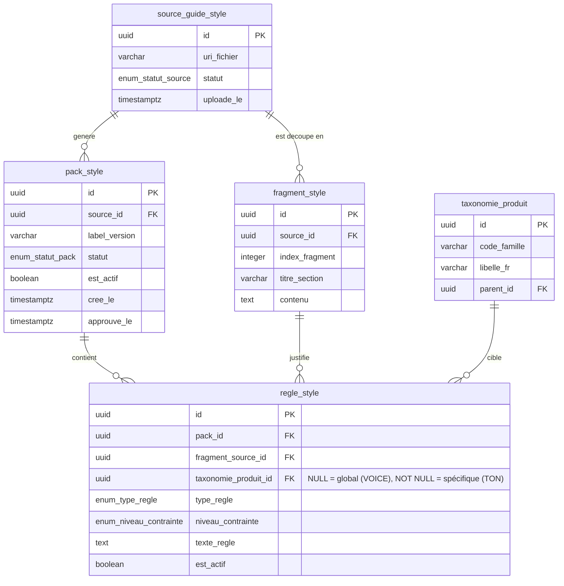

# POC : Base de données du Style Guide (Axolotl)

Ce document décrit le modèle de données simplifié pour le pipeline d'ingestion du *Style Guide* Axolotl.

L'objectif du POC est d'avoir une structure :

- simple à comprendre
- facile à requêter
- suffisante pour alimenter le runtime
- traçable jusqu'au fragment source du guide PDF

## Principe métier : `voice` vs `tone`

Pour éviter les ambiguïtés, le POC sépare clairement :

- **la voice** : l'identité rédactionnelle stable de la marque
- **le tone** : l'adaptation contextuelle de cette voice selon la famille produit

Exemple Axolotl :

- `voice` globale : élégant, expert, centré sur la nature
- `tone` `mobilier_jardin` : plus sensoriel, matière, art de vivre extérieur
- `tone` `outils_jardin` : plus précis, ergonomie, usage, confort du geste

## ERD

## 1. `source_guide_style`

Cette table représente le document source brut déposé dans GCS.

### Schéma de la table

| Champ | Type | Description |
| --- | --- | --- |
| `id` | `uuid` | Identifiant unique du document source. |
| `uri_fichier` | `varchar` | Emplacement exact du PDF dans GCS. |
| `statut` | `enum_statut_source` | État du traitement (`EN_ATTENTE`, `EN_COURS`, `TERMINE`, `ERREUR`). |
| `uploade_le` | `timestamptz` | Date d'arrivée du document. |

### Exemple de données

| id | uri_fichier | statut | uploade_le |
| --- | --- | --- | --- |
| `src_001` | `gs://axolotl-assets/guides/guide_marque_2026.pdf` | `TERMINE` | `2026-04-13 09:12:00` |

## 2. `fragment_style`

Cette table représente les fragments extraits du PDF, par exemple via Document AI Layout Parser.

### Schéma de la table

| Champ | Type | Description |
| --- | --- | --- |
| `id` | `uuid` | Identifiant unique du fragment. |
| `source_id` | `uuid` | Référence vers le document source dans `source_guide_style`. |
| `index_fragment` | `integer` | Position du fragment dans le document. |
| `titre_section` | `varchar` | Titre ou zone logique du document. |
| `contenu` | `text` | Texte brut extrait, utilisé comme preuve et comme matière d'analyse. |

### Exemple de données

| id | source_id | index_fragment | titre_section | contenu |
| --- | --- | --- | --- | --- |
| `frag_001` | `src_001` | `1` | `Voix de la marque` | `La marque s'exprime avec elegance, expertise et respect de la nature.` |
| `frag_002` | `src_001` | `2` | `Mots interdits` | `Ne jamais employer les formulations indestructible ou sans entretien pour toujours.` |
| `frag_003` | `src_001` | `3` | `Mobilier outdoor` | `Pour le mobilier outdoor, privilegier un vocabulaire de matiere, de confort et d'art de vivre exterieur.` |
| `frag_004` | `src_001` | `4` | `Outils ergonomiques` | `Pour les outils, conserver un ton expert, precis et rassurant centre sur le confort du geste.` |

## 3. `pack_style`

Cette table représente la version exploitable du guide pour le runtime.

### Schéma de la table

| Champ | Type | Description |
| --- | --- | --- |
| `id` | `uuid` | Identifiant unique du pack de style. |
| `source_id` | `uuid` | Référence vers le document source à l'origine du pack. |
| `label_version` | `varchar` | Libellé lisible de la version. |
| `statut` | `enum_statut_pack` | État métier du pack : `BROUILLON`, `APPROUVE`, `ACTIF`. |
| `est_actif` | `boolean` | Indique si cette version est utilisée au runtime. Invariant : seul un pack `ACTIF` peut avoir `est_actif = true`. |
| `cree_le` | `timestamptz` | Date de création du pack. |
| `approuve_le` | `timestamptz` | Date de validation humaine, ou `NULL` si non approuvé. |

### Exemple de données

| id | source_id | label_version | statut | est_actif | cree_le | approuve_le |
| --- | --- | --- | --- | --- | --- | --- |
| `pack_001` | `src_001` | `v1.0-poc` | `ACTIF` | `true` | `2026-04-13 09:20:00` | `2026-04-13 09:30:00` |

## 4. `taxonomie_produit`

Cette table représente l'arbre des catégories de produits (le PIM). Elle est externalisée pour éviter les erreurs de frappe (typos) et garantir une intégrité référentielle absolue lors de la définition des consignes de Ton.

### Schéma de la table

| Champ | Type | Description |
| --- | --- | --- |
| `id` | `uuid` | Identifiant unique de la catégorie. |
| `code_famille` | `varchar` | Code technique immuable (ex: `OUTDOOR_MOB`). |
| `libelle_fr` | `varchar` | Nom lisible par l'humain (ex: `Mobilier de Jardin`). |
| `parent_id` | `uuid` | Référence vers son parent pour gérer l'arbre, ou `NULL` si racine. |

### Exemple de données

| id | code_famille | libelle_fr | parent_id |
| --- | --- | --- | --- |
| `tax_001` | `OUTDOOR_MOB` | `Mobilier de Jardin` | `NULL` |
| `tax_002` | `OUTDOOR_TOOL` | `Outils de Jardin` | `NULL` |

## 5. `regle_style`

Cette table représente les règles finales injectables dans le moteur. En s'appuyant sur la `taxonomie_produit`, on évite la redondance et on assure que chaque règle s'applique à un segment métier valide.

Important :

- une règle est **globale (la Voix)** si `taxonomie_produit_id = NULL`
- une règle est **contextuelle (le Ton)** si `taxonomie_produit_id` pointe vers une catégorie valide (ex: `tax_001`)
- `fragment_source_id` est **obligatoire** pour garantir la traçabilité zéro hallucination technique.

### Schéma de la table

| Champ | Type | Description |
| --- | --- | --- |
| `id` | `uuid` | Identifiant unique de la règle. |
| `pack_id` | `uuid` | Référence vers le pack auquel appartient la règle. |
| `fragment_source_id` | `uuid` | Référence obligatoire vers le fragment qui justifie cette règle. |
| `taxonomie_produit_id`| `uuid` | Famille produit ciblée (Ton contextuel). `NULL` si la règle s'applique à toute la marque (la Voix). |
| `type_regle` | `enum_type_regle` | Catégorie de règle : `VOIX`, `TON`, `FORMATAGE`, `PROMESSE_INTERDITE`. |
| `niveau_contrainte` | `enum_niveau_contrainte`| Niveau d'obligation de la règle : `HARD` ou `SOFT`. |
| `texte_regle` | `text` | Texte exact de la contrainte à injecter au runtime. |
| `est_actif` | `boolean` | Permet d'activer ou désactiver une règle sans désactiver tout le pack. |

### Valeurs possibles de `type_regle`

| Valeur | Signification | Exemple |
| --- | --- | --- |
| `VOIX` | Règle globale de marque, stable quel que soit le produit. | `Le texte doit rester elegant, expert et centre sur la nature.` |
| `TON` | Règle contextuelle, spécifique à une famille produit. | `Parlez de résistance aux intempéries.` |
| `FORMATAGE` | Règle sur la forme du texte ou sa structure rédactionnelle. | `Privilegier des phrases fluides et eviter les formulations trop longues.` |
| `PROMESSE_INTERDITE` | Règle qui interdit explicitement une promesse marketing. | `Ne jamais promettre sans entretien pour toujours.` |

### Valeurs possibles de `niveau_contrainte`

| Valeur | Signification | Conséquence runtime |
| --- | --- | --- |
| `HARD` | Règle non négociable. | Si violée, la sortie doit être rejetée par les validateurs déterministes. |
| `SOFT` | Préférence forte mais non bloquante. | Instruction injectée dans le prompt AI sans erreur bloquante. |

### Exemple de données

| id | pack_id | fragment_source_id | taxonomie_produit_id | type_regle | niveau_contrainte | texte_regle | est_actif |
| --- | --- | --- | --- | --- | --- | --- | --- |
| `rule_001`| `pack_001`| `frag_001` | `NULL` | `VOIX` | `HARD` | `Le texte doit rester elegant, expert et centre sur la nature.` | `true` |
| `rule_002`| `pack_001`| `frag_002` | `NULL` | `PROMESSE_INTERDITE` | `HARD` | `Ne jamais utiliser le terme indestructible.` | `true` |
| `rule_003`| `pack_001`| `frag_003` | `tax_001` | `TON` | `SOFT` | `Privilegier un vocabulaire de matiere et d'art de vivre exterieur.` | `true` |
| `rule_004`| `pack_001`| `frag_004` | `tax_002` | `TON` | `SOFT` | `Privilegier un registre precis, rassurant et centre sur l'ergonomie.` | `true` |

## Lecture simple du tout

| Étape | Table |
| --- | --- |
| On reçoit le PDF | `source_guide_style` |
| On découpe le PDF | `fragment_style` |
| On construit la version métier | `pack_style` |
| On s'aligne d'abord sur la taxonomie officielle | `taxonomie_produit` |
| On injecte les règles ciblées au moteur | `regle_style` |

En une phrase :

- `source_guide_style` = ce qu'on a reçu
- `fragment_style` = ce qu'on a lu
- `pack_style` = ce qu'on a validé
- `taxonomie_produit` = l'arbre des familles de notre PIM
- `regle_style` = ce qu'on applique vraiment au moteur (avec la distinction Voix globale `NULL` vs Ton ciblé via l'ID de Taxonomie)

