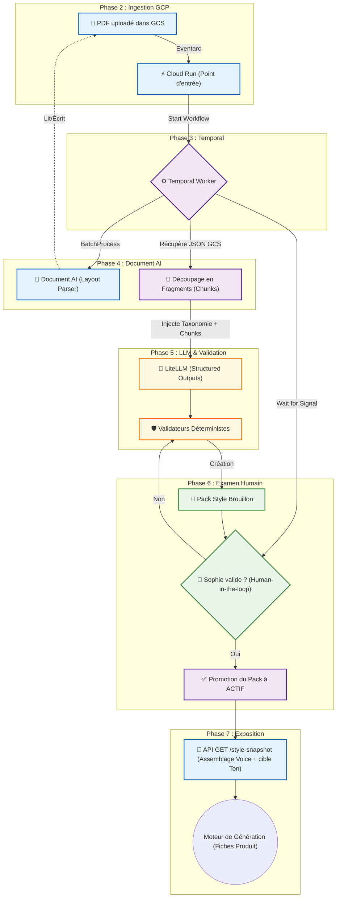

# Roadmap E2E : Ingestion du Style Guide (Factory Writer)

Ce document sert de backlog et de feuille de route pour les agents IA et les développeurs chargés d'implémenter de A à Z le pipeline d'ingestion du guide de style d'Axolotl. 

Il garantit le respect de la séparation "Voice/Tone", l'indépendance de la base de données, et l'intégration GCP/Temporal décrite dans l'architecture cible de 2026.

---

## Vue d'ensemble du Flow E2E

---

## Phase 0 : Skeleton de l'Application (SOTA 2026)
**Objectif :** Initialiser le socle technique monolithique avec les meilleures pratiques Python de 2026 pour héberger proprement la pipeline. Pas de microservices pour ce POC, mais une architecture logicielle découplée (Hexagonale / DDD).

- [x] **Création du Projet GCP :** Initier le projet "Factory Writer" sur Google Cloud Platform, lier la facturation via gcloud CLI local, et activer les APIs de base (Document AI, Storage, Cloud Run, Eventarc).
- [x] **Gestionnaire de paquets ultrarapide :** Initialiser le projet avec `uv` (le standard SOTA 2026 qui remplace pip/poetry) pour une gestion de dépendances déterministe.
- [x] **Organisation en Bounded Contexts (DDD) :** Créer la structure de dossiers : `domain/` (modèles purs et règles), `application/` (Workflows Temporal et cas d'usage), `infrastructure/` (connecteurs GCP, LiteLLM) et `presentation/` (Endpoints FastAPI).
- [x] **Qualité et Typage :** Configurer `ruff` (linter/formatter absolu) et `mypy` (typage statique strict) dans un `pyproject.toml` blindé. 
- [x] **Gestion de la Configuration :** Mettre en place `pydantic-settings` pour la validation typée des variables d'environnement (GCP secrets, DB credentials, accès Temporal).
- [x] **Injection de Dépendances :** Préparer le mécanisme d'injection (via FastAPI ou un conteneur) pour s'assurer que les appels à GCS, Temporal ou LiteLLM puissent être facilement mockés sans polluer le métier.
- [ ] **Dockerisation Cloud Run :** Rédiger un `Dockerfile` multi-stage optimisé pour Python, garantissant un démarrage rapide (Cold Start) sur Google Cloud Run.

## Phase 1 : Fondation de Données & Pydantic (Backend Core)
**Objectif :** Préparer le code et la base de données pour accueillir les entités du guide de style sans autoriser de données invalides (zéro hallucination technique).

- [x] **Définir les types ENUM SQLAlchemy/Postgres :** Créer `StatutSource`, `StatutPack`, `TypeRegle` (`VOIX`, `TON`, `FORMATAGE`, `PROMESSE_INTERDITE`) et `NiveauContrainte` (`HARD`, `SOFT`).
- [x] **Modéliser les schémas de BDD :** Traduire l'ERD de `POC_STYLE_GUIDE_DB_DESIGN.md` en classes ORM (SQLAlchemy ou SQLModel) : `SourceGuideStyle`, `FragmentStyle`, `PackStyle`, `TaxonomieProduit`, `RegleStyle`.
- [x] **Modéliser les classes Pydantic :** Créer les schémas de validation stricte qui seront utilisés par FastAPI et par LiteLLM (pour le Structured Output).
- [x] **Générer et exécuter les migrations :** Utiliser Alembic pour générer la BDD PostgreSQL locale/dev.
- [x] **Seeder la Taxonomie :** Créer un script d'amorçage pour injecter des catégories fictives dans `taxonomie_produit` (ex: `OUTDOOR_MOB`, `OUTDOOR_TOOL`) afin de simuler l'arbre PIM.

## Phase 2 : Ingestion & Infrastructure Cloud (GCP)
**Objectif :** Réceptionner le document physique de manière cloud-native.

- [x] **Provisionner le Bucket GCS :** Créer un bucket dédié à l'upload des PDF sources du guide de style.
- [x] **Provisionner Document AI :** Instancier un processor **Document AI Layout Parser** sur GCP. Noter son `processor_id` et pinner sa `version`.
- [ ] **Configurer le déclencheur :** Configurer **Eventarc** pour qu'il écoute l'événement `google.cloud.storage.object.v1.finalized` sur le bucket GCS.
- [ ] **Créer le point d'entrée Cloud Run :** Développer un endpoint HTTP (FastAPI) capable de recevoir le webhook d'Eventarc, de créer une entrée `SourceGuideStyle` (statut `EN_ATTENTE`), et de déclencher le workflow Temporal.

## Phase 3 : Orchestration Temporal (Le Moteur)
**Objectif :** Garantir que le processus - même s'il prend 5 minutes ou nécessite une pause humaine - soit résilient aux crashs.

- [ ] **Setup Worker Temporal :** Démarrer un worker Temporal pour écouter la task queue `style_ingestion_queue`.
- [ ] **Définir l'ébauche du Workflow :** Créer la fonction `StyleGuideIngestionWorkflow(source_id: UUID)`.
- [ ] **Mettre à jour le statut BDD :** Créer une Activity simple qui passe `SourceGuideStyle` en statut `EN_COURS` au démarrage du workflow.

## Phase 4 : Extraction du PDF (Activity 1)
**Objectif :** Découper le PDF en fragments bruts compréhensibles sans surcharger la mémoire.

- [ ] **Implémenter `ProcessDocumentAIActivity` :** Déclencher l'API Document AI Layout Parser en lui passant directement l'`uri_fichier` GCS. **Note SOTA GCP :** Ne surtout pas télécharger le PDF en mémoire ! Utiliser la méthode `BatchProcess` (asynchrone) qui prend nativement une source GCS (`BatchDocumentsInputConfig`) et écrit le résultat dans un GCS de destination.
- [ ] **Récupérer la sortie asynchrone :** Mettre le workflow en attente ou interroger la Long-Running Operation (LRO), puis lire et parser les fichiers JSON produits par Document AI depuis GCS.
- [ ] **Traçabilité du parseur :** S'assurer de logger ou stocker la `processor_version` pour le lignage (zéro hallucination).
- [ ] **Normalisation des Chunks :** Parcourir la réponse Document AI pour grouper les paragraphes et les listes sous leurs titres respectifs (headings associés).
- [ ] **Sauvegarde des Fragments :** Insérer chaque chunk dans la table Postgres `fragment_style` avec son index logique.

## Phase 5 : Extraction Sémantique et LLM (Activity 2)
**Objectif :** Demander à l'IA de transformer les fragments texte bruts en règles métier JSON strictes.

- [ ] **Fabriquer le Prompt Système :** Créer le prompt contenant les consignes d'extraction, expliquant explicitement la différence entre `VOIX` (global) et `TON` (lié à une catégorie du PIM), et insistant sur l'**atomisation** des règles (ne pas fusionner 3 idées en une règle).
- [ ] **Ajouter la dimension Taxonomique au Prompt :** Extraire la liste courante de `taxonomie_produit` et l'injecter dans le prompt pour que le LLM puisse mapper dynamiquement un "Ton" au bon ID de catégorie.
- [ ] **Implémenter `LiteLLMExtractActivity` :** Appeler le LLM via **LiteLLM** (pour éviter le vendor lock-in) en forçant la sortie à correspondre au modèle Pydantic de la Phase 1 (Structured Outputs). Passer en entrée le texte des chunks.
- [ ] **Validations Déterministes Locales :** Implémenter des validators stricts post-LLM selon les recos d'architecture :
    - Vérifier qu'aucune règle n'est vide.
    - Vérifier qu'il n'y a pas de doublon exact.
    - Vérifier qu'une `PROMESSE_INTERDITE` ne peut **jamais** être classée en niveau de contrainte `SOFT`.
    - Bloquer si le LLM a inventé un ID de taxonomie qui n'est pas dans la liste fournie.

## Phase 6 : Examen Humain (Human-in-the-Loop)
**Objectif :** Gérer "Sophie", la guardianne de la marque, et générer le Pack Final.

- [ ] **Créer le Pack Brouillon :** L'Activity Temporal crée une nouvelle ligne `PackStyle` en statut `BROUILLON`, liée aux règles proposées (`RegleStyle` associées mais `est_actif=false`).
- [ ] **Attente ou Signal Temporal :** Mettre le workflow en attente d'un `Signal` d'approbation humaine (`WaitForHumanApproval`).
- [ ] **Backend de modération (POC) :** Créer des endpoints HTTP CRUD pour lire le pack brouillon, corriger les règles issues du LLM, puis un endpoint `/approve-pack` qui enverra le signal au Workflow Temporal.
- [ ] **Promotion du Pack :** Une fois approuvé, l'Activity `PromotePack` passe tout l'ancien pack actif à inactif, passe le nouveau `PackStyle` à `ACTIF`, et passe ses `RegleStyle` à `est_actif=true`.

## Phase 7 : Exposition (La Consommation Runtime)
**Objectif :** Exposer l'Output ultra-rapide (SLA < 2min) pour le workflow de génération de fiches produits.

- [ ] **Créer l'endpoint de contexte :** Développer une route interne (ex: `GET /internal/context/style-snapshot?taxonomie_id=xxx`).
- [ ] **Requête SQL optimisée :** Écrire la requête qui fait `JOIN` entre `pack_style` (WHERE `est_actif=true`) et `regle_style`.
- [ ] **Logique de fusion Voix/Ton :** Filtrer pour retourner uniquement : les règles où `taxonomie_produit_id IS NULL` + les règles où `taxonomie_produit_id = xxx`.
- [ ] **Formatter la sortie JSON compacte :** Formater le résultat en un tableau très lisible, prêt à être directement balancé dans le prompt de la brique de génération de contenu Produit.

## Phase 8 : Amélioration Continue (L'architecture Cible via Vertex AI)
**Objectif :** Sortir du mode "POC" une fois le système en production et utiliser Vertex de manière professionnelle.

- [ ] **Mise en place de l'Offline Lab :** Brancher un extract des pires/meilleures sorties validées par Sophie pour constituer un Dataset d'exemples d'extraction (chunks PDF -> JSON attendu attendu).
- [ ] **Prompt Optimizer :** Utiliser Vertex AI pour optimiser le prompt d'extraction de la `Phase 5` via des approches *data-driven* et *few-shot*.
- [ ] **Métriques d'évaluations :** Mettre en place des évals déterministes, `INSTRUCTION_FOLLOWING` et `GROUNDING` pour s'assurer que les nouvelles recettes d'extraction des règles de style sont meilleures que la v1 avant de mettre en production locale.
