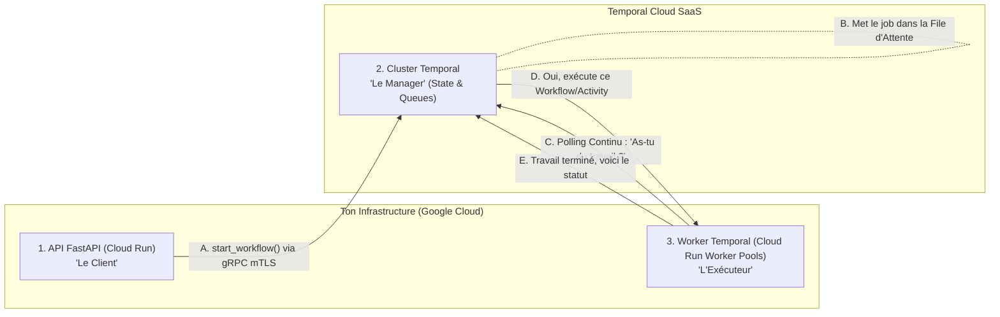

# Plan d'Implémentation SOTA 2026 : Workflow Temporal "Style Guide Ingestion"

Ce document définit l'architecture précise de la couche d'orchestration **Temporal.io** pour le projet **Factory Writer**, en appliquant les recommandations d'architecture Data/ML de la Silicon Valley (Avril 2026).

## Cadre SOTA 2026 (Silicon Valley Standards)

Les meilleures pratiques 2026 pour les pipelines IA basés sur Temporal exigent les 4 piliers suivants :
1. **Activity Granularity (Micro-Steps Idempotentes) :** Ne jamais regrouper l'extraction Document AI et l'inférence LiteLLM. Chaque appel d'API externe correspond à une Activity stricte avec son propre `RetryPolicy`.
2. **Payload Weight Minimization :** Bien que le PDF de la marque soit léger, on transite des références (URIs GCS, UUIDs Postgres).
3. **The Saga Pattern & Compensation :** S'appuie sur la gestion native des exceptions Python (`try...except`) avec un `workflow.new_detached_cancel_scope()` pour assurer un *rollback* métier.
4. **Human-in-the-Loop Asynchrone :** Utilisation des Signals Temporal pour mettre durablement en pause le workflow (`Wait`).

---

## Modélisation du "StyleGuideIngestionWorkflow"

### 1. Granularité des Activités (Le Split SOTA adapté "Single/Light PDF")

| Séquence | Nom de l'Activity | Responsabilité Métier (Idempotente) | Pattern / Contrainte Technique |
| :---: | :--- | :--- | :--- |
| **A1** | `update_source_status_activity` | Passe l'entité PostgreSQL `SourceGuideStyle` de `EN_ATTENTE` à `EN_COURS`. | DB Update simple. |
| **A2** | `trigger_docai_batch_activity` | Démarre un `BatchProcess` asynchrone sur GCP Document AI Layout Parser. | Ne bloque pas la boucle Temporal. |
| **A3** | `poll_docai_completion_activity` | Interroge périodiquement l'état du job LRO Document AI. | Heartbeat régulier. |
| **A4** | `process_layout_chunks_activity` | Regroupe textuellement et fait un *Upsert* dans PostgreSQL (`FragmentStyle`). | **Idempotence vitale** : UPDATE si Retry. |
| **A5** | `extract_rules_litellm_activity` | **Création du Pack Brouillon** : Cible LiteLLM en *Structured Output*. Crée **1 `pack_style` (BROUILLON)** et **+ enfants `regle_style`**. | Inférence "Single-Shot". RetryPolicy natif si le LLM timeout. |
| **A6** | `promote_style_pack_activity` | Exécutée **après** approbation humaine. Passe le nouveau `pack_style` en statut **ACTIF**. | Transaction atomique PostgreSQL. |

### 2. Le Flow Python (Pseudo-Code Architectural SOTA 2026)

L'approche **Orientée Objet (Classe)** pour définir l'état du Workflow, avec inputs/outputs via **Pydantic v2** (`pydantic_data_converter`).

```python
from temporalio import workflow
from temporalio.common import RetryPolicy
from pydantic import BaseModel
from datetime import timedelta

class StyleGuideIngestionInput(BaseModel):
    source_id: str
    file_uri: str

class StyleGuideIngestionOutput(BaseModel):
    status: str
    pack_id: str

@workflow.defn(name="StyleGuideIngestionWorkflow")
class StyleGuideIngestionWorkflow:
    def __init__(self):
        self.is_approved: bool | None = None
        self.compensations = []
    
    @workflow.run
    async def run(self, input: StyleGuideIngestionInput) -> StyleGuideIngestionOutput:
        try:
            await workflow.execute_activity(
                update_source_status_activity, 
                args=[input.source_id], 
                start_to_close_timeout=timedelta(seconds=10)
            )
            self.compensations.append("update_status_erreur")
            
            gcs_output_path = await workflow.execute_activity(
                trigger_docai_batch_activity, 
                args=[input.file_uri],
                start_to_close_timeout=timedelta(seconds=10)
            )
            
            await workflow.execute_activity(
                poll_docai_completion_activity, 
                args=[gcs_output_path],
                start_to_close_timeout=timedelta(hours=1) # Le polling long-running
            )
            
            chunk_ids = await workflow.execute_activity(
                process_layout_chunks_activity, 
                args=[gcs_output_path],
                start_to_close_timeout=timedelta(minutes=2)
            )
            
            # SOTA 2026: Protection de l'appel LLM avec timeout strict et un limitateur de rejeu
            draft_pack_id = await workflow.execute_activity(
                extract_rules_litellm_activity, 
                args=[chunk_ids],
                start_to_close_timeout=timedelta(minutes=5),
                retry_policy=RetryPolicy(maximum_attempts=3)
            )
            
            approval_decision = await workflow.wait_condition(
                lambda: self.is_approved is not None, timeout=timedelta(days=7)
            )
            
            if not approval_decision:
                raise Exception("Sophie a rejeté l'extraction.")
            
            await workflow.execute_activity(
                promote_style_pack_activity, 
                args=[draft_pack_id],
                start_to_close_timeout=timedelta(seconds=10)
            )
            return StyleGuideIngestionOutput(status="success", pack_id=draft_pack_id)

        except Exception as e:
            with workflow.new_detached_cancel_scope():
                for comp in reversed(self.compensations):
                    if comp == "update_status_erreur":
                        await workflow.execute_activity(
                            update_source_status_erreur, 
                            args=[input.source_id],
                            start_to_close_timeout=timedelta(seconds=10)
                        )
            raise e
            
    @workflow.signal
    def approve_pack(self, approved: bool):
        self.is_approved = approved
```

### 3. Le Déclenchement depuis FastAPI (Pattern "Fire-and-Forget")

```python
# Routeur FastAPI : On ne bloque pas via execute_workflow !
from src.temporal.client import get_temporal_client

client = await get_temporal_client() # Client mutualisé configuré avec mTLS & pydantic_data_converter
handle = await client.start_workflow(
    "StyleGuideIngestionWorkflow",
    StyleGuideIngestionInput(source_id=source_id, file_uri=file_uri),
    id=f"style-ingestion-{source_id}", # Idempotence garantie !
    task_queue="style-guide-queue"
)
```

---

## 4. Stratégie Monorepo DDD et CI/CD SOTA 2026

La recherche des meilleurs standards (DDD, Poetry, FastAPI, Temporal Python, Monorepo Docker) indique que **la séparation API / Worker DOIT exister logiquement**, mais qu'ils peuvent cohabiter physiquement dans le même `backend/`. 

### Architecture du Polling Asynchrone (Les 3 Piliers)

Voici comment tes deux services GCP échangent avec le Cloud Temporal sans jamais se parler directement :



### A. Structure du Dossier (DDD Clean Architecture)
Le code doit être partagé mais exécuté via deux points d'entrée (Entrypoints) distincts :
```text
backend/
├── pyproject.toml         # Dépendances (FastAPI, temporalio, litellm)
├── src/
│   ├── domain/            # Cœur DDD : Entités, schémas centraux, exceptions pures
│   ├── application/       # Règles fonctionnelles (Cas d'usage)
│   ├── infrastructure/    # Adaptateurs I/O (PostgreSQL, Modèles BDD, GCP)
│   ├── core/              # Configuration globale (Settings Pydantic, Logger)
│   ├── api/               # ENTRYPOINT 1 : L'interface web REST
│   │   └── routes/        # Les routeurs FastAPI (ex: eventarc_router.py)
│   ├── temporal/          # ENTRYPOINT 2 : L'interface Background Worker
│   │   ├── client.py      # Singleton mutualisé (mTLS + pydantic_data_converter)
│   │   ├── worker.py      # Script de démarrage du Worker
│   │   ├── workflows/     # Les classes de workflows (ex: StyleGuideIngestionWorkflow)
│   │   └── activities/    # Fonctions pour I/O externes
│   ├── scripts/           # Scripts utilitaires locaux
│   └── main.py            # Connecte le Temporal Client & expose l'API Web
└── Dockerfile             # UN SEUL Dockerfile pour tout le backend
```

### B. CI/CD & Déploiement : L'Astuce du "Single Dockerfile"
On ne construit qu'**une seule image Docker** qui contient tout le code `backend/`. 
C'est GitHub Actions qui va déployer **deux instances GCP différentes** à partir de la même image en écrasant la commande de démarrage (le `--command`).

```yaml
# workflow GitHub Actions (Esquisse 2026)
- name: Build & Push Image
  run: docker build -t gcr.io/mon-projet/backend:latest ./backend
  
- name: Deploy API (Cloud Run HTTP)
  run: |
    gcloud run deploy api-service \
      --image gcr.io/mon-projet/backend:latest \
      --command "uvicorn src.main:app --host 0.0.0.0 --port 8080"
      
- name: Deploy Temporal Worker (Cloud Run Worker Pool)
  run: |
    # SOTA 2026: Utilisation des Worker Pools natifs sans throttling CPU
    gcloud beta run worker-pools deploy temporal-worker \
      --image gcr.io/mon-projet/backend:latest \
      --command "python -m src.temporal.worker"
```

---

## 5. Liste des Tâches d'Intégration (Checklist)

Cette Checklist ordonnée permet à l'Agent IA d'effectuer le développement étape par étape.

- **[x] 1. Préparation Infrasctructure Cloud :**
  - [x] Connecter/Créer le Namespace sur Temporal Cloud (SaaS). -> `factory-writer-poc.waxwe`
  - [x] Configurer l'authentification : **API Key** (Mode POC, plus rapide).
  - [x] **Garantir l'asymétrie nulle** : API Key partagée entre Client et Worker via `.env` et Google Secret Manager plus tard.
- **[x] 2. Setup du Monorepo Python :**
  - [x] Ajouter la dépendance `temporalio` via Poetry.
  - [x] Créer la structure de dossiers `backend/src/temporal/workflows` et `backend/src/temporal/activities`.
  - [ ] Mettre à jour `backend/src/domain` pour contenir les Input/Output Pydantic v2 nécessaires au Workflow.
- **[ ] 3. Implémentation du Workflow :**
  - [ ] Coder la classe `StyleGuideIngestionWorkflow` en suivant les principes Actor/Pydantic/Saga définis dans le pseudo-code.
- **[ ] 4. Implémentation des 6 Activités (Heavy-Lifting) :**
  - [ ] Coder `A1` et `A6` : Interactions avec PostgreSQL (changement de statut).
  - [ ] Coder `A2`, `A3` et `A4` : Interaction GCP Document AI (batch trigger, long-polling métier, insertion chunks).
  - [ ] Coder `A5` : Appel à `LiteLLM` avec Structured Output et bulk SQL INSERT.
- **[ ] 5. Intégration du Client Partagé (FastAPI + Worker) :**
  - [x] Écrire `backend/src/temporal/client.py` exposant `get_temporal_client()` configuré avec **API Key** et l'injection du **pydantic_data_converter**.
  - [ ] Appeler `get_temporal_client()` dans la lifecycle de FastAPI.
  - [ ] Remplacer la logique actuelle du Eventarc Webhook Use Case pour faire un `client.start_workflow(...)` asynchrone.
- **[x] 6. Câblage du Worker de Démarrage :**
  - [x] Écrire `backend/src/temporal/worker.py` (appeler `get_temporal_client()`, configurer la Task Queue, appeler `await worker.run()`).
- **[x] 7. Ops / CI-CD :**
  - [x] Valider / Mettre à jour le `Dockerfile` pour supporter les variables d'environnement.
  - [x] Configurer l'infrastructure du Cloud Run Worker Pool pour le worker Temporal.
  - [x] Écrire le fichier `.github/workflows/deploy.yml` automatisant le déploiement CI/CD de l'API (Cloud Run) et du Worker (Cloud Run Worker Pool).
