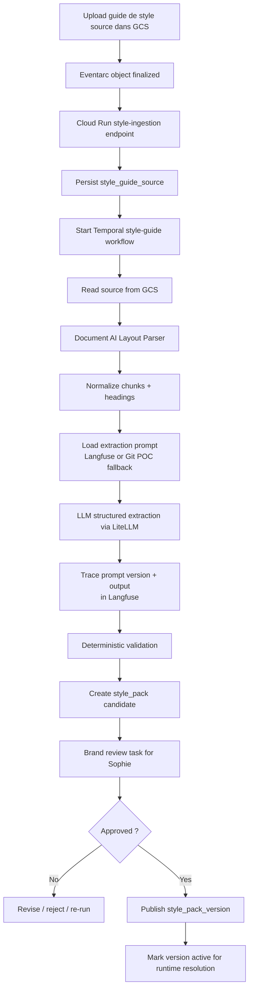

# Architecture dédiée : ingestion du guide de style de marque

Ce document est le référent d’architecture pour la **chaîne d’ingestion du guide de style** dans Factory Writer.

Il complète [FINAL_ARCHITECTURE.md](/Users/floriansollami/Documents/GitHub/factory-writer/docs/FINAL_ARCHITECTURE.md) en zoomant sur une seule brique :

**comment transformer un guide de style source, stocké dans GCS, en un `style_pack_version` structuré, versionné, validé et exploitable par le runtime de génération.**

Le besoin métier est critique :

- Axolotl veut des fiches produites en moins de 2 minutes
- mais chaque texte doit rester strictement aligné avec la **Tone of Voice**
- la marque est premium
- la cohérence éditoriale doit être gouvernée par l’humain

Donc le guide de style ne peut pas être traité comme un PDF “jeté dans le prompt”.

Il doit devenir un **asset de plateforme** :

- structuré
- versionné
- validé
- approuvé
- résolu au runtime sans relire le PDF

---

## 1. Position d’architecture

La décision d’architecture est la suivante :

- le **guide de style source** vit dans **Cloud Storage**
- son ingestion passe par une **pipeline dédiée**
- cette pipeline est **hors hot path**
- le runtime produit ne lit **jamais le PDF source**
- le runtime lit uniquement un **`style_pack_version` approuvé**
- le prompt d'extraction est versionné dans **Langfuse** en cible
- Postgres conserve la preuve d'audit du prompt exact utilisé pour produire le pack candidat

Autrement dit :

- **source éditoriale** = document brut
- **source runtime** = pack structuré validé
- **source LLMOps** = prompt versionné + trace Langfuse

Cette séparation est essentielle pour :

- la vitesse
- la cohérence
- la gouvernance
- la traçabilité
- le no vendor lock-in

---

## 2. Pourquoi il ne faut pas injecter directement le PDF au runtime

Le pattern “on met le PDF de style dans le prompt à chaque génération” est une mauvaise architecture.

### Problèmes

- coût et latence inutiles
- comportement plus instable d’un produit à l’autre
- absence de versioning propre
- difficulté à comprendre pourquoi un texte a changé
- difficulté à faire corriger la marque sans republier du code
- dépendance trop forte au comportement implicite du LLM

### Recommandation SOTA 2026

Le bon pattern est celui d’un **constraint pack** ou **style pack** :

- le document source est lu une fois
- ses règles sont extraites
- elles sont transformées en structure métier
- elles sont relues / approuvées
- puis utilisées ensuite comme **contexte compact et stable**

---

## 3. Ce que doit produire cette pipeline

La sortie de la pipeline n’est pas un résumé du PDF.

La bonne approche consiste à produire **deux objets distincts** :

1. un **pack canonique stocké**
2. un **snapshot runtime résolu**

### Pourquoi cette séparation est importante

Le **pack canonique** sert à :

- gouverner
- tracer l’origine des règles
- versionner
- corriger
- approuver
- tracer le prompt et le modèle qui ont produit le brouillon

Le **snapshot runtime** sert à :

- injecter un contexte compact dans le prompt
- éviter les objets trop lourds
- accélérer la génération

### Sorties principales du pack canonique

- `style_pack_version`
- `tone_profile`
- `style_rule`
- `forbidden_claim_rule`
- `approved_example`
- `style_chunk`

### Exemple de pack canonique recommandé

```json
{
  "id_pack_style": "pack_style_axolotl_v3",
  "version": "2026-04-12",
  "langue": "fr-FR",
  "regles_de_voice": [
    {
      "id_regle": "vr_001",
      "famille_regle": "voice",
      "type_regle": "tone_directive",
      "code_regle": "elegant",
      "criticite": "hard",
      "texte": "Le texte doit rester elegant et premium.",
      "ids_chunks_sources": ["ch_12"]
    },
    {
      "id_regle": "vr_002",
      "famille_regle": "voice",
      "type_regle": "tone_directive",
      "code_regle": "expert",
      "criticite": "hard",
      "texte": "Le texte doit inspirer la competence sans jargon excessif.",
      "ids_chunks_sources": ["ch_12"]
    },
    {
      "id_regle": "vr_003",
      "famille_regle": "voice",
      "type_regle": "tone_directive",
      "code_regle": "nature_centric",
      "criticite": "hard",
      "texte": "Le texte doit evoquer un rapport naturel et apaisant a l'exterieur.",
      "ids_chunks_sources": ["ch_13"]
    },
    {
      "id_regle": "vr_004",
      "famille_regle": "voice",
      "type_regle": "syntax_rule",
      "code_regle": "vouvoiement",
      "criticite": "hard",
      "texte": "Le texte doit utiliser le vouvoiement.",
      "ids_chunks_sources": ["ch_15"]
    }
  ],
  "profils_de_tone": [
    {
      "tone_code": "mobilier_jardin_premium",
      "libelle": "Mobilier premium",
      "conditions_d_application": {
        "familles_produit": ["mobilier_jardin"]
      },
      "regles_associees": [
        {
          "id_regle": "tr_101",
          "famille_regle": "tone",
          "type_regle": "preferred_lexicon",
          "code_regle": "art_de_vivre_exterieur",
          "criticite": "soft",
          "texte": "Privilegier un vocabulaire d'elegance, de matiere et d'art de vivre exterieur.",
          "ids_chunks_sources": ["ch_28"]
        }
      ]
    }
  ],
  "regles_de_claims_interdits": [
    {
      "id_regle": "fc_001",
      "famille_regle": "claim_guardrail",
      "type_regle": "forbidden_claim",
      "criticite": "hard",
      "texte": "sans entretien pour toujours",
      "ids_chunks_sources": ["ch_44"]
    },
    {
      "id_regle": "fc_002",
      "famille_regle": "claim_guardrail",
      "type_regle": "forbidden_claim",
      "criticite": "hard",
      "texte": "resiste aux intemperies a vie",
      "ids_chunks_sources": ["ch_44"]
    }
  ],
  "exemples_approuves": [
    {
      "id_exemple": "ex_001",
      "type_exemple": "positif",
      "texte": "Une presence exterieure elegante portee par le grain naturel du teck.",
      "ids_chunks_sources": ["ch_33"]
    }
  ]
}
```

Le pack stocké en base doit aussi garder les métadonnées LLMOps minimales :

```json
{
  "prompt_registry_provider": "local",
  "prompt_name": "style_guide_extract_rules",
  "prompt_version": "v1",
  "llm_model": "vertex_ai/gemini-3-pro-preview",
  "llm_temperature": 0.0,
  "llm_max_tokens": 4096,
  "llm_response_format": "style_pack_candidate_v1",
  "system_prompt_hash": "sha256:...",
  "user_prompt_hash": "sha256:..."
}
```

Ces champs ne remplacent pas les règles métier. Ils permettent de prouver quel prompt, quel modèle et quelle trace ont produit le pack brouillon relu par Sophie.

---

## 4. Principes de conception

### 4.1. Séparer `Voice` et `Tone`

Le guide de style doit être transformé en deux couches :

- **Voice** : règles globales de la marque, toujours applicables
- **Tone** : règles adaptatives selon le contexte produit

Exemple Axolotl :

- Voice :
  - élégant
  - expert
  - nature-centric
  - vouvoiement
- Tone :
  - mobilier premium
  - outil ergonomique expert

### 4.1 bis. Atomiser les règles

Une règle trop fusionnée est mauvaise pour une architecture mature.

Exemple à éviter :

- "Le texte doit rester elegant, expert et centre sur la nature."

Exemple recommandé :

- une règle `elegant`
- une règle `expert`
- une règle `nature_centric`
- une règle `vouvoiement`

Pourquoi :

- plus simple à corriger
- plus simple à scorer
- plus simple à activer / désactiver
- plus simple à tracer jusqu’au chunk source

### 4.2. Séparer règles `hard` et `soft`

- **hard** :
  - interdits absolus
  - claims interdits
  - contraintes de ton non négociables
- **soft** :
  - lexique préféré
  - tournures recommandées
  - nuances de rythme

### 4.2 bis. Structurer les interdits comme des règles

Les claims interdits ne devraient pas être stockés uniquement comme une simple liste de chaînes dans le pack canonique.

Dans le pack canonique, ce sont de vraies règles :

- avec un `id`
- un `type_regle`
- une `criticite`
- une provenance

La simple liste de chaînes est utile plus tard, mais seulement dans le **snapshot runtime résolu**.

### 4.3. Séparer source brute et pack publié

- le PDF source est versionné dans GCS
- le pack structuré est versionné dans Postgres
- le runtime n’utilise que le pack publié

### 4.4. Garder l’humain dans la boucle

Sophie doit pouvoir :

- corriger
- supprimer
- compléter
- republier

La pipeline ne doit pas imposer aveuglément la lecture du LLM.

### 4.5. Conserver la provenance

Chaque règle candidate doit pouvoir être reliée à son origine documentaire.

La bonne pratique est de garder :

- `source_chunk_id`
- et si possible :
  - `heading_path`
  - `page_refs`

Cela permet à Sophie de répondre à la question :

- "d’où vient exactement cette règle ?"

Sans provenance, la gouvernance du guide de style devient fragile.

---

## 5. Choix des composants

## 5.1. Stockage source

- **Cloud Storage**

Il contient :

- le PDF ou DOCX du guide de style
- éventuellement les annexes éditoriales
- éventuellement plusieurs versions

### Pourquoi GCS

- source de vérité documentaire
- versionnement simple
- intégration native Eventarc
- stockage peu coûteux

---

## 5.2. Déclenchement

- **Eventarc**
- événement recommandé : `google.cloud.storage.object.v1.finalized`
- cible : **Cloud Run API**

### Pourquoi

Le guide de style est un document administratif rare, mais il doit quand même déclencher une pipeline propre :

1. upload du nouveau document
2. Eventarc route l’événement
3. Cloud Run enregistre l’ingestion
4. Temporal démarre le workflow d’ingestion du style guide

### Point important

Le changement de document source ne doit **pas** automatiquement changer la version runtime.

Il doit créer :

- une nouvelle ingestion
- puis une nouvelle version candidate
- puis seulement après validation humaine, une nouvelle version publiée

---

## 5.3. Parsing documentaire

### Recommandation principale

- **Document AI Layout Parser**

### Pourquoi ce choix

Le style guide n’est pas un document transactionnel à champs fixes comme une facture.
Ce n’est pas non plus un dossier technique avec tables de dimensions.

C’est un document riche en :

- titres
- sous-titres
- listes
- paragraphes
- sections thématiques
- exemples

Le Layout Parser est adapté parce qu’il :

- détecte les **headings**
- détecte les **paragraphs**, **lists**, **tables**
- produit des **chunks** cohérents
- préserve une partie de la hiérarchie du document

### Point GCP important

La doc GCP indique que :

- le Layout Parser sait chunker avec contexte de hiérarchie
- il peut inclure les **ancestor headings**
- cela améliore la cohérence sémantique des chunks

Pour un guide de style, c’est exactement ce qu’on veut.

### Recommandation opérationnelle

Pour un style guide de 30 à 40 pages :

- éviter le mode online si le PDF dépasse les limites pratiques
- utiliser de préférence un **batch process**
- pinner explicitement la **processor version**

Et surtout :

- stocker `processor_id`
- stocker `processor_version`
- stocker `request_config_snapshot`

---

## 5.4. Transformation sémantique

Une fois les chunks extraits, il faut les transformer en structure métier.

### Recommandation principale

- **Langfuse** pour récupérer la version exacte du prompt d'extraction et tracer l'appel
- **LiteLLM**
- appel vers un modèle capable de structured outputs

### Pourquoi Langfuse ici

Le prompt d'extraction du guide de style est une politique applicative importante. Il décide comment transformer des fragments documentaires en règles de marque. Il ne doit donc pas rester invisible dans un fichier non tracé quand on passe en cible production.

Langfuse sert à :

- stocker les versions du prompt d'extraction
- comparer les diffs entre versions
- rattacher chaque appel LLM à la version de prompt utilisée
- construire plus tard des datasets d'extraction de style guide
- comparer des variantes de prompts sans redéployer le code

La règle de gouvernance reste :

```text
Langfuse stocke le prompt.
LiteLLM exécute le modèle.
Postgres stocke le pack style produit et la référence d'audit.
Sophie approuve ou refuse.
```

Pour le POC strict, le prompt peut rester dans Git. Pour le POC+ et la cible, il doit être importé dans Langfuse.

### Pourquoi LiteLLM ici

Parce que l’architecture cible veut :

- éviter le vendor lock-in
- garder un format d’appel stable
- pouvoir changer de provider sans changer la logique métier

### Pattern de prompt recommandé

Le prompt doit demander au modèle :

- d’identifier les règles globales `VOICE`
- d’identifier les règles contextuelles `TONE`
- d’atomiser les règles plutôt que de les fusionner
- de classer chaque règle par type
- de marquer la criticité `hard` ou `soft`
- d’extraire les éléments de lexique préféré et interdit
- de rattacher chaque règle aux chunks d’origine
- d’extraire aussi, quand ils existent, des exemples positifs ou contre-exemples utiles
- de retourner un **JSON strict**

### Structured output

Si le provider supporte un vrai schéma :

- envoyer un **JSON schema / response schema**
- ne pas dupliquer le schéma dans le prompt plus que nécessaire
- revalider localement après coup

Le point clé est :

**même si le modèle respecte le schéma, la revalidation locale reste obligatoire.**

### Recommandation importante

Le schéma doit être :

- assez structuré pour être fiable
- mais pas inutilement complexe

La bonne approche est :

- un **pack canonique riche**
- puis un **snapshot runtime compact**

---

## 5.5. Validation déterministe

Le style guide n’est pas un problème de “qualité rédactionnelle” à ce stade.

C’est d’abord un problème de **cohérence structurée**.

### Validations recommandées

- schéma JSON valide
- `rule_type` autorisé
- `criticite` autorisée
- `tone_code` unique
- pas de règle vide
- pas de doublon exact
- pas de tone orphelin
- pas de règle tone sans condition d’applicabilité
- pas de claim interdit classé en `soft`

### Règle très importante

Quand le contexte est insuffisant :

- mieux vaut `null`
- qu’une règle inventée

Autrement dit :

**better null than hallucinated rule**

---

## 5.6. Gouvernance humaine

Une fois la version candidate extraite :

- elle ne doit pas devenir runtime automatiquement

Elle doit passer par une étape :

- `pending_brand_review`

### Sophie doit pouvoir :

- relire les règles candidates
- supprimer les erreurs
- corriger le wording
- réassigner une règle au bon tone
- modifier la criticité
- approuver une nouvelle version

### Pourquoi c’est indispensable

Parce que le style guide est un **actif de marque**.

Sur les facts techniques, la vérité vient du dossier usine.  
Sur le style, la vérité vient de la **validation humaine de la marque**.

---

## 6. Workflow cible détaillé



---

## 7. Résolution runtime

Le runtime produit ne relit jamais le PDF source.

Quand un SKU doit être généré, le workflow doit résoudre :

1. la version active du style pack
2. les règles `VOICE` globales
3. les règles `TONE` applicables à `famille_code` / `sous_famille_code`
4. les lexiques préférés
5. les claims interdits

Puis construire un **snapshot de style compact** qui sera injecté dans le contexte de génération.

### Exemple de snapshot runtime

```json
{
  "id_version_pack_style": "spv_2026_04_12_v3",
  "langue": "fr-FR",
  "regles_de_voice_resolues": [
    "Le texte doit rester elegant et premium.",
    "Le texte doit inspirer la competence sans jargon excessif.",
    "Le texte doit evoquer un rapport naturel et apaisant a l'exterieur.",
    "Le texte doit utiliser le vouvoiement."
  ],
  "regles_de_tone_resolues": [
    "Pour le mobilier_jardin, privilegier un vocabulaire d'art de vivre exterieur.",
    "Pour table_repas, insister sur la presence, la matiere et la convivialite."
  ],
  "lexique_prefere_resolu": [
    "grain naturel",
    "travaille avec soin",
    "art de vivre en exterieur"
  ],
  "claims_interdits_resolus": [
    "sans entretien pour toujours",
    "resiste aux intemperies a vie"
  ],
  "exemples_approuves_resolus": [
    "Une presence exterieure elegante portee par le grain naturel du teck."
  ]
}
```

### Pourquoi ce snapshot est différent du pack canonique

Le snapshot runtime :

- est plus compact
- ne garde pas tous les métadonnées de gouvernance
- garde uniquement les éléments nécessaires à la génération

Le pack canonique, lui, reste la version riche et gouvernable.

---

## 8. Stratégie de versioning

Il faut distinguer quatre niveaux :

### 8.1. document source

Exemple :

- `brand_style_guide_2026_04.pdf`

### 8.2. prompt d'extraction

Exemple :

- `prompt_name = style_guide_extract_rules`
- `prompt_version = v1`
- `llm_response_format = style_pack_candidate_v1`

Ce niveau est géré par Langfuse en cible. Il permet de savoir si une mauvaise extraction vient du document, du modèle ou du prompt.

### 8.3. version candidate

Exemple :

- `style_pack_candidate_v7`

### 8.4. version publiée

Exemple :

- `style_pack_axolotl_fr_v3`

### Règle de gouvernance

Un upload dans GCS :

- crée une **nouvelle ingestion**
- pas une nouvelle version runtime directe

La promotion runtime n’a lieu qu’après :

- validation déterministe
- review humaine
- approbation explicite

Langfuse peut avoir des labels comme `candidate`, `staging` ou `production`, mais le pack actif reste décidé dans Postgres. Cela évite qu'un changement de label dans un outil LLMOps modifie seul le comportement runtime.

---

## 9. POC vs cible

## 9.1. POC recommandé

Pour le POC, je recommande :

- 1 guide de style source en `fr-FR`
- 1 `VOICE` globale
- 2 `TONE` principaux :
  - `mobilier_jardin`
  - `outils_jardin`
- prompts d'extraction versionnés dans Git si Langfuse n'est pas encore branché
- champs d'audit LLM minimaux dans `pack_style` : prompt, modèle, température, format de réponse et hashes des prompts rendus
- validation humaine obligatoire avant activation
- runtime qui ne résout que :
  - `voice_rules`
  - `tone_rules`
  - `preferred_lexicon`
  - `forbidden_claims`

Cela suffit pour démontrer :

- la séparation source / pack publié
- la séparation pack canonique / snapshot runtime
- la logique de versioning
- la gouvernance de Sophie
- l’intégration runtime propre

## 9.2. Architecture cible

À maturité, tu peux ajouter :

- Langfuse comme prompt registry effectif
- traces Langfuse pour chaque extraction de style guide
- datasets Langfuse construits depuis les extractions corrigées par Sophie
- plusieurs langues
- plusieurs markets
- tones par sous-famille
- règles saisonnières
- style packs par canal
- A/B tests de formulations de style offline

---

## 10. Où mettre Langfuse et Vertex dans cette brique

Langfuse et Vertex n'ont pas la même responsabilité.

La chaîne de base la plus pragmatique est :

- Document AI Layout Parser
- prompt d'extraction versionné dans Git ou Langfuse
- LiteLLM structured extraction
- trace Langfuse si activé
- validation locale
- human approval

### Là où Langfuse devient utile

Langfuse est utile dès que tu veux sortir du prompt hardcodé :

- registry du prompt d'extraction
- version explicite utilisée pour chaque ingestion
- lien prompt version -> trace -> pack candidat
- dataset des extractions corrigées par Sophie
- comparaison de deux prompts d'extraction sans redéploiement

Langfuse est donc le bon outil pour le cycle :

```text
prompt candidate
-> ingestion style guide
-> trace
-> correction humaine
-> dataset
-> nouvelle version de prompt
```

### Là où Vertex devient utile

Vertex devient utile en lab/offline avancé, pour optimiser :

- le prompt d’extraction des règles
- la qualité du classement `VOICE` vs `TONE`
- la classification `hard` vs `soft`
- la compacité et la clarté des rules packs

Tu peux alors utiliser :

- `zero-shot optimizer` pour itérer vite au départ
- `few-shot optimizer` quand tu as quelques bons exemples annotés
- `data-driven optimizer` quand tu as un vrai dataset de style guides et d’extractions attendues

La recommandation est de ne jamais auto-promouvoir une version produite par un optimizer. Vertex peut proposer, Langfuse peut stocker la variante, mais Postgres et la review humaine décident de l'activation.

### Évaluations adaptées

Pour cette brique, les évaluations les plus pertinentes sont :

- validations déterministes
- `INSTRUCTION_FOLLOWING`
- `GROUNDING`
- pairwise si tu compares deux extractions candidates

`TEXT_QUALITY` est secondaire ici, parce qu’on n’évalue pas encore la prose finale.

---

## 10 bis. Quelle stratégie d’évaluation adopter pour cette brique

La bonne base pour Axolotl est :

- **validation déterministe**
- **review humaine**

Et pour ce cas précis, c’est probablement la meilleure approche pour le POC.

### Pourquoi

Le guide de style est :

- un artefact rare
- un actif à forte valeur métier
- un document validé par une personne clairement identifiée

Ici, cette personne est :

- **Sophie**, guardian de la Tone of Voice

Dans ce contexte, les patterns 2026 les plus sérieux ne disent pas :

- "il faut remplacer l’approbation humaine par un judge LLM"

Au contraire, la logique la plus saine est :

1. **le LLM prépare**
2. **les validateurs déterministes filtrent**
3. **l’humain approuve**

Autrement dit :

- le modèle accélère
- la validation déterministe sécurise
- la validation humaine tranche

### Ce que je recommande concrètement pour Axolotl

#### Obligatoire

- structured outputs
- validations déterministes
- human review
- versioning
- provenance
- pack canonique + snapshot runtime

#### Recommandé bientôt

- `zero-shot optimizer`
- petit benchmark offline
- `INSTRUCTION_FOLLOWING`
- `GROUNDING`

#### Pas nécessaire tout de suite

- `GENERAL_QUALITY`
- `TEXT_QUALITY`
- `BLEU / ROUGE`
- `exact_match`
- `AutoSxS`
- calibration juge très poussée

### Interprétation pratique

Pour cette brique, il ne faut pas tomber dans l’excès inverse.

Si tu ajoutes trop tôt :

- judge model partout
- pairwise systématique
- AutoSxS
- calibration humaine lourde
- prompt optimizer data-driven complet

alors tu surconstruis un problème qui, au départ, se résout très bien avec :

- une extraction structurée
- des règles déterministes
- une approbation métier claire

### Conclusion

Pour l’ingestion du guide de style Axolotl, la bonne architecture 2026 est donc :

- **LLM pour préparer**
- **déterministe pour contrôler**
- **humain pour approuver**

Et seulement ensuite, si le volume ou la fréquence des changements augmente :

- ajouter progressivement les briques offline d’optimisation et d’évaluation.

---

## 11. Recommandation finale

La meilleure architecture pour l’ingestion du guide de style Axolotl est :

- **GCS** pour le document source
- **Eventarc** pour déclencher
- **Cloud Run** pour recevoir l’événement et enregistrer l’ingestion
- **Temporal** pour orchestrer le workflow
- **Document AI Layout Parser** pour parser et chunker
- **Langfuse** pour versionner le prompt d'extraction et tracer les appels LLM
- **LiteLLM** pour transformer les chunks en structure métier
- **validation déterministe** pour garantir la cohérence
- **human approval** pour garantir la fidélité de marque
- **Postgres** pour publier un `style_pack_version` runtime-ready

Et la règle d’or est :

**le runtime ne lit jamais le guide source ; il lit seulement un style pack approuvé.**

---

## 12. Sources utilisées

- [FINAL_ARCHITECTURE.md](/Users/floriansollami/Documents/GitHub/factory-writer/docs/FINAL_ARCHITECTURE.md)
- [Document AI Layout Parser](https://docs.cloud.google.com/document-ai/docs/layout-parse-chunk)
- [Document AI documentation overview](https://docs.cloud.google.com/document-ai/docs)
- [Eventarc / Cloud Run storage triggers](https://docs.cloud.google.com/run/docs/triggering/storage-triggers)
- [Eventarc direct Cloud Storage events to Cloud Run](https://docs.cloud.google.com/eventarc/standard/docs/run/route-trigger-cloud-storage)
- [Vertex AI structured output](https://docs.cloud.google.com/vertex-ai/generative-ai/docs/multimodal/control-generated-output)
- [Vertex AI system instructions](https://docs.cloud.google.com/vertex-ai/generative-ai/docs/learn/prompts/system-instructions)
- [Vertex AI prompt templates](https://docs.cloud.google.com/vertex-ai/generative-ai/docs/learn/prompts/prompt-templates)
- [Vertex AI introduction to prompt design](https://docs.cloud.google.com/vertex-ai/generative-ai/docs/learn/prompts/introduction-prompt-design)
- [Langfuse prompt management overview](https://langfuse.com/docs/prompt-management/overview)
- [Langfuse prompt version control](https://langfuse.com/docs/prompt-management/features/prompt-version-control)
- [Langfuse link prompts to traces](https://langfuse.com/docs/prompt-management/features/link-to-traces)
- [Langfuse datasets](https://langfuse.com/docs/evaluation/experiments/datasets)
- [Langfuse LiteLLM integration](https://langfuse.com/integrations/frameworks/litellm-sdk)
- [Temporal task queues](https://docs.temporal.io/task-queue)
- [Temporal workers](https://docs.temporal.io/workers)
- [Temporal workflow definition](https://docs.temporal.io/workflow-definition)
