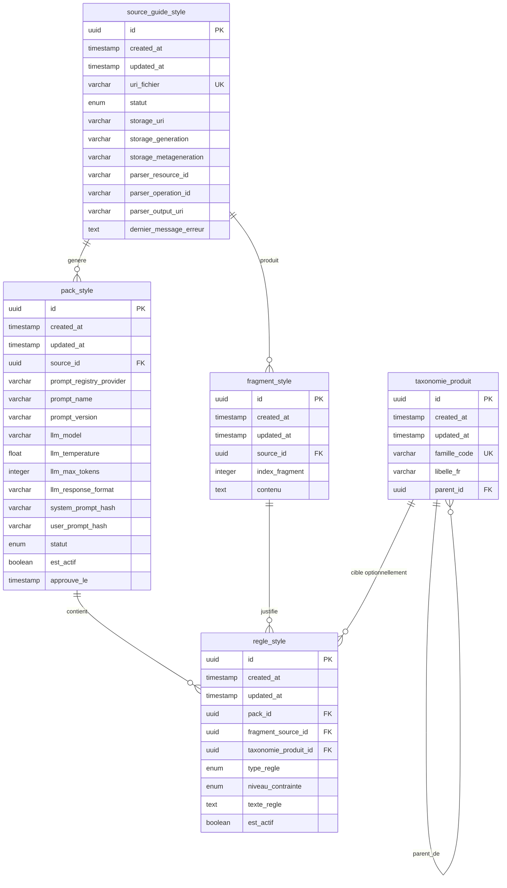

# POC : Base de données du Style Guide Axolotl

Ce document décrit l'ERD final du POC d'ingestion du guide de style, aligné avec le code actuel.

Objectif du modèle :

- tracer le PDF source déposé dans GCS ;
- stocker les fragments extraits par Document AI ;
- conserver le pack de style généré par LLM avant validation humaine ;
- rattacher chaque règle à une preuve documentaire ;
- cibler les règles de ton sur les familles produit autorisées.

## Principe métier

Le POC sépare clairement :

- `VOIX` : règle globale de marque, applicable à tous les produits ;
- `TON` : règle contextuelle, applicable à une famille produit ;
- `FORMATAGE` : règle de structure ou de forme rédactionnelle ;
- `PROMESSE_INTERDITE` : formulation ou claim interdit.

Exemple Axolotl :

- `VOIX` globale : le texte reste élégant, expert et centré sur la nature ;
- `TON` `mobilier_jardin` : vocabulaire de matière, confort et art de vivre extérieur ;
- `TON` `outils_jardin` : précision, ergonomie et confort du geste.

## ERD final

## 1. `source_guide_style`

Cette table représente le PDF source et le suivi technique de son extraction Document AI.

| Champ | Type | Description | Exemple |
| --- | --- | --- | --- |
| `id` | `uuid` | Identifiant technique du document source. | `src_7b3d1c2e` |
| `created_at` | `timestamp` | Date de création de la ligne. | `2026-04-18T09:12:00Z` |
| `updated_at` | `timestamp` | Date de dernière mise à jour. | `2026-04-18T09:14:25Z` |
| `uri_fichier` | `varchar` | URI GCS du PDF uploadé. | `gs://factory-writer-brand-styles/sources/style-guides/AXOLOTL_STYLE_GUIDE_V1.pdf` |
| `statut` | `enum` | État d'ingestion du document. | `EN_COURS` |
| `storage_uri` | `varchar` | URI GCS normalisée lue depuis les métadonnées du blob. | `gs://factory-writer-brand-styles/sources/style-guides/AXOLOTL_STYLE_GUIDE_V1.pdf` |
| `storage_generation` | `varchar` | Version GCS exacte du fichier. | `1713438729000000` |
| `storage_metageneration` | `varchar` | Version des métadonnées GCS. | `1` |
| `parser_resource_id` | `varchar` | Resource name du processor Document AI utilisé. | `projects/xxx/locations/eu/processors/684ca2ae2323b47c/processorVersions/pretrained-layout-parser-v1.5-2025-08-25` |
| `parser_operation_id` | `varchar` | Operation ID du batch Document AI. | `projects/xxx/locations/eu/operations/1234567890` |
| `parser_output_uri` | `varchar` | Préfixe GCS où Document AI écrit les JSON de sortie. | `gs://factory-writer-brand-styles/_factory_writer/derived/document-ai/style-guide-layout/source_id=src_7b3d1c2e/gcs_generation=1713438729000000/` |
| `dernier_message_erreur` | `text` | Dernière erreur enregistrée, ou `NULL` si aucune. | `Document AI n'a produit aucun JSON exploitable` |

## 2. `fragment_style`

Cette table contient les fragments textuels extraits depuis la sortie Document AI.

| Champ | Type | Description | Exemple |
| --- | --- | --- | --- |
| `id` | `uuid` | Identifiant technique du fragment. | `frag_001` |
| `created_at` | `timestamp` | Date de création du fragment. | `2026-04-18T09:15:00Z` |
| `updated_at` | `timestamp` | Date de dernière mise à jour du fragment. | `2026-04-18T09:15:00Z` |
| `source_id` | `uuid` | Référence vers le PDF source. | `src_7b3d1c2e` |
| `index_fragment` | `integer` | Position du fragment dans l'ordre Document AI. | `1` |
| `contenu` | `text` | Texte du fragment utilisé comme preuve. | `La marque s'exprime avec élégance, expertise et respect de la nature.` |

## 3. `pack_style`

Cette table représente un pack de style généré par LLM, puis éventuellement validé et activé.

| Champ | Type | Description | Exemple |
| --- | --- | --- | --- |
| `id` | `uuid` | Identifiant technique du pack. | `pack_001` |
| `created_at` | `timestamp` | Date de création du pack. | `2026-04-18T09:18:00Z` |
| `updated_at` | `timestamp` | Date de dernière mise à jour du pack. | `2026-04-18T09:30:00Z` |
| `source_id` | `uuid` | Référence vers le guide source. | `src_7b3d1c2e` |
| `prompt_registry_provider` | `varchar` | Registry d'origine du prompt. | `local` |
| `prompt_name` | `varchar` | Nom stable du prompt utilisé. | `style_guide_extract_rules` |
| `prompt_version` | `varchar` | Version exacte du prompt utilisé. | `v1` |
| `llm_model` | `varchar` | Modèle LLM exécuté par LiteLLM. | `vertex_ai/gemini-3-pro-preview` |
| `llm_temperature` | `float` | Température utilisée pour l'extraction. | `0.0` |
| `llm_max_tokens` | `integer` | Nombre maximal de tokens générés. | `4096` |
| `llm_response_format` | `varchar` | Nom du schéma de sortie structurée. | `style_pack_candidate_v1` |
| `system_prompt_hash` | `varchar` | Hash du system prompt rendu. | `sha256:8a7f...` |
| `user_prompt_hash` | `varchar` | Hash du user prompt rendu avec fragments et familles. | `sha256:9bc2...` |
| `statut` | `enum` | État métier du pack. | `BROUILLON` |
| `est_actif` | `boolean` | Indique si ce pack est le pack runtime actif. | `false` |
| `approuve_le` | `timestamp` | Date de validation humaine, ou `NULL` si non validé. | `NULL` |

## 4. `regle_style`

Cette table contient les règles finales issues du pack. Chaque règle est rattachée à un fragment source.

| Champ | Type | Description | Exemple |
| --- | --- | --- | --- |
| `id` | `uuid` | Identifiant technique de la règle. | `rule_001` |
| `created_at` | `timestamp` | Date de création de la règle. | `2026-04-18T09:18:10Z` |
| `updated_at` | `timestamp` | Date de dernière mise à jour de la règle. | `2026-04-18T09:18:10Z` |
| `pack_id` | `uuid` | Pack auquel appartient la règle. | `pack_001` |
| `fragment_source_id` | `uuid` | Fragment qui justifie la règle. | `frag_001` |
| `taxonomie_produit_id` | `uuid` | Famille produit ciblée ; `NULL` pour une règle globale. | `tax_001` |
| `type_regle` | `enum` | Type de règle : `VOIX`, `TON`, `FORMATAGE`, `PROMESSE_INTERDITE`. | `TON` |
| `niveau_contrainte` | `enum` | Niveau d'obligation : `HARD` ou `SOFT`. | `SOFT` |
| `texte_regle` | `text` | Règle à injecter au runtime. | `Privilégier un vocabulaire de matière, de confort et d'art de vivre extérieur.` |
| `est_actif` | `boolean` | Permet de désactiver une règle sans supprimer le pack. | `true` |

## 5. `taxonomie_produit`

Cette table contient les familles produit autorisées pour cibler les règles de ton.

| Champ | Type | Description | Exemple |
| --- | --- | --- | --- |
| `id` | `uuid` | Identifiant technique de la famille. | `tax_001` |
| `created_at` | `timestamp` | Date de création de la famille. | `2026-04-18T08:00:00Z` |
| `updated_at` | `timestamp` | Date de dernière mise à jour de la famille. | `2026-04-18T08:00:00Z` |
| `famille_code` | `varchar` | Code métier immuable de la famille produit. | `mobilier_jardin` |
| `libelle_fr` | `varchar` | Libellé humain de la famille produit. | `Mobilier de jardin` |
| `parent_id` | `uuid` | Parent dans l'arbre de taxonomie, ou `NULL` si racine. | `NULL` |

## Exemples de règles

| id | pack_id | fragment_source_id | taxonomie_produit_id | type_regle | niveau_contrainte | texte_regle | est_actif |
| --- | --- | --- | --- | --- | --- | --- | --- |
| `rule_001` | `pack_001` | `frag_001` | `NULL` | `VOIX` | `HARD` | `Le texte doit rester élégant, expert et centré sur la nature.` | `true` |
| `rule_002` | `pack_001` | `frag_002` | `NULL` | `PROMESSE_INTERDITE` | `HARD` | `Ne jamais promettre un produit sans entretien pour toujours.` | `true` |
| `rule_003` | `pack_001` | `frag_003` | `tax_001` | `TON` | `SOFT` | `Privilégier un vocabulaire de matière et d'art de vivre extérieur.` | `true` |

## Lecture simple du modèle

| Étape | Table | Rôle |
| --- | --- | --- |
| On reçoit le PDF | `source_guide_style` | Trace le document source et le job Document AI. |
| On découpe le PDF | `fragment_style` | Stocke les fragments qui serviront de preuve. |
| On génère le pack | `pack_style` | Stocke le résultat LLM et les métadonnées de prompt/modèle. |
| On contrôle les familles | `taxonomie_produit` | Fournit la liste fermée des familles produit autorisées. |
| On applique au runtime | `regle_style` | Contient les règles réellement injectables dans le moteur. |

Le point clé : `regle_style.fragment_source_id` donne la preuve documentaire de chaque règle. C'est le lien de traçabilité principal contre les hallucinations.
