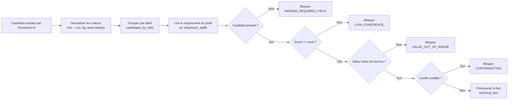

# Exemple de normalisation - Fiche atelier Rivage 220

Ce document reprend un exemple reel issu des logs Document AI pour le PDF `AXOLOTL_RIVAGE_220_FICHE_ATELIER.pdf`.

Source d'extraction :

- `document_type`: `TECHNICAL_SHEET`
- `extractor`: `fw-technical-sheet-extractor`
- `processor_id`: `51d79fcf170d4db5`
- `processor_version`: `pretrained-foundation-model-v1.5-pro-2025-06-20`

Code concerne :

- `backend/src/factory_writer/application/services/technical_fact_normalization.py`
- `normalize_candidates(...)`
- `_normalize_dimension_cm(...)`
- `_dimension_unit_context(...)`
- `_normalize_weight_kg(...)`
- `_normalize_number(...)`

## Regles appliquees

| Cas | Regle |
|---|---|
| Texte libre | Les retours ligne et espaces multiples sont remplaces par un espace simple. |
| Dimensions produit | `dimension_width`, `dimension_depth`, `dimension_height` sont normalisees en `cm` si une unite est identifiable. |
| Contexte dimensions | `dimension_set_raw` peut donner l'unite commune. Ici `2 200 x 950 x 740 mm` donne le contexte `mm`. |
| Poids | `weight` est normalise en `kg` si l'unite est identifiable. |
| Capacite | `usage_capacity` reste un texte source. Le profil table peut lire un nombre de controle pour verifier les bornes, sans remplacer la valeur extraite. |
| Champs composants | `component_dimensions` reste du texte libre. On ne convertit pas les dimensions de composants dans cette passe. |

## Tableau de normalisation

| Label | Valeur extraite | Valeur normalisee | Unite | Score brut | Regle appliquee |
|---|---|---|---|---:|---|
| `component_dimensions` | `epaisseur plateau 28 mm nominal` | `epaisseur plateau 28 mm nominal` | null | 0.54232955 | Texte libre, nettoyage espaces uniquement. |
| `component_dimensions` | `diametre passage Ø50 mm` | `diametre passage Ø50 mm` | null | 0.4889444 | Texte libre, nettoyage espaces uniquement. |
| `dimension_depth` | `950` | `95` | `cm` | 0.84768426 | Contexte `mm` depuis `dimension_set_raw`, donc `950 mm = 95 cm`. |
| `dimension_depth` | `950` | `95` | `cm` | 0.89755154 | Meme valeur normalisee que la precedente. |
| `dimension_height` | `740` | `74` | `cm` | 0.99995196 | Contexte `mm`, donc `740 mm = 74 cm`. |
| `dimension_height` | `H 740 mm` | `74` | `cm` | 0.9299986 | Unite explicite `mm`, donc conversion directe en `cm`. |
| `dimension_set_raw` | `2 200 x 950 x 740 mm` | `2 200 x 950 x 740 mm` | null | 0.8916987 | Ligne complete conservee comme preuve et contexte. Pas de conversion. |
| `dimension_width` | `2 200` | `220` | `cm` | 0.99743307 | Contexte `mm`, donc `2200 mm = 220 cm`. |
| `dimension_width` | `L 2200 mm` | `220` | `cm` | 0.9999597 | Unite explicite `mm`, donc conversion directe en `cm`. |
| `feature_or_accessory` | `bouchon teck fourni, centre` | `bouchon teck fourni, centre` | null | 0.5285775 | Texte libre. |
| `feature_or_accessory` | `patins reglables M8` | `patins reglables M8` | null | 0.99187934 | Texte libre. |
| `finish_primary` | `finition poudre polyester graphite mat RAL 7021, epaisseur nominale 80 microns.` | `finition poudre polyester graphite mat RAL 7021, epaisseur nominale 80 microns.` | null | 0.30194205 | Texte libre. |
| `finish_primary` | `huile exterieure a base aqueuse, aspect satine non filmogene.` | `huile exterieure a base aqueuse, aspect satine non filmogene.` | null | 0.9803096 | Texte libre. |
| `material_primary` | `teck massif Tectona grandis, grade A/B selection export, humidite bois cible 10 a 12%.` | `teck massif Tectona grandis, grade A/B selection export, humidite bois cible 10 a 12%.` | null | 0.7780664 | Texte libre. |
| `material_secondary` | `aluminium 6063-T5` | `aluminium 6063-T5` | null | 0.80483735 | Texte libre. |
| `material_secondary` | `inox A2` | `inox A2` | null | 0.5184878 | Texte libre. |
| `product_name` | `Table repas exterieure RIVAGE 220, version teck graphite.` | `Table repas exterieure RIVAGE 220, version teck graphite.` | null | 0.6984892 | Texte libre. |
| `product_name` | `Table Rivage 220` | `Table Rivage 220` | null | 0.9999585 | Texte libre. |
| `quality_control_points` | `stabilite au sol aucun basculement sur dalle plane; patins reglables M8` | `stabilite au sol aucun basculement sur dalle plane; patins reglables M8` | null | 0.71636236 | Texte libre. |
| `quality_control_points` | `jonction bois / metal jeu visible 3 a 5 mm pour dilatation naturelle` | `jonction bois / metal jeu visible 3 a 5 mm pour dilatation naturelle` | null | 0.999804 | Texte libre. |
| `quality_control_points` | `nettoyage eau tiede et chiffon doux; abrasif interdit` | `nettoyage eau tiede et chiffon doux; abrasif interdit` | null | 0.7579953 | Texte libre. |
| `sku` | `AX-TB-RIV-220-TKGR` | `AX-TB-RIV-220-TKGR` | null | 0.9999771 | Texte libre exact. |
| `technical_claim_limits` | `La mention "outdoor all season" decrit le positionnement usine. Elle ne vaut pas garantie de resistance permanente. Les controles marketing doivent garder les preuves ci-dessus comme seules valeurs techniques.` | `La mention "outdoor all season" decrit le positionnement usine. Elle ne vaut pas garantie de resistance permanente. Les controles marketing doivent garder les preuves ci-dessus comme seules valeurs techniques.` | null | 0.7935636 | Texte libre. |
| `usage_capacity` | `8 couverts, usage domestique premium` | `8 couverts, usage domestique premium` | null | 0.99798745 | Texte source conserve. Pour ce profil table, la validation lit `8` comme valeur de controle. |
| `weight` | `58 kg +/- 2 kg` | `58` | `kg` | 0.99999046 | Premier poids principal en `kg`; la tolerance n'est pas conservee comme valeur canonique. |

## candidates_by_field simplifie

```json
{
  "dimension_width": [
    {
      "raw_value": "2 200",
      "normalized_value": "220",
      "unit": "cm",
      "extractor_confidence": 0.99743307
    },
    {
      "raw_value": "L 2200 mm",
      "normalized_value": "220",
      "unit": "cm",
      "extractor_confidence": 0.9999597
    }
  ],
  "dimension_depth": [
    {
      "raw_value": "950",
      "normalized_value": "95",
      "unit": "cm",
      "extractor_confidence": 0.84768426
    },
    {
      "raw_value": "950",
      "normalized_value": "95",
      "unit": "cm",
      "extractor_confidence": 0.89755154
    }
  ],
  "dimension_height": [
    {
      "raw_value": "740",
      "normalized_value": "74",
      "unit": "cm",
      "extractor_confidence": 0.99995196
    },
    {
      "raw_value": "H 740 mm",
      "normalized_value": "74",
      "unit": "cm",
      "extractor_confidence": 0.9299986
    }
  ],
  "sku": [
    {
      "raw_value": "AX-TB-RIV-220-TKGR",
      "normalized_value": "AX-TB-RIV-220-TKGR",
      "unit": null,
      "extractor_confidence": 0.9999771
    }
  ],
  "product_name": [
    {
      "raw_value": "Table repas exterieure RIVAGE 220, version teck graphite.",
      "normalized_value": "Table repas exterieure RIVAGE 220, version teck graphite.",
      "unit": null,
      "extractor_confidence": 0.6984892
    },
    {
      "raw_value": "Table Rivage 220",
      "normalized_value": "Table Rivage 220",
      "unit": null,
      "extractor_confidence": 0.9999585
    }
  ],
  "material_primary": [
    {
      "raw_value": "teck massif Tectona grandis, grade A/B selection export, humidite bois cible 10 a 12%.",
      "normalized_value": "teck massif Tectona grandis, grade A/B selection export, humidite bois cible 10 a 12%.",
      "unit": null,
      "extractor_confidence": 0.7780664
    }
  ],
  "finish_primary": [
    {
      "raw_value": "finition poudre polyester graphite mat RAL 7021, epaisseur nominale 80 microns.",
      "normalized_value": "finition poudre polyester graphite mat RAL 7021, epaisseur nominale 80 microns.",
      "unit": null,
      "extractor_confidence": 0.30194205
    },
    {
      "raw_value": "huile exterieure a base aqueuse, aspect satine non filmogene.",
      "normalized_value": "huile exterieure a base aqueuse, aspect satine non filmogene.",
      "unit": null,
      "extractor_confidence": 0.9803096
    }
  ],
  "usage_capacity": [
    {
      "raw_value": "8 couverts, usage domestique premium",
      "normalized_value": "8 couverts, usage domestique premium",
      "unit": null,
      "extractor_confidence": 0.99798745
    }
  ],
  "weight": [
    {
      "raw_value": "58 kg +/- 2 kg",
      "normalized_value": "58",
      "unit": "kg",
      "extractor_confidence": 0.99999046
    }
  ]
}
```

## Controle par requirements

Apres la normalisation, le backend ne fait plus confiance directement aux sorties IA. Il compare les candidats normalises a un profil de requirements produit.

Pour le POC, ce profil est celui de la fiche produit table repas exterieur. Il dit au backend quels champs sont requis, quels seuils de confiance appliquer, quelles bornes controler, et s'il faut garder une valeur unique ou plusieurs valeurs.



## Exemple lisible pour la demo

| Requirement | Regle du profil | Candidats apres normalisation | Decision backend | Resultat |
|---|---|---|---|---|
| `sku` | `REQUIRED`, `SINGLE`, score min 85%, conflit si autre valeur credible >= 70%. | `AX-TB-RIV-220-TKGR` a 99.99%. | Une seule valeur, score suffisant. | Fact promu : `AX-TB-RIV-220-TKGR`. |
| `product_name` | Requis, une seule valeur, score min 85%. | `Table repas exterieure RIVAGE 220...` a 69.85% et `Table Rivage 220` a 99.99%. | La premiere occurrence est trop faible, la seconde passe. | Fact promu : `Table Rivage 220`. |
| `dimension_width` | `REQUIRED`, `SINGLE`, unite `cm` obligatoire, bornes 120-360 cm, score min 90%. | `2 200 -> 220 cm` a 99.74% et `L 2200 mm -> 220 cm` a 99.99%. | Les deux candidats donnent la meme valeur normalisee `220 cm`. Pas de conflit. Le backend garde la meilleure occurrence. | Fact promu : `220 cm`. |
| `dimension_depth` | `REQUIRED`, `SINGLE`, unite `cm` obligatoire, bornes 60-140 cm, score min 90%. | `950 -> 95 cm` a 84.76% et `950 -> 95 cm` a 89.75%. | Les deux candidats sont sous le seuil de 90%. Les valeurs sont coherentes, mais la confiance est insuffisante pour promouvoir automatiquement. | Point a corriger : `LOW_CONFIDENCE`. |
| `dimension_height` | `REQUIRED`, `SINGLE`, unite `cm` obligatoire, bornes 60-90 cm, score min 90%. | `740 -> 74 cm` a 99.99% et `H 740 mm -> 74 cm` a 93.00%. | Les deux candidats donnent `74 cm`, dans les bornes, avec score suffisant. | Fact promu : `74 cm`. |
| `material_primary` | `REQUIRED`, `SINGLE`, score min 90%, priorite matiere puis fiche technique. | `teck massif Tectona grandis...` a 77.81%. | Candidat present mais score sous 90%. | Point a corriger : `LOW_CONFIDENCE`. |
| `finish_primary` | Requis, une seule valeur, score min 80%. | `finition poudre...` a 30.19% et `huile exterieure...` a 98.03%. | Le premier candidat est trop faible, le second passe. | Fact promu : `huile exterieure...`. |
| `usage_capacity` | Requis, `control_type=NUMBER`, bornes 2-14 pour le profil table. | `8 couverts...` a 99.80%, valeur de controle `8`. | Le texte source reste la valeur retenue. Le nombre sert seulement au controle des bornes. | Fact promu : `8 couverts, usage domestique premium`. |
| `weight` | Optionnel, `kg`, bornes 15-140. | `58 kg +/- 2 kg -> 58 kg` a 99.99%. | Champ optionnel valide. | Fact promu. |
| `technical_claim_limits` | `OPTIONAL`, `MULTIPLE`, `DO_NOT_MENTION` si absent. | Texte limite marketing a 79.35%. | Champ optionnel present, conserve comme garde-fou redactionnel. | Fact promu optionnel. |
| `component_dimensions` | Hors profil POC. Pas utilise pour decider si la fiche peut etre generee. | `epaisseur plateau 28 mm nominal` a 54.23% et `diametre passage Ø50 mm` a 48.89%. | Non controle par le profil readiness POC. | Non promu en fact requis. Visible comme candidat extrait. |
| `dimension_set_raw` | Hors profil POC. Sert surtout de contexte de normalisation. | `2 200 x 950 x 740 mm` a 89.17%. | Utilise indirectement pour comprendre que les dimensions sans unite sont en `mm`. | Non promu comme fact final. Sert au contexte. |
| `feature_or_accessory` | Hors profil POC. | `bouchon teck fourni, centre` a 52.86% et `patins reglables M8` a 99.19%. | Non controle par le profil readiness POC. | Non promu. Visible comme candidat extrait. |
| `material_secondary` | Hors profil POC. | `aluminium 6063-T5` a 80.48% et `inox A2` a 51.85%. | Non controle par le profil readiness POC. | Non promu. Visible comme candidat extrait. |
| `quality_control_points` | Hors profil POC. | `stabilite au sol...` a 71.64%, `jonction bois / metal...` a 99.98% et `nettoyage eau tiede...` a 75.80%. | Non controle par le profil readiness POC. | Non promu. Visible comme candidat extrait. |

## Message simple a presenter

Le pipeline ne dit pas : "l'IA a extrait une valeur, donc elle est vraie".

Il dit :

1. L'IA propose des candidats avec une preuve PDF et un score.
2. Le backend normalise les dimensions et poids, et calcule une valeur de controle seulement quand le profil le demande.
3. Le profil produit definit ce qui est obligatoire et acceptable.
4. Le controle deterministe promeut uniquement les facts fiables.
5. En cas de doute, le systeme bloque et demande une correction humaine.
